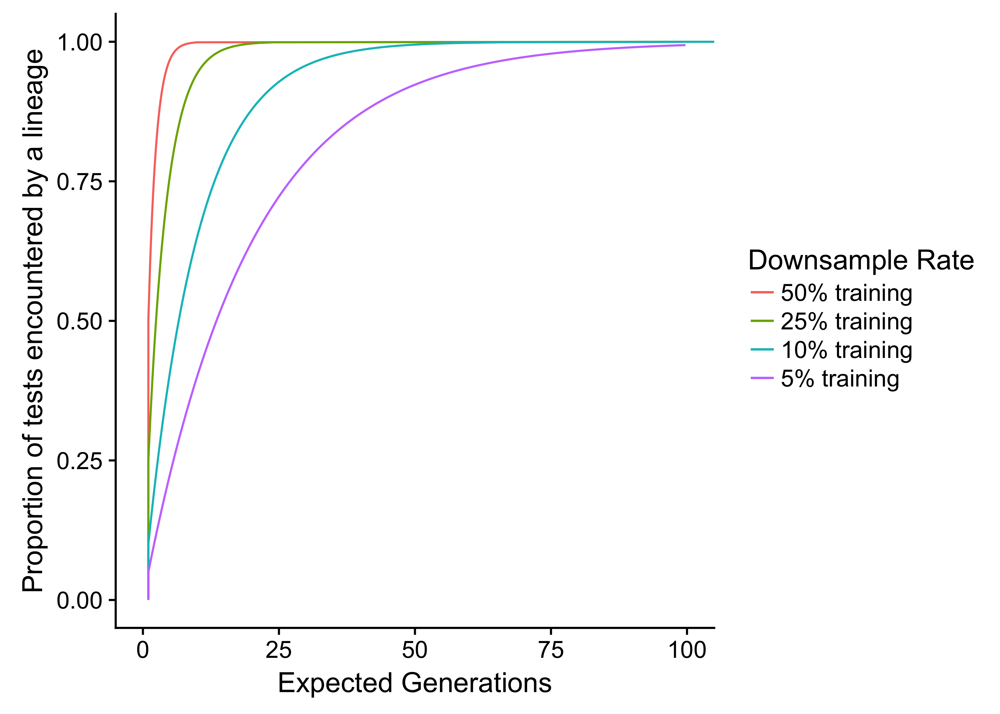

# Applying Random Subsampling to Lexicase Selection

This repository contains supplementary material (e.g., source code, data, documentation)
for our 2019 GECCO student workshop submission, Applying Random Subsampling to Lexicase
Selection (title not yet finalized).

**Navigation**

<!-- TOC -->

- [Project Overview](#project-overview)
  - [Down-sampled Lexicase](#down-sampled-lexicase)
  - [Cohort Lexicase](#cohort-lexicase)
  - [Why use random subsampling instead of just reducing the total size of the test case set?](#why-use-random-subsampling-instead-of-just-reducing-the-total-size-of-the-test-case-set)
  - [Contribution Authors](#contribution-authors)
- [Repository Guide](#repository-guide)
- [Supplemental Material](#supplemental-material)

<!-- /TOC -->

## Project Overview

Here, we apply random subsampling techniques to the lexicase parent-selection algorithm. We present two simple variants of standard lexicase selection that incorporate random subsampling: **down-sampled lexicase** and **cohort lexicase**.

Lexicase selection has proven to be highly successful for finding solutions in genetic
programming, especially for test-based problems where there are many distinct test cases that must all be passed.
However, lexicase selection (like many other selection schemes) requires prospective solutions to be evaluated against most test cases each generation, which can be
computationally demanding.
In this work, we reduce the number of per-generation evaluations by using a subset of test cases each generation (down-sampling) or by constraining test cases to subgroups of the population (cohort assignment).
Tests are randomly reassigned each generation and candidate solutions are only ever evaluated on test cases that they have access to, radically reducing the total number of evaluations needed while ensuring that each lineage eventually encounters all test cases.

We tested both down-sampled and cohort lexicase on five different program synthesis problems. We demonstrate that these lexicase variants can leverage random subsampling to improve lexicase selection's problem-solving success.

### Down-sampled Lexicase

> Down-sampled lexicase applies the random subsampling technique to lexicase selection. Each generation, down-sampled lexicase randomly selects a subset, without replacement, of the test case set to be used for all selection events, guaranteeing that unselected test cases are not evaluated against at all.

&mdash; excerpt from our paper

### Cohort Lexicase

> Down-sampled lexicase makes use of only a subset of test cases each generation, reducing the worst-case number of evaluations required per generation.
In contrast, cohort lexicase selection makes use of the full test case set each generation but ensures that each prospective solution is evaluated against only a subset of them. 
&nbsp;&nbsp;&nbsp;&nbsp;Cohort lexicase modifies standard lexicase by dividing the population and test cases into sub-groups (cohorts) to reduce the number of per-generation evaluations required; each cohort of prospective solutions is evaluated against only those test cases within a corresponding cohort for a particular generation.
Every generation, cohort lexicase randomly partitions both the population of candidate solutions into _K_ equally-sized cohorts and the set of test cases into _K_ equally-sized cohorts.
Each of the _K_ candidate solution cohorts is then paired with a test case cohort, and each candidate solution in a cohort is evaluated against all test cases in the associated test case cohort.

&mdash; excerpt from our paper

### Why use random subsampling instead of just reducing the total size of the test case set?

Down-sampling and cohort lexicase are distinct from permanently reducing the total
number of test cases, which would also achieve per-generation evaluation savings,
but at the cost of assessment quality; by reshuffling which tests are experienced
every generation, **_lineages_** will eventually encounter all test cases, discouraging overfitting.
Simply reducing the total number of tests, especially in scenarios where practitioners
are not familiar with the problem domain, is more likely to result in prospective
solutions overfitting to the reduced test case set.

The figure below shows the expected number of generations for a lineage to encounter
a given proportion of the test case set at 4 different subsampling rates: 50%,
25%, 10%, and 5% of the test set (i.e., the fraction of the test set used when subsampling).
The function is described in Equation 1 of our paper.

### Contribution Authors

- Jose Hernandez
- [Alexander Lalejini](lalejini.com)
- [Emily Dolson](emilyldolson.com)
- [Charles Ofria](ofria.com)

## Repository Guide

- [analysis/](https://github.com/amlalejini/GECCO-2019-cohort-lexicase/tree/master/analysis/)
  - Contains R scripts used for data analyses and generating graphs.
- [data/](https://github.com/amlalejini/GECCO-2019-cohort-lexicase/tree/master/data/)
  - Contains raw data for preliminary and published experiments as well as the
    training and testing examples used for the programming synthesis benchmark
    problems (taken from [Tom Helmuth's example repository](https://github.com/thelmuth/Program-Synthesis-Benchmark-Data)).
- [docs/](https://github.com/amlalejini/GECCO-2019-cohort-lexicase/tree/master/docs/)
  - Contains miscellaneous documentation associated with this work.
- [experiment/](https://github.com/amlalejini/GECCO-2019-cohort-lexicase/tree/master/experiment/)
  - Contains the source code (C++) for our simple linear GP representation and for
    running the experiments discussed in our contribution.
- [hpcc/](https://github.com/amlalejini/GECCO-2019-cohort-lexicase/tree/master/hpcc/)
  - Contains scripts used to submit experiment jobs to MSU's HPCC.
- [scripts/](https://github.com/amlalejini/GECCO-2019-cohort-lexicase/tree/master/scripts/)
  - Contains utility scripts used for managing experiments on the HPCC and for aggregating
    and manipulating experiment data.

## Supplemental Material

- Description of the GP system used for this work, including instruction set information: [./docs/gp-system.md](./docs/gp-system.md)
- Hand-coded solutions for (many of) the program synthesis problems used in this work: [./docs/ProgSynthHandWrittenSolutions.md](./docs/ProgSynthHandWrittenSolutions.md)
- Program synthesis problem descriptions: [./docs/problem-descriptions.md](./docs/problem-descriptions.md)
- Training and testing sets used for program synthesis problems can be found here: [./data/prog-synth-examples/](./data/prog-synth-examples/)
  - These test case sets were pulled from here: [https://github.com/thelmuth/Program-Synthesis-Benchmark-Data](https://github.com/thelmuth/Program-Synthesis-Benchmark-Data)
- Data analyses can be found:
  - Raw rmarkdown file: [./analysis/ds-exp-analysis/performances-analysis.Rmd](./analysis/ds-exp-analysis/performance-analysis.Rmd)
  - Web page generated using R markdown: [https://lalejini.com/GECCO-2019-cohort-lexicase/analysis/ds-exp-analysis/performance-analysis.html](https://lalejini.com/GECCO-2019-cohort-lexicase/analysis/ds-exp-analysis/performance-analysis.html)