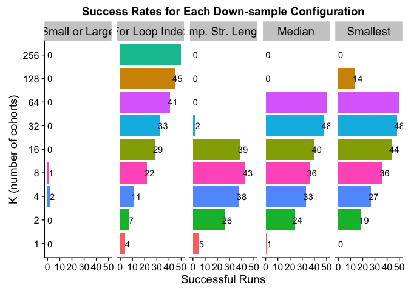
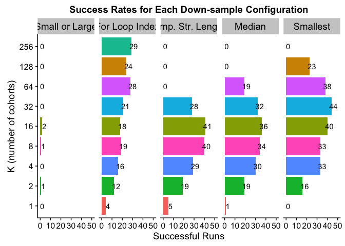
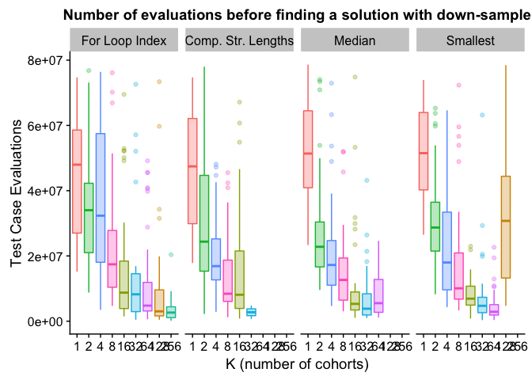
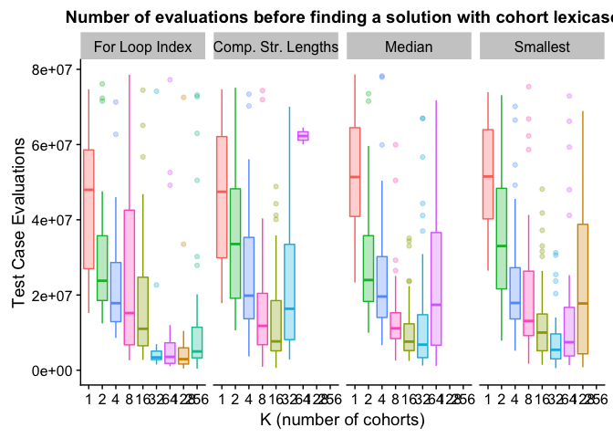

## Overview

Here, an overview of what we do in this here document.

## Analysis Setup

First, we'll load our R packages.


```r
library(tidyr)      # (Wickham & Henry, 2018)
library(ggplot2)    # (Wickham, 2009)
library(plyr)       # (Wickham, 2011)
library(dplyr)      # (Wickham et al., 2018)
library(cowplot)    # (Wilke, 2018)
library(readr)
library(rcompanion) # (Mangiafico, 2019)
```

## Data Loading

Note, the path information used here is accurate for the directory structure used in our Git repository (LINK ANONYMIZED).

First, we'll load solution data after a fixed number of _evaluations_:


```r
# (1) After 26214400 total evaluations (100 generations of std lex)
solutions_e26214400_data_loc <- "../data/exp-data/min_programs__eval_26214400.csv"
prog_solutions_e26214400 <- read.csv(solutions_e26214400_data_loc, na.strings = "NONE")

# (2) After 78643200 total evaluations (300 generations of std lex)
solutions_e78643200_data_loc <- "../data/exp-data/min_programs__eval_78643200.csv"
prog_solutions_e78643200 <- read.csv(solutions_e78643200_data_loc, na.strings = "NONE")

# (3) Load summary of solution data (contingency tables), which contains both time points.
prog_solutions_evals_summary <- read.csv("../data/exp-data/min_programs__eval_all__solutions_summary.csv", na.strings = "NONE")
```

Below, we impose an ordering on the problems in the data (to make order of appearance in plotting consistent).


```r
prog_solutions_evals_summary$problem <- factor(prog_solutions_evals_summary$problem, levels=c('small-or-large','for-loop-index','compare-string-lengths','median','smallest'))

prog_solutions_e78643200$problem <- factor(prog_solutions_e78643200$problem, levels=c('small-or-large','for-loop-index','compare-string-lengths','median','smallest'))

# A map from data column name to name to be used in figures.
problem_names <- c(
  'small-or-large'=        "Small or Large",
  'for-loop-index'=        "For Loop Index",
  'compare-string-lengths'="Comp. Str. Lengths",
  'median'=                "Median",
  'smallest'=              "Smallest"
)
```

## Given a Fixed number of evaluations (26214400), both cohorts and downsampling improve problem solving success

## Down sampling


```
## Warning: Removed 3 rows containing missing values (geom_text).
```

<!-- -->

#### Statistics - Compare string lengths


```r
prob_data <- filter(downsample_data, problem=="compare-string-lengths")
prob_data$successful_runs = prob_data$solutions_found
prob_data$failed_runs = prob_data$total_runs - prob_data$solutions_found
con_table <- matrix(c(prob_data$successful_runs, prob_data$failed_runs), nrow=length(prob_data$successful_runs))
rownames(con_table) <- prob_data$cohort_config
colnames(con_table) <- c("Successful Runs", "Failed Runs")
pairwiseNominalIndependence(con_table, fisher=TRUE, gtest=FALSE, chisq=FALSE, method="holm")
```

```
##               Comparison p.Fisher p.adj.Fisher
## 1  cn1:cs512 : cn128:cs4 5.63e-02     7.32e-01
## 2  cn1:cs512 : cn16:cs32 3.30e-12     7.59e-11
## 3  cn1:cs512 : cn256:cs2 5.63e-02     7.32e-01
## 4  cn1:cs512 : cn2:cs256 8.57e-06     1.46e-04
## 5  cn1:cs512 : cn32:cs16 4.36e-01     1.00e+00
## 6  cn1:cs512 : cn4:cs128 1.40e-11     3.08e-10
## 7   cn1:cs512 : cn64:cs8 5.63e-02     7.32e-01
## 8   cn1:cs512 : cn8:cs64 4.62e-15     1.20e-13
## 9  cn128:cs4 : cn16:cs32 8.29e-18     2.65e-16
## 10 cn128:cs4 : cn256:cs2 1.00e+00     1.00e+00
## 11 cn128:cs4 : cn2:cs256 3.47e-10     7.29e-09
## 12 cn128:cs4 : cn32:cs16 4.95e-01     1.00e+00
## 13 cn128:cs4 : cn4:cs128 4.28e-17     1.24e-15
## 14  cn128:cs4 : cn64:cs8 1.00e+00     1.00e+00
## 15  cn128:cs4 : cn8:cs64 5.24e-21     1.89e-19
## 16 cn16:cs32 : cn256:cs2 8.29e-18     2.65e-16
## 17 cn16:cs32 : cn2:cs256 1.13e-02     1.69e-01
## 18 cn16:cs32 : cn32:cs16 4.60e-15     1.20e-13
## 19 cn16:cs32 : cn4:cs128 1.00e+00     1.00e+00
## 20  cn16:cs32 : cn64:cs8 8.29e-18     2.65e-16
## 21  cn16:cs32 : cn8:cs64 4.36e-01     1.00e+00
## 22 cn256:cs2 : cn2:cs256 3.47e-10     7.29e-09
## 23 cn256:cs2 : cn32:cs16 4.95e-01     1.00e+00
## 24 cn256:cs2 : cn4:cs128 4.28e-17     1.24e-15
## 25  cn256:cs2 : cn64:cs8 1.00e+00     1.00e+00
## 26  cn256:cs2 : cn8:cs64 5.24e-21     1.89e-19
## 27 cn2:cs256 : cn32:cs16 6.18e-08     1.11e-06
## 28 cn2:cs256 : cn4:cs128 2.13e-02     2.98e-01
## 29  cn2:cs256 : cn64:cs8 3.47e-10     7.29e-09
## 30  cn2:cs256 : cn8:cs64 4.35e-04     6.96e-03
## 31 cn32:cs16 : cn4:cs128 2.19e-14     5.26e-13
## 32  cn32:cs16 : cn64:cs8 4.95e-01     1.00e+00
## 33  cn32:cs16 : cn8:cs64 4.01e-18     1.32e-16
## 34  cn4:cs128 : cn64:cs8 4.28e-17     1.24e-15
## 35  cn4:cs128 : cn8:cs64 3.08e-01     1.00e+00
## 36   cn64:cs8 : cn8:cs64 5.24e-21     1.89e-19
```

#### Statistics - For loop index


```r
prob_data <- filter(downsample_data, problem=="for-loop-index")
prob_data$successful_runs = prob_data$solutions_found
prob_data$failed_runs = prob_data$total_runs - prob_data$solutions_found
con_table <- matrix(c(prob_data$successful_runs, prob_data$failed_runs), nrow=length(prob_data$successful_runs))
rownames(con_table) <- prob_data$cohort_config
colnames(con_table) <- c("Successful Runs", "Failed Runs")
pairwiseNominalIndependence(con_table, fisher=TRUE, gtest=FALSE, chisq=FALSE, method="holm")
```

```
##               Comparison p.Fisher p.adj.Fisher
## 1  cn1:cs512 : cn128:cs4 9.96e-18     3.29e-16
## 2  cn1:cs512 : cn16:cs32 1.12e-07     2.69e-06
## 3  cn1:cs512 : cn256:cs2 6.27e-24     2.26e-22
## 4  cn1:cs512 : cn2:cs256 5.25e-01     1.00e+00
## 5  cn1:cs512 : cn32:cs16 1.38e-09     3.73e-08
## 6  cn1:cs512 : cn4:cs128 9.05e-02     6.34e-01
## 7   cn1:cs512 : cn64:cs8 1.91e-14     5.92e-13
## 8   cn1:cs512 : cn8:cs64 6.49e-05     1.17e-03
## 9  cn128:cs4 : cn16:cs32 4.73e-04     7.18e-03
## 10 cn128:cs4 : cn256:cs2 5.63e-02     4.50e-01
## 11 cn128:cs4 : cn2:cs256 4.62e-15     1.48e-13
## 12 cn128:cs4 : cn32:cs16 7.00e-03     8.40e-02
## 13 cn128:cs4 : cn4:cs128 3.30e-12     9.90e-11
## 14  cn128:cs4 : cn64:cs8 3.88e-01     1.00e+00
## 15  cn128:cs4 : cn8:cs64 1.39e-06     3.06e-05
## 16 cn16:cs32 : cn256:cs2 6.59e-08     1.65e-06
## 17 cn16:cs32 : cn2:cs256 7.63e-06     1.53e-04
## 18 cn16:cs32 : cn32:cs16 5.37e-01     1.00e+00
## 19 cn16:cs32 : cn4:cs128 4.49e-04     7.18e-03
## 20  cn16:cs32 : cn64:cs8 1.56e-02     1.72e-01
## 21  cn16:cs32 : cn8:cs64 2.30e-01     1.00e+00
## 22 cn256:cs2 : cn2:cs256 5.24e-21     1.83e-19
## 23 cn256:cs2 : cn32:cs16 2.96e-06     6.22e-05
## 24 cn256:cs2 : cn4:cs128 8.29e-18     2.82e-16
## 25  cn256:cs2 : cn64:cs8 2.63e-03     3.42e-02
## 26  cn256:cs2 : cn8:cs64 3.55e-11     9.94e-10
## 27 cn2:cs256 : cn32:cs16 1.55e-07     3.56e-06
## 28 cn2:cs256 : cn4:cs128 4.36e-01     1.00e+00
## 29  cn2:cs256 : cn64:cs8 5.56e-12     1.61e-10
## 30  cn2:cs256 : cn8:cs64 1.75e-03     2.45e-02
## 31 cn32:cs16 : cn4:cs128 1.72e-05     3.27e-04
## 32  cn32:cs16 : cn64:cs8 1.10e-01     6.60e-01
## 33  cn32:cs16 : cn8:cs64 4.39e-02     3.95e-01
## 34  cn4:cs128 : cn64:cs8 2.13e-09     5.54e-08
## 35  cn4:cs128 : cn8:cs64 3.27e-02     3.27e-01
## 36   cn64:cs8 : cn8:cs64 1.54e-04     2.62e-03
```

#### Statistics - Median


```r
prob_data <- filter(downsample_data, problem=="median")
prob_data$successful_runs = prob_data$solutions_found
prob_data$failed_runs = prob_data$total_runs - prob_data$solutions_found
con_table <- matrix(c(prob_data$successful_runs, prob_data$failed_runs), nrow=length(prob_data$successful_runs))
rownames(con_table) <- prob_data$cohort_config
colnames(con_table) <- c("Successful Runs", "Failed Runs")
pairwiseNominalIndependence(con_table, fisher=TRUE, gtest=FALSE, chisq=FALSE, method="holm")
```

```
##               Comparison p.Fisher p.adj.Fisher
## 1  cn1:cs512 : cn128:cs4 1.00e+00     1.00e+00
## 2  cn1:cs512 : cn16:cs32 5.13e-17     1.44e-15
## 3  cn1:cs512 : cn256:cs2 1.00e+00     1.00e+00
## 4  cn1:cs512 : cn2:cs256 5.12e-08     9.22e-07
## 5  cn1:cs512 : cn32:cs16 1.24e-24     3.84e-23
## 6  cn1:cs512 : cn4:cs128 1.71e-12     3.76e-11
## 7   cn1:cs512 : cn64:cs8 1.01e-27     3.43e-26
## 8   cn1:cs512 : cn8:cs64 2.76e-14     6.90e-13
## 9  cn128:cs4 : cn16:cs32 1.49e-18     4.47e-17
## 10 cn128:cs4 : cn256:cs2 1.00e+00     1.00e+00
## 11 cn128:cs4 : cn2:cs256 3.05e-09     6.10e-08
## 12 cn128:cs4 : cn32:cs16 2.63e-26     8.68e-25
## 13 cn128:cs4 : cn4:cs128 6.68e-14     1.60e-12
## 14  cn128:cs4 : cn64:cs8 1.98e-29     7.13e-28
## 15  cn128:cs4 : cn8:cs64 9.49e-16     2.56e-14
## 16 cn16:cs32 : cn256:cs2 1.49e-18     4.47e-17
## 17 cn16:cs32 : cn2:cs256 1.59e-03     1.91e-02
## 18 cn16:cs32 : cn32:cs16 2.77e-02     2.49e-01
## 19 cn16:cs32 : cn4:cs128 1.76e-01     1.00e+00
## 20  cn16:cs32 : cn64:cs8 1.19e-03     1.55e-02
## 21  cn16:cs32 : cn8:cs64 4.83e-01     1.00e+00
## 22 cn256:cs2 : cn2:cs256 3.05e-09     6.10e-08
## 23 cn256:cs2 : cn32:cs16 2.63e-26     8.68e-25
## 24 cn256:cs2 : cn4:cs128 6.68e-14     1.60e-12
## 25  cn256:cs2 : cn64:cs8 1.98e-29     7.13e-28
## 26  cn256:cs2 : cn8:cs64 9.49e-16     2.56e-14
## 27 cn2:cs256 : cn32:cs16 6.18e-08     1.05e-06
## 28 cn2:cs256 : cn4:cs128 1.06e-01     8.48e-01
## 29  cn2:cs256 : cn64:cs8 3.47e-10     7.29e-09
## 30  cn2:cs256 : cn8:cs64 2.42e-02     2.42e-01
## 31 cn32:cs16 : cn4:cs128 1.96e-04     2.74e-03
## 32  cn32:cs16 : cn64:cs8 4.95e-01     1.00e+00
## 33  cn32:cs16 : cn8:cs64 1.88e-03     2.07e-02
## 34  cn4:cs128 : cn64:cs8 2.96e-06     4.74e-05
## 35  cn4:cs128 : cn8:cs64 6.66e-01     1.00e+00
## 36   cn64:cs8 : cn8:cs64 4.24e-05     6.36e-04
```

#### Statistics - Small or large


```r
prob_data <- filter(downsample_data, problem=="small-or-large")
prob_data$successful_runs = prob_data$solutions_found
prob_data$failed_runs = prob_data$total_runs - prob_data$solutions_found
con_table <- matrix(c(prob_data$successful_runs, prob_data$failed_runs), nrow=length(prob_data$successful_runs))
rownames(con_table) <- prob_data$cohort_config
colnames(con_table) <- c("Successful Runs", "Failed Runs")
pairwiseNominalIndependence(con_table, fisher=TRUE, gtest=FALSE, chisq=FALSE, method="holm")
```

```
##               Comparison p.Fisher p.adj.Fisher
## 1  cn1:cs512 : cn128:cs4    1.000            1
## 2  cn1:cs512 : cn16:cs32    1.000            1
## 3  cn1:cs512 : cn256:cs2    1.000            1
## 4  cn1:cs512 : cn2:cs256    1.000            1
## 5  cn1:cs512 : cn32:cs16    1.000            1
## 6  cn1:cs512 : cn4:cs128    0.495            1
## 7   cn1:cs512 : cn64:cs8    1.000            1
## 8   cn1:cs512 : cn8:cs64    1.000            1
## 9  cn128:cs4 : cn16:cs32    1.000            1
## 10 cn128:cs4 : cn256:cs2    1.000            1
## 11 cn128:cs4 : cn2:cs256    1.000            1
## 12 cn128:cs4 : cn32:cs16    1.000            1
## 13 cn128:cs4 : cn4:cs128    0.495            1
## 14  cn128:cs4 : cn64:cs8    1.000            1
## 15  cn128:cs4 : cn8:cs64    1.000            1
## 16 cn16:cs32 : cn256:cs2    1.000            1
## 17 cn16:cs32 : cn2:cs256    1.000            1
## 18 cn16:cs32 : cn32:cs16    1.000            1
## 19 cn16:cs32 : cn4:cs128    0.495            1
## 20  cn16:cs32 : cn64:cs8    1.000            1
## 21  cn16:cs32 : cn8:cs64    1.000            1
## 22 cn256:cs2 : cn2:cs256    1.000            1
## 23 cn256:cs2 : cn32:cs16    1.000            1
## 24 cn256:cs2 : cn4:cs128    0.495            1
## 25  cn256:cs2 : cn64:cs8    1.000            1
## 26  cn256:cs2 : cn8:cs64    1.000            1
## 27 cn2:cs256 : cn32:cs16    1.000            1
## 28 cn2:cs256 : cn4:cs128    0.495            1
## 29  cn2:cs256 : cn64:cs8    1.000            1
## 30  cn2:cs256 : cn8:cs64    1.000            1
## 31 cn32:cs16 : cn4:cs128    0.495            1
## 32  cn32:cs16 : cn64:cs8    1.000            1
## 33  cn32:cs16 : cn8:cs64    1.000            1
## 34  cn4:cs128 : cn64:cs8    0.495            1
## 35  cn4:cs128 : cn8:cs64    1.000            1
## 36   cn64:cs8 : cn8:cs64    1.000            1
```

#### Statistics - Smallest


```r
prob_data <- filter(downsample_data, problem=="smallest")
prob_data$successful_runs = prob_data$solutions_found
prob_data$failed_runs = prob_data$total_runs - prob_data$solutions_found
con_table <- matrix(c(prob_data$successful_runs, prob_data$failed_runs), nrow=length(prob_data$successful_runs))
rownames(con_table) <- prob_data$cohort_config
colnames(con_table) <- c("Successful Runs", "Failed Runs")
pairwiseNominalIndependence(con_table, fisher=TRUE, gtest=FALSE, chisq=FALSE, method="holm")
```

```
##               Comparison p.Fisher p.adj.Fisher
## 1  cn1:cs512 : cn128:cs4 4.24e-05     6.36e-04
## 2  cn1:cs512 : cn16:cs32 6.44e-22     2.06e-20
## 3  cn1:cs512 : cn256:cs2 1.00e+00     1.00e+00
## 4  cn1:cs512 : cn2:cs256 4.60e-07     8.74e-06
## 5  cn1:cs512 : cn32:cs16 2.63e-26     8.94e-25
## 6  cn1:cs512 : cn4:cs128 1.13e-10     2.82e-09
## 7   cn1:cs512 : cn64:cs8 1.98e-29     7.13e-28
## 8   cn1:cs512 : cn8:cs64 9.49e-16     2.85e-14
## 9  cn128:cs4 : cn16:cs32 1.11e-09     2.44e-08
## 10 cn128:cs4 : cn256:cs2 4.24e-05     6.36e-04
## 11 cn128:cs4 : cn2:cs256 3.95e-01     1.00e+00
## 12 cn128:cs4 : cn32:cs16 4.12e-13     1.11e-11
## 13 cn128:cs4 : cn4:cs128 1.42e-02     1.28e-01
## 14  cn128:cs4 : cn64:cs8 9.49e-16     2.85e-14
## 15  cn128:cs4 : cn8:cs64 2.03e-05     3.25e-04
## 16 cn16:cs32 : cn256:cs2 6.44e-22     2.06e-20
## 17 cn16:cs32 : cn2:cs256 3.06e-07     6.12e-06
## 18 cn16:cs32 : cn32:cs16 2.69e-01     1.00e+00
## 19 cn16:cs32 : cn4:cs128 3.23e-04     3.88e-03
## 20  cn16:cs32 : cn64:cs8 2.67e-02     2.14e-01
## 21  cn16:cs32 : cn8:cs64 7.84e-02     5.49e-01
## 22 cn256:cs2 : cn2:cs256 4.60e-07     8.74e-06
## 23 cn256:cs2 : cn32:cs16 2.63e-26     8.94e-25
## 24 cn256:cs2 : cn4:cs128 1.13e-10     2.82e-09
## 25  cn256:cs2 : cn64:cs8 1.98e-29     7.13e-28
## 26  cn256:cs2 : cn8:cs64 9.49e-16     2.85e-14
## 27 cn2:cs256 : cn32:cs16 2.59e-10     5.96e-09
## 28 cn2:cs256 : cn4:cs128 1.60e-01     8.00e-01
## 29  cn2:cs256 : cn64:cs8 9.17e-13     2.38e-11
## 30  cn2:cs256 : cn8:cs64 1.18e-03     1.30e-02
## 31 cn32:cs16 : cn4:cs128 1.14e-06     1.94e-05
## 32  cn32:cs16 : cn64:cs8 4.95e-01     1.00e+00
## 33  cn32:cs16 : cn8:cs64 1.88e-03     1.88e-02
## 34  cn4:cs128 : cn64:cs8 8.69e-09     1.82e-07
## 35  cn4:cs128 : cn8:cs64 9.69e-02     5.81e-01
## 36   cn64:cs8 : cn8:cs64 4.24e-05     6.36e-04
```


## Cohorts

<!-- -->


#### Statistics - Compare string lengths


```r
prob_data <- filter(cohort_data, problem=="compare-string-lengths")
prob_data$successful_runs = prob_data$solutions_found
prob_data$failed_runs = prob_data$total_runs - prob_data$solutions_found
con_table <- matrix(c(prob_data$successful_runs, prob_data$failed_runs), nrow=length(prob_data$successful_runs))
rownames(con_table) <- prob_data$cohort_config
colnames(con_table) <- c("Successful Runs", "Failed Runs")
pairwiseNominalIndependence(con_table, fisher=TRUE, gtest=FALSE, chisq=FALSE, method="holm")
```

```
##               Comparison p.Fisher p.adj.Fisher
## 1  cn128:cs4 : cn16:cs32 2.49e-19     8.96e-18
## 2  cn128:cs4 : cn1:cs512 5.63e-02     5.63e-01
## 3  cn128:cs4 : cn256:cs2 1.00e+00     1.00e+00
## 4  cn128:cs4 : cn2:cs256 4.60e-07     1.01e-05
## 5  cn128:cs4 : cn32:cs16 3.55e-11     8.88e-10
## 6  cn128:cs4 : cn4:cs128 1.08e-11     3.02e-10
## 7   cn128:cs4 : cn64:cs8 1.00e+00     1.00e+00
## 8   cn128:cs4 : cn8:cs64 1.49e-18     4.92e-17
## 9  cn16:cs32 : cn1:cs512 1.48e-13     4.44e-12
## 10 cn16:cs32 : cn256:cs2 2.49e-19     8.96e-18
## 11 cn16:cs32 : cn2:cs256 1.26e-05     2.14e-04
## 12 cn16:cs32 : cn32:cs16 8.89e-03     1.24e-01
## 13 cn16:cs32 : cn4:cs128 1.56e-02     2.03e-01
## 14  cn16:cs32 : cn64:cs8 2.49e-19     8.96e-18
## 15  cn16:cs32 : cn8:cs64 1.00e+00     1.00e+00
## 16 cn1:cs512 : cn256:cs2 5.63e-02     5.63e-01
## 17 cn1:cs512 : cn2:cs256 1.92e-03     2.88e-02
## 18 cn1:cs512 : cn32:cs16 1.39e-06     2.50e-05
## 19 cn1:cs512 : cn4:cs128 5.31e-07     1.01e-05
## 20  cn1:cs512 : cn64:cs8 5.63e-02     5.63e-01
## 21  cn1:cs512 : cn8:cs64 7.28e-13     2.11e-11
## 22 cn256:cs2 : cn2:cs256 4.60e-07     1.01e-05
## 23 cn256:cs2 : cn32:cs16 3.55e-11     8.88e-10
## 24 cn256:cs2 : cn4:cs128 1.08e-11     3.02e-10
## 25  cn256:cs2 : cn64:cs8 1.00e+00     1.00e+00
## 26  cn256:cs2 : cn8:cs64 1.49e-18     4.92e-17
## 27 cn2:cs256 : cn32:cs16 1.09e-01     6.54e-01
## 28 cn2:cs256 : cn4:cs128 7.11e-02     5.63e-01
## 29  cn2:cs256 : cn64:cs8 4.60e-07     1.01e-05
## 30  cn2:cs256 : cn8:cs64 3.61e-05     5.78e-04
## 31 cn32:cs16 : cn4:cs128 1.00e+00     1.00e+00
## 32  cn32:cs16 : cn64:cs8 3.55e-11     8.88e-10
## 33  cn32:cs16 : cn8:cs64 1.77e-02     2.12e-01
## 34  cn4:cs128 : cn64:cs8 1.08e-11     3.02e-10
## 35  cn4:cs128 : cn8:cs64 2.97e-02     3.27e-01
## 36   cn64:cs8 : cn8:cs64 1.49e-18     4.92e-17
```

#### Statistics - For loop index


```r
prob_data <- filter(cohort_data, problem=="for-loop-index")
prob_data$successful_runs = prob_data$solutions_found
prob_data$failed_runs = prob_data$total_runs - prob_data$solutions_found
con_table <- matrix(c(prob_data$successful_runs, prob_data$failed_runs), nrow=length(prob_data$successful_runs))
rownames(con_table) <- prob_data$cohort_config
colnames(con_table) <- c("Successful Runs", "Failed Runs")
pairwiseNominalIndependence(con_table, fisher=TRUE, gtest=FALSE, chisq=FALSE, method="holm")
```

```
##               Comparison p.Fisher p.adj.Fisher
## 1  cn128:cs4 : cn16:cs32 3.11e-01     1.00e+00
## 2  cn128:cs4 : cn1:cs512 1.23e-05     4.18e-04
## 3  cn128:cs4 : cn256:cs2 4.23e-01     1.00e+00
## 4  cn128:cs4 : cn2:cs256 2.13e-02     5.54e-01
## 5  cn128:cs4 : cn32:cs16 6.88e-01     1.00e+00
## 6  cn128:cs4 : cn4:cs128 1.53e-01     1.00e+00
## 7   cn128:cs4 : cn64:cs8 5.48e-01     1.00e+00
## 8   cn128:cs4 : cn8:cs64 4.19e-01     1.00e+00
## 9  cn16:cs32 : cn1:cs512 1.31e-03     3.93e-02
## 10 cn16:cs32 : cn256:cs2 4.46e-02     1.00e+00
## 11 cn16:cs32 : cn2:cs256 2.75e-01     1.00e+00
## 12 cn16:cs32 : cn32:cs16 6.82e-01     1.00e+00
## 13 cn16:cs32 : cn4:cs128 8.33e-01     1.00e+00
## 14  cn16:cs32 : cn64:cs8 7.04e-02     1.00e+00
## 15  cn16:cs32 : cn8:cs64 1.00e+00     1.00e+00
## 16 cn1:cs512 : cn256:cs2 1.12e-07     4.03e-06
## 17 cn1:cs512 : cn2:cs256 5.38e-02     1.00e+00
## 18 cn1:cs512 : cn32:cs16 1.43e-04     4.72e-03
## 19 cn1:cs512 : cn4:cs128 5.04e-03     1.41e-01
## 20  cn1:cs512 : cn64:cs8 3.05e-07     1.07e-05
## 21  cn1:cs512 : cn8:cs64 6.45e-04     2.06e-02
## 22 cn256:cs2 : cn2:cs256 1.02e-03     3.16e-02
## 23 cn256:cs2 : cn32:cs16 1.61e-01     1.00e+00
## 24 cn256:cs2 : cn4:cs128 1.54e-02     4.16e-01
## 25  cn256:cs2 : cn64:cs8 1.00e+00     1.00e+00
## 26  cn256:cs2 : cn8:cs64 7.11e-02     1.00e+00
## 27 cn2:cs256 : cn32:cs16 8.81e-02     1.00e+00
## 28 cn2:cs256 : cn4:cs128 5.04e-01     1.00e+00
## 29  cn2:cs256 : cn64:cs8 2.02e-03     5.86e-02
## 30  cn2:cs256 : cn8:cs64 1.94e-01     1.00e+00
## 31 cn32:cs16 : cn4:cs128 4.08e-01     1.00e+00
## 32  cn32:cs16 : cn64:cs8 2.30e-01     1.00e+00
## 33  cn32:cs16 : cn8:cs64 8.38e-01     1.00e+00
## 34  cn4:cs128 : cn64:cs8 2.62e-02     6.55e-01
## 35  cn4:cs128 : cn8:cs64 6.75e-01     1.00e+00
## 36   cn64:cs8 : cn8:cs64 1.09e-01     1.00e+00
```

#### Statistics - Median


```r
prob_data <- filter(cohort_data, problem=="median")
prob_data$successful_runs = prob_data$solutions_found
prob_data$failed_runs = prob_data$total_runs - prob_data$solutions_found
con_table <- matrix(c(prob_data$successful_runs, prob_data$failed_runs), nrow=length(prob_data$successful_runs))
rownames(con_table) <- prob_data$cohort_config
colnames(con_table) <- c("Successful Runs", "Failed Runs")
pairwiseNominalIndependence(con_table, fisher=TRUE, gtest=FALSE, chisq=FALSE, method="holm")
```

```
##               Comparison p.Fisher p.adj.Fisher
## 1  cn128:cs4 : cn16:cs32 9.49e-16     3.42e-14
## 2  cn128:cs4 : cn1:cs512 1.00e+00     1.00e+00
## 3  cn128:cs4 : cn256:cs2 1.00e+00     1.00e+00
## 4  cn128:cs4 : cn2:cs256 4.60e-07     1.10e-05
## 5  cn128:cs4 : cn32:cs16 2.52e-13     7.81e-12
## 6  cn128:cs4 : cn4:cs128 3.21e-12     8.99e-11
## 7   cn128:cs4 : cn64:cs8 4.60e-07     1.10e-05
## 8   cn128:cs4 : cn8:cs64 1.70e-14     5.78e-13
## 9  cn16:cs32 : cn1:cs512 2.76e-14     8.83e-13
## 10 cn16:cs32 : cn256:cs2 9.49e-16     3.42e-14
## 11 cn16:cs32 : cn2:cs256 1.18e-03     2.12e-02
## 12 cn16:cs32 : cn32:cs16 5.21e-01     1.00e+00
## 13 cn16:cs32 : cn4:cs128 2.91e-01     1.00e+00
## 14  cn16:cs32 : cn64:cs8 1.18e-03     2.12e-02
## 15  cn16:cs32 : cn8:cs64 8.28e-01     1.00e+00
## 16 cn1:cs512 : cn256:cs2 1.00e+00     1.00e+00
## 17 cn1:cs512 : cn2:cs256 5.85e-06     1.17e-04
## 18 cn1:cs512 : cn32:cs16 6.19e-12     1.61e-10
## 19 cn1:cs512 : cn4:cs128 7.20e-11     1.80e-09
## 20  cn1:cs512 : cn64:cs8 5.85e-06     1.17e-04
## 21  cn1:cs512 : cn8:cs64 4.54e-13     1.32e-11
## 22 cn256:cs2 : cn2:cs256 4.60e-07     1.10e-05
## 23 cn256:cs2 : cn32:cs16 2.52e-13     7.81e-12
## 24 cn256:cs2 : cn4:cs128 3.21e-12     8.99e-11
## 25  cn256:cs2 : cn64:cs8 4.60e-07     1.10e-05
## 26  cn256:cs2 : cn8:cs64 1.70e-14     5.78e-13
## 27 cn2:cs256 : cn32:cs16 1.59e-02     2.23e-01
## 28 cn2:cs256 : cn4:cs128 4.49e-02     5.39e-01
## 29  cn2:cs256 : cn64:cs8 1.00e+00     1.00e+00
## 30  cn2:cs256 : cn8:cs64 4.78e-03     7.65e-02
## 31 cn32:cs16 : cn4:cs128 8.37e-01     1.00e+00
## 32  cn32:cs16 : cn64:cs8 1.59e-02     2.23e-01
## 33  cn32:cs16 : cn8:cs64 8.33e-01     1.00e+00
## 34  cn4:cs128 : cn64:cs8 4.49e-02     5.39e-01
## 35  cn4:cs128 : cn8:cs64 5.32e-01     1.00e+00
## 36   cn64:cs8 : cn8:cs64 4.78e-03     7.65e-02
```

#### Statistics - Small or large


```r
prob_data <- filter(cohort_data, problem=="small-or-large")
prob_data$successful_runs = prob_data$solutions_found
prob_data$failed_runs = prob_data$total_runs - prob_data$solutions_found
con_table <- matrix(c(prob_data$successful_runs, prob_data$failed_runs), nrow=length(prob_data$successful_runs))
rownames(con_table) <- prob_data$cohort_config
colnames(con_table) <- c("Successful Runs", "Failed Runs")
pairwiseNominalIndependence(con_table, fisher=TRUE, gtest=FALSE, chisq=FALSE, method="holm")
```

```
##               Comparison p.Fisher p.adj.Fisher
## 1  cn128:cs4 : cn16:cs32    0.495            1
## 2  cn128:cs4 : cn1:cs512    1.000            1
## 3  cn128:cs4 : cn256:cs2    1.000            1
## 4  cn128:cs4 : cn2:cs256    1.000            1
## 5  cn128:cs4 : cn32:cs16    1.000            1
## 6  cn128:cs4 : cn4:cs128    1.000            1
## 7   cn128:cs4 : cn64:cs8    1.000            1
## 8   cn128:cs4 : cn8:cs64    1.000            1
## 9  cn16:cs32 : cn1:cs512    0.495            1
## 10 cn16:cs32 : cn256:cs2    0.495            1
## 11 cn16:cs32 : cn2:cs256    1.000            1
## 12 cn16:cs32 : cn32:cs16    0.495            1
## 13 cn16:cs32 : cn4:cs128    0.495            1
## 14  cn16:cs32 : cn64:cs8    0.495            1
## 15  cn16:cs32 : cn8:cs64    1.000            1
## 16 cn1:cs512 : cn256:cs2    1.000            1
## 17 cn1:cs512 : cn2:cs256    1.000            1
## 18 cn1:cs512 : cn32:cs16    1.000            1
## 19 cn1:cs512 : cn4:cs128    1.000            1
## 20  cn1:cs512 : cn64:cs8    1.000            1
## 21  cn1:cs512 : cn8:cs64    1.000            1
## 22 cn256:cs2 : cn2:cs256    1.000            1
## 23 cn256:cs2 : cn32:cs16    1.000            1
## 24 cn256:cs2 : cn4:cs128    1.000            1
## 25  cn256:cs2 : cn64:cs8    1.000            1
## 26  cn256:cs2 : cn8:cs64    1.000            1
## 27 cn2:cs256 : cn32:cs16    1.000            1
## 28 cn2:cs256 : cn4:cs128    1.000            1
## 29  cn2:cs256 : cn64:cs8    1.000            1
## 30  cn2:cs256 : cn8:cs64    1.000            1
## 31 cn32:cs16 : cn4:cs128    1.000            1
## 32  cn32:cs16 : cn64:cs8    1.000            1
## 33  cn32:cs16 : cn8:cs64    1.000            1
## 34  cn4:cs128 : cn64:cs8    1.000            1
## 35  cn4:cs128 : cn8:cs64    1.000            1
## 36   cn64:cs8 : cn8:cs64    1.000            1
```

#### Statistics - Smallest


```r
prob_data <- filter(cohort_data, problem=="smallest")
prob_data$successful_runs = prob_data$solutions_found
prob_data$failed_runs = prob_data$total_runs - prob_data$solutions_found
con_table <- matrix(c(prob_data$successful_runs, prob_data$failed_runs), nrow=length(prob_data$successful_runs))
rownames(con_table) <- prob_data$cohort_config
colnames(con_table) <- c("Successful Runs", "Failed Runs")
pairwiseNominalIndependence(con_table, fisher=TRUE, gtest=FALSE, chisq=FALSE, method="holm")
```

```
##               Comparison p.Fisher p.adj.Fisher
## 1  cn128:cs4 : cn16:cs32 8.03e-04     1.45e-02
## 2  cn128:cs4 : cn1:cs512 8.69e-09     2.26e-07
## 3  cn128:cs4 : cn256:cs2 8.69e-09     2.26e-07
## 4  cn128:cs4 : cn2:cs256 2.18e-01     1.00e+00
## 5  cn128:cs4 : cn32:cs16 1.30e-05     2.60e-04
## 6  cn128:cs4 : cn4:cs128 6.93e-02     8.32e-01
## 7   cn128:cs4 : cn64:cs8 3.83e-03     5.74e-02
## 8   cn128:cs4 : cn8:cs64 6.93e-02     8.32e-01
## 9  cn16:cs32 : cn1:cs512 1.49e-18     5.07e-17
## 10 cn16:cs32 : cn256:cs2 1.49e-18     5.07e-17
## 11 cn16:cs32 : cn2:cs256 2.30e-06     5.29e-05
## 12 cn16:cs32 : cn32:cs16 4.14e-01     1.00e+00
## 13 cn16:cs32 : cn4:cs128 1.76e-01     1.00e+00
## 14  cn16:cs32 : cn64:cs8 8.10e-01     1.00e+00
## 15  cn16:cs32 : cn8:cs64 1.76e-01     1.00e+00
## 16 cn1:cs512 : cn256:cs2 1.00e+00     1.00e+00
## 17 cn1:cs512 : cn2:cs256 7.32e-06     1.61e-04
## 18 cn1:cs512 : cn32:cs16 6.44e-22     2.32e-20
## 19 cn1:cs512 : cn4:cs128 6.68e-14     2.00e-12
## 20  cn1:cs512 : cn64:cs8 4.28e-17     1.37e-15
## 21  cn1:cs512 : cn8:cs64 6.68e-14     2.00e-12
## 22 cn256:cs2 : cn2:cs256 7.32e-06     1.61e-04
## 23 cn256:cs2 : cn32:cs16 6.44e-22     2.32e-20
## 24 cn256:cs2 : cn4:cs128 6.68e-14     2.00e-12
## 25  cn256:cs2 : cn64:cs8 4.28e-17     1.37e-15
## 26  cn256:cs2 : cn8:cs64 6.68e-14     2.00e-12
## 27 cn2:cs256 : cn32:cs16 1.21e-08     2.90e-07
## 28 cn2:cs256 : cn4:cs128 1.25e-03     2.13e-02
## 29  cn2:cs256 : cn64:cs8 1.88e-05     3.57e-04
## 30  cn2:cs256 : cn8:cs64 1.25e-03     2.13e-02
## 31 cn32:cs16 : cn4:cs128 1.63e-02     2.28e-01
## 32  cn32:cs16 : cn64:cs8 1.92e-01     1.00e+00
## 33  cn32:cs16 : cn8:cs64 1.63e-02     2.28e-01
## 34  cn4:cs128 : cn64:cs8 3.78e-01     1.00e+00
## 35  cn4:cs128 : cn8:cs64 1.00e+00     1.00e+00
## 36   cn64:cs8 : cn8:cs64 3.78e-01     1.00e+00
```


## Down sampling and cohort lexicase solves problems with less computational effort

## Down sampling


```
## Warning: Removed 630 rows containing non-finite values (stat_boxplot).
```

<!-- -->

#### Statistics - Small Or Large


```r
eval_data <- filter(prog_solutions_e78643200, problem=="small-or-large" & (sel_mode == "sample tests"|cohort_config=="cn1:cs512") & !is.na(evaluation_first_solution_found))
kruskal.test(evaluation_first_solution_found ~ cohort_config, eval_data)
```

```
## 
## 	Kruskal-Wallis rank sum test
## 
## data:  evaluation_first_solution_found by cohort_config
## Kruskal-Wallis chi-squared = 4.2497, df = 3, p-value = 0.2357
```

```r
pairwise.wilcox.test(x=eval_data$evaluation_first_solution_found, g=eval_data$cohort_config, exact=FALSE, p.adjust.method = "holm")
```

```
## 
## 	Pairwise comparisons using Wilcoxon rank sum test 
## 
## data:  eval_data$evaluation_first_solution_found and eval_data$cohort_config 
## 
##           cn1:cs512 cn2:cs256 cn4:cs128
## cn2:cs256 1.00      -         -        
## cn4:cs128 0.99      1.00      -        
## cn8:cs64  0.64      0.99      1.00     
## 
## P value adjustment method: holm
```

```r
cfgs <- c()
meds <- c()
for (cfg in levels(eval_data$cohort_config)) {
  cfgs <- c(cfgs, cfg)
  med  <- median(filter(eval_data, cohort_config==cfg)$evaluation_first_solution_found)
  meds <- c(meds, med)
}
df<-as.data.frame(x=cfgs)
df$medians<-meds
arrange(df, meds)
```

```
##        cfgs  medians
## 1  cn8:cs64 44859392
## 2 cn2:cs256 52822016
## 3 cn4:cs128 54984704
## 4 cn1:cs512 68550650
## 5 cn128:cs4       NA
## 6 cn16:cs32       NA
## 7 cn256:cs2       NA
## 8 cn32:cs16       NA
## 9  cn64:cs8       NA
```

#### Statistics - For Loop Index


```r
eval_data <- filter(prog_solutions_e78643200, problem=="for-loop-index" & (sel_mode == "sample tests"|cohort_config=="cn1:cs512") & !is.na(evaluation_first_solution_found))
kruskal.test(evaluation_first_solution_found ~ cohort_config, eval_data)
```

```
## 
## 	Kruskal-Wallis rank sum test
## 
## data:  evaluation_first_solution_found by cohort_config
## Kruskal-Wallis chi-squared = 136.44, df = 8, p-value < 2.2e-16
```

```r
pairwise.wilcox.test(x=eval_data$evaluation_first_solution_found, g=eval_data$cohort_config, exact=FALSE, p.adjust.method = "holm")
```

```
## 
## 	Pairwise comparisons using Wilcoxon rank sum test 
## 
## data:  eval_data$evaluation_first_solution_found and eval_data$cohort_config 
## 
##           cn1:cs512 cn128:cs4 cn16:cs32 cn2:cs256 cn256:cs2 cn32:cs16
## cn128:cs4 6.6e-06   -         -         -         -         -        
## cn16:cs32 0.00136   0.02102   -         -         -         -        
## cn2:cs256 0.99639   8.5e-06   0.00615   -         -         -        
## cn256:cs2 2.2e-07   0.41699   1.5e-05   2.4e-08   -         -        
## cn32:cs16 6.7e-05   0.09992   0.99678   0.00026   4.4e-05   -        
## cn4:cs128 0.99678   1.0e-06   0.00667   0.99678   2.2e-09   0.00069  
## cn64:cs8  1.5e-05   0.21330   0.53896   9.7e-05   0.00075   0.99678  
## cn8:cs64  0.01450   4.9e-06   0.12410   0.21330   9.8e-11   0.00477  
##           cn4:cs128 cn64:cs8
## cn128:cs4 -         -       
## cn16:cs32 -         -       
## cn2:cs256 -         -       
## cn256:cs2 -         -       
## cn32:cs16 -         -       
## cn4:cs128 -         -       
## cn64:cs8  2.9e-05   -       
## cn8:cs64  0.53896   0.00017 
## 
## P value adjustment method: holm
```

```r
cfgs <- c()
meds <- c()
for (cfg in levels(eval_data$cohort_config)) {
  cfgs <- c(cfgs, cfg)
  med  <- median(filter(eval_data, cohort_config==cfg)$evaluation_first_solution_found)
  meds <- c(meds, med)
}
df<-as.data.frame(x=cfgs)
df$medians<-meds
arrange(df, meds)
```

```
##        cfgs  medians
## 1 cn256:cs2  2640384
## 2 cn128:cs4  3020800
## 3  cn64:cs8  4771840
## 4 cn32:cs16  8241152
## 5 cn16:cs32  8749056
## 6  cn8:cs64 17432576
## 7 cn4:cs128 32342016
## 8 cn2:cs256 34013184
## 9 cn1:cs512 47972400
```

#### Statistics - Compare String Lengths


```r
eval_data <- filter(prog_solutions_e78643200, problem=="compare-string-lengths" & (sel_mode == "sample tests"|cohort_config=="cn1:cs512") & !is.na(evaluation_first_solution_found))
kruskal.test(evaluation_first_solution_found ~ cohort_config, eval_data)
```

```
## 
## 	Kruskal-Wallis rank sum test
## 
## data:  evaluation_first_solution_found by cohort_config
## Kruskal-Wallis chi-squared = 74.536, df = 5, p-value = 1.163e-14
```

```r
pairwise.wilcox.test(x=eval_data$evaluation_first_solution_found, g=eval_data$cohort_config, exact=FALSE, p.adjust.method = "holm")
```

```
## 
## 	Pairwise comparisons using Wilcoxon rank sum test 
## 
## data:  eval_data$evaluation_first_solution_found and eval_data$cohort_config 
## 
##           cn1:cs512 cn16:cs32 cn2:cs256 cn32:cs16 cn4:cs128
## cn16:cs32 1.4e-07   -         -         -         -        
## cn2:cs256 0.00237   0.00031   -         -         -        
## cn32:cs16 0.15339   0.20804   0.15339   -         -        
## cn4:cs128 1.4e-07   0.02631   0.15339   0.15339   -        
## cn8:cs64  6.8e-10   0.75015   1.2e-05   0.16187   0.00421  
## 
## P value adjustment method: holm
```

```r
cfgs <- c()
meds <- c()
for (cfg in levels(eval_data$cohort_config)) {
  cfgs <- c(cfgs, cfg)
  med  <- median(filter(eval_data, cohort_config==cfg)$evaluation_first_solution_found)
  meds <- c(meds, med)
}
df<-as.data.frame(x=cfgs)
df$medians<-meds
arrange(df, meds)
```

```
##        cfgs  medians
## 1 cn32:cs16  2740224
## 2 cn16:cs32  8110080
## 3  cn8:cs64  8421376
## 4 cn4:cs128 16875520
## 5 cn2:cs256 24379392
## 6 cn1:cs512 47448100
## 7 cn128:cs4       NA
## 8 cn256:cs2       NA
## 9  cn64:cs8       NA
```

#### Statistics - Median


```r
eval_data <- filter(prog_solutions_e78643200, problem=="median" & (sel_mode == "sample tests"|cohort_config=="cn1:cs512") & !is.na(evaluation_first_solution_found))
kruskal.test(evaluation_first_solution_found ~ cohort_config, eval_data)
```

```
## 
## 	Kruskal-Wallis rank sum test
## 
## data:  evaluation_first_solution_found by cohort_config
## Kruskal-Wallis chi-squared = 150.44, df = 6, p-value < 2.2e-16
```

```r
pairwise.wilcox.test(x=eval_data$evaluation_first_solution_found, g=eval_data$cohort_config, exact=FALSE, p.adjust.method = "holm")
```

```
## 
## 	Pairwise comparisons using Wilcoxon rank sum test 
## 
## data:  eval_data$evaluation_first_solution_found and eval_data$cohort_config 
## 
##           cn1:cs512 cn16:cs32 cn2:cs256 cn32:cs16 cn4:cs128 cn64:cs8
## cn16:cs32 3.1e-09   -         -         -         -         -       
## cn2:cs256 2.7e-06   5.8e-09   -         -         -         -       
## cn32:cs16 9.7e-11   0.26971   2.9e-11   -         -         -       
## cn4:cs128 1.7e-07   2.8e-07   0.06960   6.3e-09   -         -       
## cn64:cs8  4.8e-11   0.87562   8.1e-11   0.26971   1.7e-07   -       
## cn8:cs64  7.3e-09   0.00118   0.00015   1.7e-05   0.08079   0.00118 
## 
## P value adjustment method: holm
```

```r
cfgs <- c()
meds <- c()
for (cfg in levels(eval_data$cohort_config)) {
  cfgs <- c(cfgs, cfg)
  med  <- median(filter(eval_data, cohort_config==cfg)$evaluation_first_solution_found)
  meds <- c(meds, med)
}
df<-as.data.frame(x=cfgs)
df$medians<-meds
arrange(df, meds)
```

```
##        cfgs  medians
## 1 cn32:cs16  3829760
## 2 cn16:cs32  5308416
## 3  cn64:cs8  5523456
## 4  cn8:cs64 12648448
## 5 cn4:cs128 17235968
## 6 cn2:cs256 22806528
## 7 cn1:cs512 51380200
## 8 cn128:cs4       NA
## 9 cn256:cs2       NA
```


#### Statistics - Smallest


```r
eval_data <- filter(prog_solutions_e78643200, problem=="smallest" & (sel_mode == "sample tests"|cohort_config=="cn1:cs512") & !is.na(evaluation_first_solution_found))
kruskal.test(evaluation_first_solution_found ~ cohort_config, eval_data)
```

```
## 
## 	Kruskal-Wallis rank sum test
## 
## data:  evaluation_first_solution_found by cohort_config
## Kruskal-Wallis chi-squared = 202.09, df = 7, p-value < 2.2e-16
```

```r
pairwise.wilcox.test(x=eval_data$evaluation_first_solution_found, g=eval_data$cohort_config, exact=FALSE, p.adjust.method = "holm")
```

```
## 
## 	Pairwise comparisons using Wilcoxon rank sum test 
## 
## data:  eval_data$evaluation_first_solution_found and eval_data$cohort_config 
## 
##           cn1:cs512 cn128:cs4 cn16:cs32 cn2:cs256 cn32:cs16 cn4:cs128
## cn128:cs4 0.00194   -         -         -         -         -        
## cn16:cs32 2.8e-11   1.0e-07   -         -         -         -        
## cn2:cs256 4.3e-05   0.90963   8.9e-13   -         -         -        
## cn32:cs16 3.7e-11   1.4e-09   0.06680   5.8e-13   -         -        
## cn4:cs128 2.4e-07   0.14326   2.4e-06   0.02316   7.2e-09   -        
## cn64:cs8  8.0e-12   3.7e-11   0.00026   2.0e-14   0.14326   3.5e-11  
## cn8:cs64  2.5e-08   0.00246   0.02316   8.8e-06   8.8e-06   0.06986  
##           cn64:cs8
## cn128:cs4 -       
## cn16:cs32 -       
## cn2:cs256 -       
## cn32:cs16 -       
## cn4:cs128 -       
## cn64:cs8  -       
## cn8:cs64  1.7e-08 
## 
## P value adjustment method: holm
```

```r
cfgs <- c()
meds <- c()
for (cfg in levels(eval_data$cohort_config)) {
  cfgs <- c(cfgs, cfg)
  med  <- median(filter(eval_data, cohort_config==cfg)$evaluation_first_solution_found)
  meds <- c(meds, med)
}
df<-as.data.frame(x=cfgs)
df$medians<-meds
arrange(df, meds)
```

```
##        cfgs  medians
## 1  cn64:cs8  2881536
## 2 cn32:cs16  4718592
## 3 cn16:cs32  6905856
## 4  cn8:cs64 10076160
## 5 cn4:cs128 17989632
## 6 cn2:cs256 28704768
## 7 cn128:cs4 30744576
## 8 cn1:cs512 51511300
## 9 cn256:cs2       NA
```

## Cohorts


```
## Warning: Removed 742 rows containing non-finite values (stat_boxplot).
```

<!-- -->

#### Statistics - Small Or Large


```r
eval_data <- filter(prog_solutions_e78643200, problem=="small-or-large" & sel_mode == "cohort lex" & !is.na(evaluation_first_solution_found))
kruskal.test(evaluation_first_solution_found ~ cohort_config, eval_data)
```

```
## 
## 	Kruskal-Wallis rank sum test
## 
## data:  evaluation_first_solution_found by cohort_config
## Kruskal-Wallis chi-squared = 6.6216, df = 4, p-value = 0.1573
```

```r
pairwise.wilcox.test(x=eval_data$evaluation_first_solution_found, g=eval_data$cohort_config, exact=FALSE, p.adjust.method = "holm")
```

```
## 
## 	Pairwise comparisons using Wilcoxon rank sum test 
## 
## data:  eval_data$evaluation_first_solution_found and eval_data$cohort_config 
## 
##           cn1:cs512 cn16:cs32 cn2:cs256 cn4:cs128
## cn16:cs32 1         -         -         -        
## cn2:cs256 1         1         -         -        
## cn4:cs128 1         1         1         -        
## cn8:cs64  1         1         1         1        
## 
## P value adjustment method: holm
```

```r
cfgs <- c()
meds <- c()
for (cfg in levels(eval_data$cohort_config)) {
  cfgs <- c(cfgs, cfg)
  med  <- median(filter(eval_data, cohort_config==cfg)$evaluation_first_solution_found)
  meds <- c(meds, med)
}
df<-as.data.frame(x=cfgs)
df$medians<-meds
arrange(df, meds)
```

```
##        cfgs  medians
## 1 cn16:cs32 37158900
## 2 cn2:cs256 39452650
## 3  cn8:cs64 58966000
## 4 cn4:cs128 62881800
## 5 cn1:cs512 68550650
## 6 cn128:cs4       NA
## 7 cn256:cs2       NA
## 8 cn32:cs16       NA
## 9  cn64:cs8       NA
```

#### Statistics - For Loop Index


```r
eval_data <- filter(prog_solutions_e78643200, problem=="for-loop-index" & sel_mode == "cohort lex" & !is.na(evaluation_first_solution_found))
kruskal.test(evaluation_first_solution_found ~ cohort_config, eval_data)
```

```
## 
## 	Kruskal-Wallis rank sum test
## 
## data:  evaluation_first_solution_found by cohort_config
## Kruskal-Wallis chi-squared = 93.686, df = 8, p-value < 2.2e-16
```

```r
pairwise.wilcox.test(x=eval_data$evaluation_first_solution_found, g=eval_data$cohort_config, exact=FALSE, p.adjust.method = "holm")
```

```
## 
## 	Pairwise comparisons using Wilcoxon rank sum test 
## 
## data:  eval_data$evaluation_first_solution_found and eval_data$cohort_config 
## 
##           cn1:cs512 cn128:cs4 cn16:cs32 cn2:cs256 cn256:cs2 cn32:cs16
## cn128:cs4 6.3e-05   -         -         -         -         -        
## cn16:cs32 0.01270   0.00211   -         -         -         -        
## cn2:cs256 0.77274   3.6e-05   0.07341   -         -         -        
## cn256:cs2 0.00060   0.85649   0.22199   0.00101   -         -        
## cn32:cs16 0.00014   1.00000   0.00211   6.3e-05   1.00000   -        
## cn4:cs128 0.02475   1.9e-05   0.50564   0.55161   0.00211   3.7e-05  
## cn64:cs8  0.00011   1.00000   0.00488   5.6e-05   1.00000   1.00000  
## cn8:cs64  0.13533   0.00021   1.00000   0.55161   0.01699   0.00045  
##           cn4:cs128 cn64:cs8
## cn128:cs4 -         -       
## cn16:cs32 -         -       
## cn2:cs256 -         -       
## cn256:cs2 -         -       
## cn32:cs16 -         -       
## cn4:cs128 -         -       
## cn64:cs8  3.4e-05   -       
## cn8:cs64  1.00000   0.00036 
## 
## P value adjustment method: holm
```

```r
cfgs <- c()
meds <- c()
for (cfg in levels(eval_data$cohort_config)) {
  cfgs <- c(cfgs, cfg)
  med  <- median(filter(eval_data, cohort_config==cfg)$evaluation_first_solution_found)
  meds <- c(meds, med)
}
df<-as.data.frame(x=cfgs)
df$medians<-meds
arrange(df, meds)
```

```
##        cfgs  medians
## 1 cn128:cs4  2955260
## 2 cn32:cs16  3407870
## 3  cn64:cs8  3551230
## 4 cn256:cs2  4990980
## 5 cn16:cs32 11010050
## 6  cn8:cs64 15204400
## 7 cn4:cs128 17825800
## 8 cn2:cs256 23789550
## 9 cn1:cs512 47972400
```

#### Statistics - Compare String Lengths


```r
eval_data <- filter(prog_solutions_e78643200, problem=="compare-string-lengths" & sel_mode == "cohort lex" & !is.na(evaluation_first_solution_found))
kruskal.test(evaluation_first_solution_found ~ cohort_config, eval_data)
```

```
## 
## 	Kruskal-Wallis rank sum test
## 
## data:  evaluation_first_solution_found by cohort_config
## Kruskal-Wallis chi-squared = 80.273, df = 6, p-value = 3.138e-15
```

```r
pairwise.wilcox.test(x=eval_data$evaluation_first_solution_found, g=eval_data$cohort_config, exact=FALSE, p.adjust.method = "holm")
```

```
## 
## 	Pairwise comparisons using Wilcoxon rank sum test 
## 
## data:  eval_data$evaluation_first_solution_found and eval_data$cohort_config 
## 
##           cn1:cs512 cn16:cs32 cn2:cs256 cn32:cs16 cn4:cs128 cn64:cs8
## cn16:cs32 8.6e-09   -         -         -         -         -       
## cn2:cs256 0.11958   1.1e-07   -         -         -         -       
## cn32:cs16 0.00018   0.11958   0.01763   -         -         -       
## cn4:cs128 0.00013   0.00107   0.11326   0.68496   -         -       
## cn64:cs8  0.68496   0.16650   0.24651   0.30444   0.24651   -       
## cn8:cs64  9.1e-08   0.68496   1.7e-06   0.68496   0.02800   0.24651 
## 
## P value adjustment method: holm
```

```r
cfgs <- c()
meds <- c()
for (cfg in levels(eval_data$cohort_config)) {
  cfgs <- c(cfgs, cfg)
  med  <- median(filter(eval_data, cohort_config==cfg)$evaluation_first_solution_found)
  meds <- c(meds, med)
}
df<-as.data.frame(x=cfgs)
df$medians<-meds
arrange(df, meds)
```

```
##        cfgs  medians
## 1 cn16:cs32  7667710
## 2  cn8:cs64 11796500
## 3 cn32:cs16 16343000
## 4 cn4:cs128 19824650
## 5 cn2:cs256 33554400
## 6 cn1:cs512 47448100
## 7  cn64:cs8 62279700
## 8 cn128:cs4       NA
## 9 cn256:cs2       NA
```

#### Statistics - Median


```r
eval_data <- filter(prog_solutions_e78643200, problem=="median" & sel_mode == "cohort lex" & !is.na(evaluation_first_solution_found))
kruskal.test(evaluation_first_solution_found ~ cohort_config, eval_data)
```

```
## 
## 	Kruskal-Wallis rank sum test
## 
## data:  evaluation_first_solution_found by cohort_config
## Kruskal-Wallis chi-squared = 95.787, df = 6, p-value < 2.2e-16
```

```r
pairwise.wilcox.test(x=eval_data$evaluation_first_solution_found, g=eval_data$cohort_config, exact=FALSE, p.adjust.method = "holm")
```

```
## 
## 	Pairwise comparisons using Wilcoxon rank sum test 
## 
## data:  eval_data$evaluation_first_solution_found and eval_data$cohort_config 
## 
##           cn1:cs512 cn16:cs32 cn2:cs256 cn32:cs16 cn4:cs128 cn64:cs8
## cn16:cs32 1.5e-09   -         -         -         -         -       
## cn2:cs256 4.2e-05   1.8e-07   -         -         -         -       
## cn32:cs16 2.0e-07   0.53961   8.3e-05   -         -         -       
## cn4:cs128 1.8e-06   2.9e-06   0.36944   0.00029   -         -       
## cn64:cs8  0.00038   0.19245   0.19245   0.19245   0.53961   -       
## cn8:cs64  8.5e-09   0.18159   4.6e-06   0.19245   0.00040   0.53961 
## 
## P value adjustment method: holm
```

```r
cfgs <- c()
meds <- c()
for (cfg in levels(eval_data$cohort_config)) {
  cfgs <- c(cfgs, cfg)
  med  <- median(filter(eval_data, cohort_config==cfg)$evaluation_first_solution_found)
  meds <- c(meds, med)
}
df<-as.data.frame(x=cfgs)
df$medians<-meds
arrange(df, meds)
```

```
##        cfgs  medians
## 1 cn32:cs16  6807550
## 2 cn16:cs32  7602180
## 3  cn8:cs64 11141100
## 4  cn64:cs8 17391600
## 5 cn4:cs128 19595300
## 6 cn2:cs256 23986200
## 7 cn1:cs512 51380200
## 8 cn128:cs4       NA
## 9 cn256:cs2       NA
```


#### Statistics - Smallest


```r
eval_data <- filter(prog_solutions_e78643200, problem=="smallest" & sel_mode == "cohort lex" & !is.na(evaluation_first_solution_found))
kruskal.test(evaluation_first_solution_found ~ cohort_config, eval_data)
```

```
## 
## 	Kruskal-Wallis rank sum test
## 
## data:  evaluation_first_solution_found by cohort_config
## Kruskal-Wallis chi-squared = 124.93, df = 7, p-value < 2.2e-16
```

```r
pairwise.wilcox.test(x=eval_data$evaluation_first_solution_found, g=eval_data$cohort_config, exact=FALSE, p.adjust.method = "holm")
```

```
## 
## 	Pairwise comparisons using Wilcoxon rank sum test 
## 
## data:  eval_data$evaluation_first_solution_found and eval_data$cohort_config 
## 
##           cn1:cs512 cn128:cs4 cn16:cs32 cn2:cs256 cn32:cs16 cn4:cs128
## cn128:cs4 0.00026   -         -         -         -         -        
## cn16:cs32 3.2e-10   0.41778   -         -         -         -        
## cn2:cs256 0.00417   0.13466   3.5e-08   -         -         -        
## cn32:cs16 3.4e-11   0.01488   0.05670   6.6e-11   -         -        
## cn4:cs128 2.3e-07   1.00000   9.3e-05   0.01138   1.1e-08   -        
## cn64:cs8  3.5e-08   0.43539   1.00000   2.0e-06   0.41778   0.00107  
## cn8:cs64  2.9e-07   1.00000   0.04792   0.00107   1.4e-05   0.43539  
##           cn64:cs8
## cn128:cs4 -       
## cn16:cs32 -       
## cn2:cs256 -       
## cn32:cs16 -       
## cn4:cs128 -       
## cn64:cs8  -       
## cn8:cs64  0.05153 
## 
## P value adjustment method: holm
```

```r
cfgs <- c()
meds <- c()
for (cfg in levels(eval_data$cohort_config)) {
  cfgs <- c(cfgs, cfg)
  med  <- median(filter(eval_data, cohort_config==cfg)$evaluation_first_solution_found)
  meds <- c(meds, med)
}
df<-as.data.frame(x=cfgs)
df$medians<-meds
arrange(df, meds)
```

```
##        cfgs  medians
## 1 cn32:cs16  5431295
## 2  cn64:cs8  7442430
## 3 cn16:cs32 10010600
## 4  cn8:cs64 13090850
## 5 cn128:cs4 17754100
## 6 cn4:cs128 17891300
## 7 cn2:cs256 33030100
## 8 cn1:cs512 51511300
## 9 cn256:cs2       NA
```

## References

Claus O. Wilke (2018). cowplot: Streamlined Plot Theme and Plot Annotations for 'ggplot2'. R package version 0.9.3.
  https://CRAN.R-project.org/package=cowplot

Helmuth, T., & Spector, L. (2015). General Program Synthesis Benchmark Suite. In Proceedings of the 2015 on Genetic and Evolutionary Computation Conference - GECCO ’15 (pp. 1039–1046). New York, New York, USA: ACM Press. https://doi.org/10.1145/2739480.2754769

R Core Team (2016). R: A language and environment for statistical computing. R Foundation for Statistical Computing, Vienna, Austria. URL
  https://www.R-project.org/.

H. Wickham. ggplot2: Elegant Graphics for Data Analysis. Springer-Verlag New York, 2009.

Hadley Wickham and Lionel Henry (2018). tidyr: Easily Tidy Data with 'spread()' and 'gather()'
Functions. R package version 0.8.1. https://CRAN.R-project.org/package=tidyr

Hadley Wickham (2011). The Split-Apply-Combine Strategy for Data Analysis. Journal of Statistical
Software, 40(1), 1-29. URL http://www.jstatsoft.org/v40/i01/.

Hadley Wickham, Romain François, Lionel Henry and Kirill Müller (2018). dplyr: A Grammar of Data
Manipulation. R package version 0.7.5. https://CRAN.R-project.org/package=dplyr

Salvatore Mangiafico (2019). rcompanion: Functions to Support Extension Education Program Evaluation. R package
  version 2.0.10. https://CRAN.R-project.org/package=rcompanion
