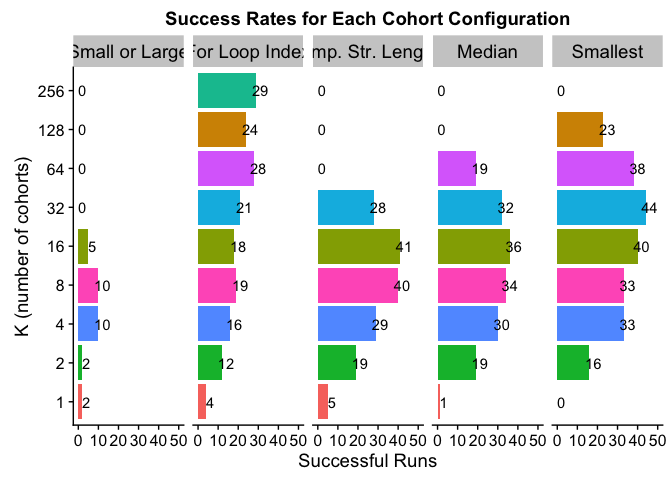
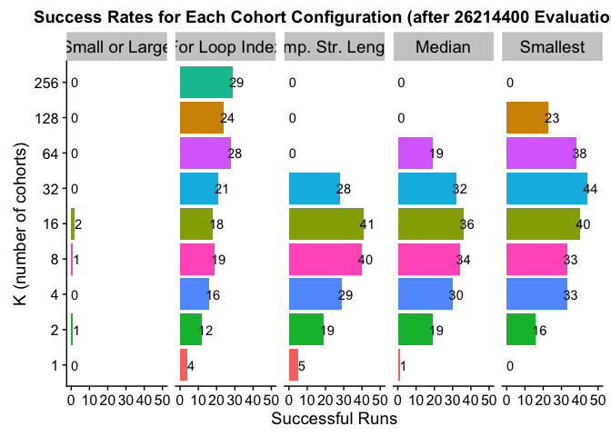
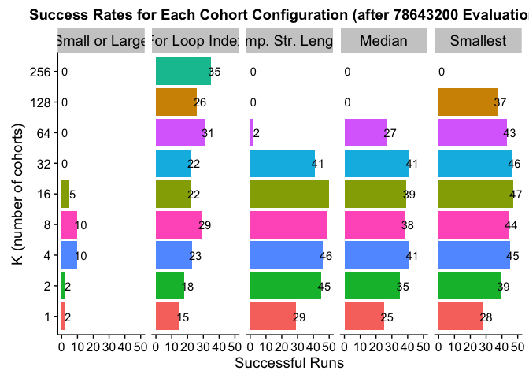
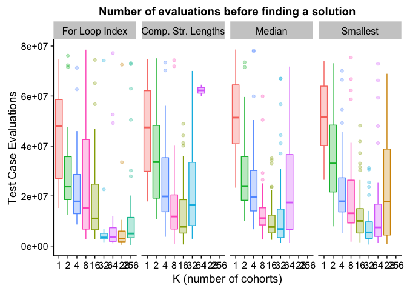
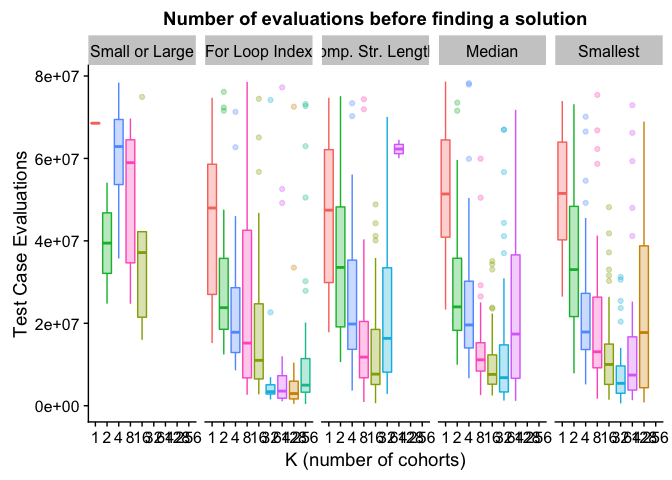

## Overview

Here, an overview of what we do in this here document.

## Analysis Setup

First, we'll load our R packages.


```r
library(tidyr)      # (Wickham & Henry, 2018)
library(ggplot2)    # (Wickham, 2009)
library(plyr)       # (Wickham, 2011)
library(dplyr)      # (Wickham et al., 2018)
library(cowplot)    # (Wilke, 2018)
library(readr)
library(rcompanion) # (Mangiafico, 2019)
```

## Data Loading

Note, the path information used here is accurate for the directory structure used in our Git repository (LINK ANONYMIZED).

First, we'll load solution data after a fixed number of _evaluations_:


```r
# (1) After 26214400 total evaluations (100 generations of std lex)
solutions_e26214400_data_loc <- "../data/exp-data/min_programs__eval_26214400.csv"
prog_solutions_e26214400 <- read.csv(solutions_e26214400_data_loc, na.strings = "NONE")

# (2) After 78643200 total evaluations (300 generations of std lex)
solutions_e78643200_data_loc <- "../data/exp-data/min_programs__eval_78643200.csv"
prog_solutions_e78643200 <- read.csv(solutions_e78643200_data_loc, na.strings = "NONE")

# (3) Load summary of solution data (contingency tables), which contains both time points.
prog_solutions_evals_summary <- read.csv("../data/exp-data/min_programs__eval_all__solutions_summary.csv", na.strings = "NONE")
```

Next, we'll load solution data after a fixed number of _generations_:


```r
# (1) After 100 generations (for all conditions)
solutions_u100_data_loc <- "../data/exp-data/min_programs__update_100.csv"
prog_solutions_u100 <- read.csv(solutions_u100_data_loc, na.strings = "NONE")

# (2) After 300 generations (for all conditions)
solutions_u300_data_loc <- "../data/exp-data/min_programs__update_300.csv"
prog_solutions_u300 <- read.csv(solutions_u300_data_loc, na.strings = "NONE")

# (3) Load summary of solution data (contingency tables), which contains both time points.
prog_solutions_updates_summary <- read.csv("../data/exp-data/min_programs__update_all__solutions_summary.csv", na.strings = "NONE")
```

Below, we impose an ordering on the problems in the data (to make order of appearance in plotting consistent).


```r
prog_solutions_evals_summary$problem <- factor(prog_solutions_evals_summary$problem, levels=c('small-or-large','for-loop-index','compare-string-lengths','median','smallest'))

prog_solutions_updates_summary$problem <- factor(prog_solutions_updates_summary$problem, levels=c('small-or-large','for-loop-index','compare-string-lengths','median','smallest'))

prog_solutions_e78643200$problem <- factor(prog_solutions_e78643200$problem, levels=c('small-or-large','for-loop-index','compare-string-lengths','median','smallest'))

# A map from data column name to name to be used in figures.
problem_names <- c(
  'small-or-large'=        "Small or Large",
  'for-loop-index'=        "For Loop Index",
  'compare-string-lengths'="Comp. Str. Lengths",
  'median'=                "Median",
  'smallest'=              "Smallest"
)
```

## Given a Fixed number of evaluations, cohorts improve problem solving success

### Paper Figure

<!-- For four of the five problems (all but small or large), this figure gives the number of successful runs after 26214400 total evaluations (100 generations of standard lexicase). This was not sufficient time for solutions to evolve in small or large, so that problem is reported after 78643200 total evaluations (300 generations of standard lexicase). -->


```
## Warning: Removed 2 rows containing missing values (geom_text).

## Warning: Removed 2 rows containing missing values (geom_text).
```

<!-- -->

### After 26214400 Evaluations (100 generations of standard lexicase)

<!-- -->

#### Statistics - Compare string lengths


```r
prob_data <- filter(eval_26214400_clex_data, problem=="compare-string-lengths")
prob_data$successful_runs = prob_data$solutions_found
prob_data$failed_runs = prob_data$total_runs - prob_data$solutions_found
con_table <- matrix(c(prob_data$successful_runs, prob_data$failed_runs), nrow=length(prob_data$successful_runs))
rownames(con_table) <- prob_data$cohort_config
colnames(con_table) <- c("Successful Runs", "Failed Runs")
pairwiseNominalIndependence(con_table, fisher=TRUE, gtest=FALSE, chisq=FALSE, method="holm")
```

```
##               Comparison p.Fisher p.adj.Fisher
## 1  cn128:cs4 : cn16:cs32 2.49e-19     8.96e-18
## 2  cn128:cs4 : cn1:cs512 5.63e-02     5.63e-01
## 3  cn128:cs4 : cn256:cs2 1.00e+00     1.00e+00
## 4  cn128:cs4 : cn2:cs256 4.60e-07     1.01e-05
## 5  cn128:cs4 : cn32:cs16 3.55e-11     8.88e-10
## 6  cn128:cs4 : cn4:cs128 1.08e-11     3.02e-10
## 7   cn128:cs4 : cn64:cs8 1.00e+00     1.00e+00
## 8   cn128:cs4 : cn8:cs64 1.49e-18     4.92e-17
## 9  cn16:cs32 : cn1:cs512 1.48e-13     4.44e-12
## 10 cn16:cs32 : cn256:cs2 2.49e-19     8.96e-18
## 11 cn16:cs32 : cn2:cs256 1.26e-05     2.14e-04
## 12 cn16:cs32 : cn32:cs16 8.89e-03     1.24e-01
## 13 cn16:cs32 : cn4:cs128 1.56e-02     2.03e-01
## 14  cn16:cs32 : cn64:cs8 2.49e-19     8.96e-18
## 15  cn16:cs32 : cn8:cs64 1.00e+00     1.00e+00
## 16 cn1:cs512 : cn256:cs2 5.63e-02     5.63e-01
## 17 cn1:cs512 : cn2:cs256 1.92e-03     2.88e-02
## 18 cn1:cs512 : cn32:cs16 1.39e-06     2.50e-05
## 19 cn1:cs512 : cn4:cs128 5.31e-07     1.01e-05
## 20  cn1:cs512 : cn64:cs8 5.63e-02     5.63e-01
## 21  cn1:cs512 : cn8:cs64 7.28e-13     2.11e-11
## 22 cn256:cs2 : cn2:cs256 4.60e-07     1.01e-05
## 23 cn256:cs2 : cn32:cs16 3.55e-11     8.88e-10
## 24 cn256:cs2 : cn4:cs128 1.08e-11     3.02e-10
## 25  cn256:cs2 : cn64:cs8 1.00e+00     1.00e+00
## 26  cn256:cs2 : cn8:cs64 1.49e-18     4.92e-17
## 27 cn2:cs256 : cn32:cs16 1.09e-01     6.54e-01
## 28 cn2:cs256 : cn4:cs128 7.11e-02     5.63e-01
## 29  cn2:cs256 : cn64:cs8 4.60e-07     1.01e-05
## 30  cn2:cs256 : cn8:cs64 3.61e-05     5.78e-04
## 31 cn32:cs16 : cn4:cs128 1.00e+00     1.00e+00
## 32  cn32:cs16 : cn64:cs8 3.55e-11     8.88e-10
## 33  cn32:cs16 : cn8:cs64 1.77e-02     2.12e-01
## 34  cn4:cs128 : cn64:cs8 1.08e-11     3.02e-10
## 35  cn4:cs128 : cn8:cs64 2.97e-02     3.27e-01
## 36   cn64:cs8 : cn8:cs64 1.49e-18     4.92e-17
```

#### Statistics - For loop index


```r
prob_data <- filter(eval_26214400_clex_data, problem=="for-loop-index")
prob_data$successful_runs = prob_data$solutions_found
prob_data$failed_runs = prob_data$total_runs - prob_data$solutions_found
con_table <- matrix(c(prob_data$successful_runs, prob_data$failed_runs), nrow=length(prob_data$successful_runs))
rownames(con_table) <- prob_data$cohort_config
colnames(con_table) <- c("Successful Runs", "Failed Runs")
pairwiseNominalIndependence(con_table, fisher=TRUE, gtest=FALSE, chisq=FALSE, method="holm")
```

```
##               Comparison p.Fisher p.adj.Fisher
## 1  cn128:cs4 : cn16:cs32 3.11e-01     1.00e+00
## 2  cn128:cs4 : cn1:cs512 1.23e-05     4.18e-04
## 3  cn128:cs4 : cn256:cs2 4.23e-01     1.00e+00
## 4  cn128:cs4 : cn2:cs256 2.13e-02     5.54e-01
## 5  cn128:cs4 : cn32:cs16 6.88e-01     1.00e+00
## 6  cn128:cs4 : cn4:cs128 1.53e-01     1.00e+00
## 7   cn128:cs4 : cn64:cs8 5.48e-01     1.00e+00
## 8   cn128:cs4 : cn8:cs64 4.19e-01     1.00e+00
## 9  cn16:cs32 : cn1:cs512 1.31e-03     3.93e-02
## 10 cn16:cs32 : cn256:cs2 4.46e-02     1.00e+00
## 11 cn16:cs32 : cn2:cs256 2.75e-01     1.00e+00
## 12 cn16:cs32 : cn32:cs16 6.82e-01     1.00e+00
## 13 cn16:cs32 : cn4:cs128 8.33e-01     1.00e+00
## 14  cn16:cs32 : cn64:cs8 7.04e-02     1.00e+00
## 15  cn16:cs32 : cn8:cs64 1.00e+00     1.00e+00
## 16 cn1:cs512 : cn256:cs2 1.12e-07     4.03e-06
## 17 cn1:cs512 : cn2:cs256 5.38e-02     1.00e+00
## 18 cn1:cs512 : cn32:cs16 1.43e-04     4.72e-03
## 19 cn1:cs512 : cn4:cs128 5.04e-03     1.41e-01
## 20  cn1:cs512 : cn64:cs8 3.05e-07     1.07e-05
## 21  cn1:cs512 : cn8:cs64 6.45e-04     2.06e-02
## 22 cn256:cs2 : cn2:cs256 1.02e-03     3.16e-02
## 23 cn256:cs2 : cn32:cs16 1.61e-01     1.00e+00
## 24 cn256:cs2 : cn4:cs128 1.54e-02     4.16e-01
## 25  cn256:cs2 : cn64:cs8 1.00e+00     1.00e+00
## 26  cn256:cs2 : cn8:cs64 7.11e-02     1.00e+00
## 27 cn2:cs256 : cn32:cs16 8.81e-02     1.00e+00
## 28 cn2:cs256 : cn4:cs128 5.04e-01     1.00e+00
## 29  cn2:cs256 : cn64:cs8 2.02e-03     5.86e-02
## 30  cn2:cs256 : cn8:cs64 1.94e-01     1.00e+00
## 31 cn32:cs16 : cn4:cs128 4.08e-01     1.00e+00
## 32  cn32:cs16 : cn64:cs8 2.30e-01     1.00e+00
## 33  cn32:cs16 : cn8:cs64 8.38e-01     1.00e+00
## 34  cn4:cs128 : cn64:cs8 2.62e-02     6.55e-01
## 35  cn4:cs128 : cn8:cs64 6.75e-01     1.00e+00
## 36   cn64:cs8 : cn8:cs64 1.09e-01     1.00e+00
```

#### Statistics - Median


```r
prob_data <- filter(eval_26214400_clex_data, problem=="median")
prob_data$successful_runs = prob_data$solutions_found
prob_data$failed_runs = prob_data$total_runs - prob_data$solutions_found
con_table <- matrix(c(prob_data$successful_runs, prob_data$failed_runs), nrow=length(prob_data$successful_runs))
rownames(con_table) <- prob_data$cohort_config
colnames(con_table) <- c("Successful Runs", "Failed Runs")
pairwiseNominalIndependence(con_table, fisher=TRUE, gtest=FALSE, chisq=FALSE, method="holm")
```

```
##               Comparison p.Fisher p.adj.Fisher
## 1  cn128:cs4 : cn16:cs32 9.49e-16     3.42e-14
## 2  cn128:cs4 : cn1:cs512 1.00e+00     1.00e+00
## 3  cn128:cs4 : cn256:cs2 1.00e+00     1.00e+00
## 4  cn128:cs4 : cn2:cs256 4.60e-07     1.10e-05
## 5  cn128:cs4 : cn32:cs16 2.52e-13     7.81e-12
## 6  cn128:cs4 : cn4:cs128 3.21e-12     8.99e-11
## 7   cn128:cs4 : cn64:cs8 4.60e-07     1.10e-05
## 8   cn128:cs4 : cn8:cs64 1.70e-14     5.78e-13
## 9  cn16:cs32 : cn1:cs512 2.76e-14     8.83e-13
## 10 cn16:cs32 : cn256:cs2 9.49e-16     3.42e-14
## 11 cn16:cs32 : cn2:cs256 1.18e-03     2.12e-02
## 12 cn16:cs32 : cn32:cs16 5.21e-01     1.00e+00
## 13 cn16:cs32 : cn4:cs128 2.91e-01     1.00e+00
## 14  cn16:cs32 : cn64:cs8 1.18e-03     2.12e-02
## 15  cn16:cs32 : cn8:cs64 8.28e-01     1.00e+00
## 16 cn1:cs512 : cn256:cs2 1.00e+00     1.00e+00
## 17 cn1:cs512 : cn2:cs256 5.85e-06     1.17e-04
## 18 cn1:cs512 : cn32:cs16 6.19e-12     1.61e-10
## 19 cn1:cs512 : cn4:cs128 7.20e-11     1.80e-09
## 20  cn1:cs512 : cn64:cs8 5.85e-06     1.17e-04
## 21  cn1:cs512 : cn8:cs64 4.54e-13     1.32e-11
## 22 cn256:cs2 : cn2:cs256 4.60e-07     1.10e-05
## 23 cn256:cs2 : cn32:cs16 2.52e-13     7.81e-12
## 24 cn256:cs2 : cn4:cs128 3.21e-12     8.99e-11
## 25  cn256:cs2 : cn64:cs8 4.60e-07     1.10e-05
## 26  cn256:cs2 : cn8:cs64 1.70e-14     5.78e-13
## 27 cn2:cs256 : cn32:cs16 1.59e-02     2.23e-01
## 28 cn2:cs256 : cn4:cs128 4.49e-02     5.39e-01
## 29  cn2:cs256 : cn64:cs8 1.00e+00     1.00e+00
## 30  cn2:cs256 : cn8:cs64 4.78e-03     7.65e-02
## 31 cn32:cs16 : cn4:cs128 8.37e-01     1.00e+00
## 32  cn32:cs16 : cn64:cs8 1.59e-02     2.23e-01
## 33  cn32:cs16 : cn8:cs64 8.33e-01     1.00e+00
## 34  cn4:cs128 : cn64:cs8 4.49e-02     5.39e-01
## 35  cn4:cs128 : cn8:cs64 5.32e-01     1.00e+00
## 36   cn64:cs8 : cn8:cs64 4.78e-03     7.65e-02
```

#### Statistics - Small or large


```r
prob_data <- filter(eval_26214400_clex_data, problem=="small-or-large")
prob_data$successful_runs = prob_data$solutions_found
prob_data$failed_runs = prob_data$total_runs - prob_data$solutions_found
con_table <- matrix(c(prob_data$successful_runs, prob_data$failed_runs), nrow=length(prob_data$successful_runs))
rownames(con_table) <- prob_data$cohort_config
colnames(con_table) <- c("Successful Runs", "Failed Runs")
pairwiseNominalIndependence(con_table, fisher=TRUE, gtest=FALSE, chisq=FALSE, method="holm")
```

```
##               Comparison p.Fisher p.adj.Fisher
## 1  cn128:cs4 : cn16:cs32    0.495            1
## 2  cn128:cs4 : cn1:cs512    1.000            1
## 3  cn128:cs4 : cn256:cs2    1.000            1
## 4  cn128:cs4 : cn2:cs256    1.000            1
## 5  cn128:cs4 : cn32:cs16    1.000            1
## 6  cn128:cs4 : cn4:cs128    1.000            1
## 7   cn128:cs4 : cn64:cs8    1.000            1
## 8   cn128:cs4 : cn8:cs64    1.000            1
## 9  cn16:cs32 : cn1:cs512    0.495            1
## 10 cn16:cs32 : cn256:cs2    0.495            1
## 11 cn16:cs32 : cn2:cs256    1.000            1
## 12 cn16:cs32 : cn32:cs16    0.495            1
## 13 cn16:cs32 : cn4:cs128    0.495            1
## 14  cn16:cs32 : cn64:cs8    0.495            1
## 15  cn16:cs32 : cn8:cs64    1.000            1
## 16 cn1:cs512 : cn256:cs2    1.000            1
## 17 cn1:cs512 : cn2:cs256    1.000            1
## 18 cn1:cs512 : cn32:cs16    1.000            1
## 19 cn1:cs512 : cn4:cs128    1.000            1
## 20  cn1:cs512 : cn64:cs8    1.000            1
## 21  cn1:cs512 : cn8:cs64    1.000            1
## 22 cn256:cs2 : cn2:cs256    1.000            1
## 23 cn256:cs2 : cn32:cs16    1.000            1
## 24 cn256:cs2 : cn4:cs128    1.000            1
## 25  cn256:cs2 : cn64:cs8    1.000            1
## 26  cn256:cs2 : cn8:cs64    1.000            1
## 27 cn2:cs256 : cn32:cs16    1.000            1
## 28 cn2:cs256 : cn4:cs128    1.000            1
## 29  cn2:cs256 : cn64:cs8    1.000            1
## 30  cn2:cs256 : cn8:cs64    1.000            1
## 31 cn32:cs16 : cn4:cs128    1.000            1
## 32  cn32:cs16 : cn64:cs8    1.000            1
## 33  cn32:cs16 : cn8:cs64    1.000            1
## 34  cn4:cs128 : cn64:cs8    1.000            1
## 35  cn4:cs128 : cn8:cs64    1.000            1
## 36   cn64:cs8 : cn8:cs64    1.000            1
```

#### Statistics - Smallest


```r
prob_data <- filter(eval_26214400_clex_data, problem=="smallest")
prob_data$successful_runs = prob_data$solutions_found
prob_data$failed_runs = prob_data$total_runs - prob_data$solutions_found
con_table <- matrix(c(prob_data$successful_runs, prob_data$failed_runs), nrow=length(prob_data$successful_runs))
rownames(con_table) <- prob_data$cohort_config
colnames(con_table) <- c("Successful Runs", "Failed Runs")
pairwiseNominalIndependence(con_table, fisher=TRUE, gtest=FALSE, chisq=FALSE, method="holm")
```

```
##               Comparison p.Fisher p.adj.Fisher
## 1  cn128:cs4 : cn16:cs32 8.03e-04     1.45e-02
## 2  cn128:cs4 : cn1:cs512 8.69e-09     2.26e-07
## 3  cn128:cs4 : cn256:cs2 8.69e-09     2.26e-07
## 4  cn128:cs4 : cn2:cs256 2.18e-01     1.00e+00
## 5  cn128:cs4 : cn32:cs16 1.30e-05     2.60e-04
## 6  cn128:cs4 : cn4:cs128 6.93e-02     8.32e-01
## 7   cn128:cs4 : cn64:cs8 3.83e-03     5.74e-02
## 8   cn128:cs4 : cn8:cs64 6.93e-02     8.32e-01
## 9  cn16:cs32 : cn1:cs512 1.49e-18     5.07e-17
## 10 cn16:cs32 : cn256:cs2 1.49e-18     5.07e-17
## 11 cn16:cs32 : cn2:cs256 2.30e-06     5.29e-05
## 12 cn16:cs32 : cn32:cs16 4.14e-01     1.00e+00
## 13 cn16:cs32 : cn4:cs128 1.76e-01     1.00e+00
## 14  cn16:cs32 : cn64:cs8 8.10e-01     1.00e+00
## 15  cn16:cs32 : cn8:cs64 1.76e-01     1.00e+00
## 16 cn1:cs512 : cn256:cs2 1.00e+00     1.00e+00
## 17 cn1:cs512 : cn2:cs256 7.32e-06     1.61e-04
## 18 cn1:cs512 : cn32:cs16 6.44e-22     2.32e-20
## 19 cn1:cs512 : cn4:cs128 6.68e-14     2.00e-12
## 20  cn1:cs512 : cn64:cs8 4.28e-17     1.37e-15
## 21  cn1:cs512 : cn8:cs64 6.68e-14     2.00e-12
## 22 cn256:cs2 : cn2:cs256 7.32e-06     1.61e-04
## 23 cn256:cs2 : cn32:cs16 6.44e-22     2.32e-20
## 24 cn256:cs2 : cn4:cs128 6.68e-14     2.00e-12
## 25  cn256:cs2 : cn64:cs8 4.28e-17     1.37e-15
## 26  cn256:cs2 : cn8:cs64 6.68e-14     2.00e-12
## 27 cn2:cs256 : cn32:cs16 1.21e-08     2.90e-07
## 28 cn2:cs256 : cn4:cs128 1.25e-03     2.13e-02
## 29  cn2:cs256 : cn64:cs8 1.88e-05     3.57e-04
## 30  cn2:cs256 : cn8:cs64 1.25e-03     2.13e-02
## 31 cn32:cs16 : cn4:cs128 1.63e-02     2.28e-01
## 32  cn32:cs16 : cn64:cs8 1.92e-01     1.00e+00
## 33  cn32:cs16 : cn8:cs64 1.63e-02     2.28e-01
## 34  cn4:cs128 : cn64:cs8 3.78e-01     1.00e+00
## 35  cn4:cs128 : cn8:cs64 1.00e+00     1.00e+00
## 36   cn64:cs8 : cn8:cs64 3.78e-01     1.00e+00
```

### After 78643200 Evaluations (300 generations of standard lexicase)


```
## Warning: Removed 2 rows containing missing values (geom_text).
```

<!-- -->

#### Statistics - Compare string lengths


```r
prob_data <- filter(eval_78643200_clex_data, problem=="compare-string-lengths")
prob_data$successful_runs = prob_data$solutions_found
prob_data$failed_runs = prob_data$total_runs - prob_data$solutions_found
con_table <- matrix(c(prob_data$successful_runs, prob_data$failed_runs), nrow=length(prob_data$successful_runs))
rownames(con_table) <- prob_data$cohort_config
colnames(con_table) <- c("Successful Runs", "Failed Runs")
pairwiseNominalIndependence(con_table, fisher=TRUE, gtest=FALSE, chisq=FALSE, method="holm")
```

```
##               Comparison p.Fisher p.adj.Fisher
## 1  cn128:cs4 : cn16:cs32 1.98e-29     7.13e-28
## 2  cn128:cs4 : cn1:cs512 1.08e-11     2.27e-10
## 3  cn128:cs4 : cn256:cs2 1.00e+00     1.00e+00
## 4  cn128:cs4 : cn2:cs256 6.90e-23     1.93e-21
## 5  cn128:cs4 : cn32:cs16 2.49e-19     5.98e-18
## 6  cn128:cs4 : cn4:cs128 6.27e-24     1.88e-22
## 7   cn128:cs4 : cn64:cs8 4.95e-01     1.00e+00
## 8   cn128:cs4 : cn8:cs64 1.01e-27     3.43e-26
## 9  cn16:cs32 : cn1:cs512 6.59e-08     1.19e-06
## 10 cn16:cs32 : cn256:cs2 1.98e-29     7.13e-28
## 11 cn16:cs32 : cn2:cs256 5.63e-02     6.19e-01
## 12 cn16:cs32 : cn32:cs16 2.63e-03     3.68e-02
## 13 cn16:cs32 : cn4:cs128 1.17e-01     1.00e+00
## 14  cn16:cs32 : cn64:cs8 2.63e-26     8.42e-25
## 15  cn16:cs32 : cn8:cs64 1.00e+00     1.00e+00
## 16 cn1:cs512 : cn256:cs2 1.08e-11     2.27e-10
## 17 cn1:cs512 : cn2:cs256 4.73e-04     7.10e-03
## 18 cn1:cs512 : cn32:cs16 1.56e-02     2.03e-01
## 19 cn1:cs512 : cn4:cs128 1.43e-04     2.29e-03
## 20  cn1:cs512 : cn64:cs8 2.56e-09     4.86e-08
## 21  cn1:cs512 : cn8:cs64 9.42e-07     1.60e-05
## 22 cn256:cs2 : cn2:cs256 6.90e-23     1.93e-21
## 23 cn256:cs2 : cn32:cs16 2.49e-19     5.98e-18
## 24 cn256:cs2 : cn4:cs128 6.27e-24     1.88e-22
## 25  cn256:cs2 : cn64:cs8 4.95e-01     1.00e+00
## 26  cn256:cs2 : cn8:cs64 1.01e-27     3.43e-26
## 27 cn2:cs256 : cn32:cs16 3.88e-01     1.00e+00
## 28 cn2:cs256 : cn4:cs128 1.00e+00     1.00e+00
## 29  cn2:cs256 : cn64:cs8 6.18e-20     1.54e-18
## 30  cn2:cs256 : cn8:cs64 2.04e-01     1.00e+00
## 31 cn32:cs16 : cn4:cs128 2.34e-01     1.00e+00
## 32  cn32:cs16 : cn64:cs8 1.62e-16     3.56e-15
## 33  cn32:cs16 : cn8:cs64 1.57e-02     2.03e-01
## 34  cn4:cs128 : cn64:cs8 6.07e-21     1.58e-19
## 35  cn4:cs128 : cn8:cs64 3.62e-01     1.00e+00
## 36   cn64:cs8 : cn8:cs64 1.24e-24     3.84e-23
```

#### Statistics - For loop index


```r
prob_data <- filter(eval_78643200_clex_data, problem=="for-loop-index")
prob_data$successful_runs = prob_data$solutions_found
prob_data$failed_runs = prob_data$total_runs - prob_data$solutions_found
con_table <- matrix(c(prob_data$successful_runs, prob_data$failed_runs), nrow=length(prob_data$successful_runs))
rownames(con_table) <- prob_data$cohort_config
colnames(con_table) <- c("Successful Runs", "Failed Runs")
pairwiseNominalIndependence(con_table, fisher=TRUE, gtest=FALSE, chisq=FALSE, method="holm")
```

```
##               Comparison p.Fisher p.adj.Fisher
## 1  cn128:cs4 : cn16:cs32 0.548000      1.00000
## 2  cn128:cs4 : cn1:cs512 0.041400      1.00000
## 3  cn128:cs4 : cn256:cs2 0.100000      1.00000
## 4  cn128:cs4 : cn2:cs256 0.158000      1.00000
## 5  cn128:cs4 : cn32:cs16 0.548000      1.00000
## 6  cn128:cs4 : cn4:cs128 0.689000      1.00000
## 7   cn128:cs4 : cn64:cs8 0.419000      1.00000
## 8   cn128:cs4 : cn8:cs64 0.688000      1.00000
## 9  cn16:cs32 : cn1:cs512 0.214000      1.00000
## 10 cn16:cs32 : cn256:cs2 0.014900      0.47700
## 11 cn16:cs32 : cn2:cs256 0.541000      1.00000
## 12 cn16:cs32 : cn32:cs16 1.000000      1.00000
## 13 cn16:cs32 : cn4:cs128 1.000000      1.00000
## 14  cn16:cs32 : cn64:cs8 0.109000      1.00000
## 15  cn16:cs32 : cn8:cs64 0.230000      1.00000
## 16 cn1:cs512 : cn256:cs2 0.000121      0.00436
## 17 cn1:cs512 : cn2:cs256 0.671000      1.00000
## 18 cn1:cs512 : cn32:cs16 0.214000      1.00000
## 19 cn1:cs512 : cn4:cs128 0.149000      1.00000
## 20  cn1:cs512 : cn64:cs8 0.002440      0.08300
## 21  cn1:cs512 : cn8:cs64 0.008470      0.28000
## 22 cn256:cs2 : cn2:cs256 0.001230      0.04300
## 23 cn256:cs2 : cn32:cs16 0.014900      0.47700
## 24 cn256:cs2 : cn4:cs128 0.025300      0.73400
## 25  cn256:cs2 : cn64:cs8 0.527000      1.00000
## 26  cn256:cs2 : cn8:cs64 0.298000      1.00000
## 27 cn2:cs256 : cn32:cs16 0.541000      1.00000
## 28 cn2:cs256 : cn4:cs128 0.416000      1.00000
## 29  cn2:cs256 : cn64:cs8 0.015900      0.47700
## 30  cn2:cs256 : cn8:cs64 0.044600      1.00000
## 31 cn32:cs16 : cn4:cs128 1.000000      1.00000
## 32  cn32:cs16 : cn64:cs8 0.109000      1.00000
## 33  cn32:cs16 : cn8:cs64 0.230000      1.00000
## 34  cn4:cs128 : cn64:cs8 0.160000      1.00000
## 35  cn4:cs128 : cn8:cs64 0.317000      1.00000
## 36   cn64:cs8 : cn8:cs64 0.838000      1.00000
```

#### Statistics - Median


```r
prob_data <- filter(eval_78643200_clex_data, problem=="median")
prob_data$successful_runs = prob_data$solutions_found
prob_data$failed_runs = prob_data$total_runs - prob_data$solutions_found
con_table <- matrix(c(prob_data$successful_runs, prob_data$failed_runs), nrow=length(prob_data$successful_runs))
rownames(con_table) <- prob_data$cohort_config
colnames(con_table) <- c("Successful Runs", "Failed Runs")
pairwiseNominalIndependence(con_table, fisher=TRUE, gtest=FALSE, chisq=FALSE, method="holm")
```

```
##               Comparison p.Fisher p.adj.Fisher
## 1  cn128:cs4 : cn16:cs32 8.29e-18     2.65e-16
## 2  cn128:cs4 : cn1:cs512 1.04e-09     2.50e-08
## 3  cn128:cs4 : cn256:cs2 1.00e+00     1.00e+00
## 4  cn128:cs4 : cn2:cs256 4.11e-15     1.15e-13
## 5  cn128:cs4 : cn32:cs16 2.49e-19     8.96e-18
## 6  cn128:cs4 : cn4:cs128 2.49e-19     8.96e-18
## 7   cn128:cs4 : cn64:cs8 1.13e-10     2.94e-09
## 8   cn128:cs4 : cn8:cs64 4.28e-17     1.28e-15
## 9  cn16:cs32 : cn1:cs512 6.37e-03     1.15e-01
## 10 cn16:cs32 : cn256:cs2 8.29e-18     2.65e-16
## 11 cn16:cs32 : cn2:cs256 4.95e-01     1.00e+00
## 12 cn16:cs32 : cn32:cs16 8.03e-01     1.00e+00
## 13 cn16:cs32 : cn4:cs128 8.03e-01     1.00e+00
## 14  cn16:cs32 : cn64:cs8 1.96e-02     3.14e-01
## 15  cn16:cs32 : cn8:cs64 1.00e+00     1.00e+00
## 16 cn1:cs512 : cn256:cs2 1.04e-09     2.50e-08
## 17 cn1:cs512 : cn2:cs256 6.56e-02     9.18e-01
## 18 cn1:cs512 : cn32:cs16 1.36e-03     2.99e-02
## 19 cn1:cs512 : cn4:cs128 1.36e-03     2.99e-02
## 20  cn1:cs512 : cn64:cs8 8.41e-01     1.00e+00
## 21  cn1:cs512 : cn8:cs64 1.24e-02     2.11e-01
## 22 cn256:cs2 : cn2:cs256 4.11e-15     1.15e-13
## 23 cn256:cs2 : cn32:cs16 2.49e-19     8.96e-18
## 24 cn256:cs2 : cn4:cs128 2.49e-19     8.96e-18
## 25  cn256:cs2 : cn64:cs8 1.13e-10     2.94e-09
## 26  cn256:cs2 : cn8:cs64 4.28e-17     1.28e-15
## 27 cn2:cs256 : cn32:cs16 2.41e-01     1.00e+00
## 28 cn2:cs256 : cn4:cs128 2.41e-01     1.00e+00
## 29  cn2:cs256 : cn64:cs8 1.49e-01     1.00e+00
## 30  cn2:cs256 : cn8:cs64 6.53e-01     1.00e+00
## 31 cn32:cs16 : cn4:cs128 1.00e+00     1.00e+00
## 32  cn32:cs16 : cn64:cs8 4.91e-03     9.82e-02
## 33  cn32:cs16 : cn8:cs64 6.24e-01     1.00e+00
## 34  cn4:cs128 : cn64:cs8 4.91e-03     9.82e-02
## 35  cn4:cs128 : cn8:cs64 6.24e-01     1.00e+00
## 36   cn64:cs8 : cn8:cs64 3.53e-02     5.30e-01
```

#### Statistics - Small or large


```r
prob_data <- filter(eval_78643200_clex_data, problem=="small-or-large")
prob_data$successful_runs = prob_data$solutions_found
prob_data$failed_runs = prob_data$total_runs - prob_data$solutions_found
con_table <- matrix(c(prob_data$successful_runs, prob_data$failed_runs), nrow=length(prob_data$successful_runs))
rownames(con_table) <- prob_data$cohort_config
colnames(con_table) <- c("Successful Runs", "Failed Runs")
pairwiseNominalIndependence(con_table, fisher=TRUE, gtest=FALSE, chisq=FALSE, method="holm")
```

```
##               Comparison p.Fisher p.adj.Fisher
## 1  cn128:cs4 : cn16:cs32  0.05630       1.0000
## 2  cn128:cs4 : cn1:cs512  0.49500       1.0000
## 3  cn128:cs4 : cn256:cs2  1.00000       1.0000
## 4  cn128:cs4 : cn2:cs256  0.49500       1.0000
## 5  cn128:cs4 : cn32:cs16  1.00000       1.0000
## 6  cn128:cs4 : cn4:cs128  0.00119       0.0428
## 7   cn128:cs4 : cn64:cs8  1.00000       1.0000
## 8   cn128:cs4 : cn8:cs64  0.00119       0.0428
## 9  cn16:cs32 : cn1:cs512  0.43600       1.0000
## 10 cn16:cs32 : cn256:cs2  0.05630       1.0000
## 11 cn16:cs32 : cn2:cs256  0.43600       1.0000
## 12 cn16:cs32 : cn32:cs16  0.05630       1.0000
## 13 cn16:cs32 : cn4:cs128  0.26200       1.0000
## 14  cn16:cs32 : cn64:cs8  0.05630       1.0000
## 15  cn16:cs32 : cn8:cs64  0.26200       1.0000
## 16 cn1:cs512 : cn256:cs2  0.49500       1.0000
## 17 cn1:cs512 : cn2:cs256  1.00000       1.0000
## 18 cn1:cs512 : cn32:cs16  0.49500       1.0000
## 19 cn1:cs512 : cn4:cs128  0.02770       0.7760
## 20  cn1:cs512 : cn64:cs8  0.49500       1.0000
## 21  cn1:cs512 : cn8:cs64  0.02770       0.7760
## 22 cn256:cs2 : cn2:cs256  0.49500       1.0000
## 23 cn256:cs2 : cn32:cs16  1.00000       1.0000
## 24 cn256:cs2 : cn4:cs128  0.00119       0.0428
## 25  cn256:cs2 : cn64:cs8  1.00000       1.0000
## 26  cn256:cs2 : cn8:cs64  0.00119       0.0428
## 27 cn2:cs256 : cn32:cs16  0.49500       1.0000
## 28 cn2:cs256 : cn4:cs128  0.02770       0.7760
## 29  cn2:cs256 : cn64:cs8  0.49500       1.0000
## 30  cn2:cs256 : cn8:cs64  0.02770       0.7760
## 31 cn32:cs16 : cn4:cs128  0.00119       0.0428
## 32  cn32:cs16 : cn64:cs8  1.00000       1.0000
## 33  cn32:cs16 : cn8:cs64  0.00119       0.0428
## 34  cn4:cs128 : cn64:cs8  0.00119       0.0428
## 35  cn4:cs128 : cn8:cs64  1.00000       1.0000
## 36   cn64:cs8 : cn8:cs64  0.00119       0.0428
```

#### Statistics - Smallest


```r
prob_data <- filter(eval_78643200_clex_data, problem=="smallest")
prob_data$successful_runs = prob_data$solutions_found
prob_data$failed_runs = prob_data$total_runs - prob_data$solutions_found
con_table <- matrix(c(prob_data$successful_runs, prob_data$failed_runs), nrow=length(prob_data$successful_runs))
rownames(con_table) <- prob_data$cohort_config
colnames(con_table) <- c("Successful Runs", "Failed Runs")
pairwiseNominalIndependence(con_table, fisher=TRUE, gtest=FALSE, chisq=FALSE, method="holm")
```

```
##               Comparison p.Fisher p.adj.Fisher
## 1  cn128:cs4 : cn16:cs32 1.22e-02     2.81e-01
## 2  cn128:cs4 : cn1:cs512 9.28e-02     1.00e+00
## 3  cn128:cs4 : cn256:cs2 2.08e-16     6.24e-15
## 4  cn128:cs4 : cn2:cs256 8.15e-01     1.00e+00
## 5  cn128:cs4 : cn32:cs16 3.10e-02     6.82e-01
## 6  cn128:cs4 : cn4:cs128 6.64e-02     1.00e+00
## 7   cn128:cs4 : cn64:cs8 2.11e-01     1.00e+00
## 8   cn128:cs4 : cn8:cs64 1.25e-01     1.00e+00
## 9  cn16:cs32 : cn1:cs512 1.55e-05     4.34e-04
## 10 cn16:cs32 : cn256:cs2 4.64e-25     1.67e-23
## 11 cn16:cs32 : cn2:cs256 4.07e-02     8.14e-01
## 12 cn16:cs32 : cn32:cs16 1.00e+00     1.00e+00
## 13 cn16:cs32 : cn4:cs128 7.15e-01     1.00e+00
## 14  cn16:cs32 : cn64:cs8 3.18e-01     1.00e+00
## 15  cn16:cs32 : cn8:cs64 4.87e-01     1.00e+00
## 16 cn1:cs512 : cn256:cs2 3.55e-11     1.03e-09
## 17 cn1:cs512 : cn2:cs256 3.27e-02     6.87e-01
## 18 cn1:cs512 : cn32:cs16 6.49e-05     1.75e-03
## 19 cn1:cs512 : cn4:cs128 2.25e-04     5.85e-03
## 20  cn1:cs512 : cn64:cs8 1.75e-03     4.20e-02
## 21  cn1:cs512 : cn8:cs64 6.68e-04     1.67e-02
## 22 cn256:cs2 : cn2:cs256 8.29e-18     2.57e-16
## 23 cn256:cs2 : cn32:cs16 6.27e-24     2.19e-22
## 24 cn256:cs2 : cn4:cs128 6.90e-23     2.35e-21
## 25  cn256:cs2 : cn64:cs8 5.24e-21     1.68e-19
## 26  cn256:cs2 : cn8:cs64 6.44e-22     2.13e-20
## 27 cn2:cs256 : cn32:cs16 9.05e-02     1.00e+00
## 28 cn2:cs256 : cn4:cs128 1.71e-01     1.00e+00
## 29  cn2:cs256 : cn64:cs8 4.36e-01     1.00e+00
## 30  cn2:cs256 : cn8:cs64 2.87e-01     1.00e+00
## 31 cn32:cs16 : cn4:cs128 1.00e+00     1.00e+00
## 32  cn32:cs16 : cn64:cs8 5.25e-01     1.00e+00
## 33  cn32:cs16 : cn8:cs64 7.41e-01     1.00e+00
## 34  cn4:cs128 : cn64:cs8 7.60e-01     1.00e+00
## 35  cn4:cs128 : cn8:cs64 1.00e+00     1.00e+00
## 36   cn64:cs8 : cn8:cs64 1.00e+00     1.00e+00
```


## Cohort lexicase solves problems with less computational effort

### Paper Figure

Because selection schemes were statistically indistiguishable on the small or large problem, we leave that problem out the analyses presented in the paper. However, it is included in analyses below.

To give more time for different conditions to yield solutions, we ran everything for 78643200 total evaluations.

<!-- -->

### After 78643200 Total Evaluations

<!-- -->

#### Statistics - Small Or Large


```r
eval_data <- filter(prog_solutions_e78643200, problem=="small-or-large" & sel_mode == "cohort lex" & !is.na(evaluation_first_solution_found))
kruskal.test(evaluation_first_solution_found ~ cohort_config, eval_data)
```

```
## 
## 	Kruskal-Wallis rank sum test
## 
## data:  evaluation_first_solution_found by cohort_config
## Kruskal-Wallis chi-squared = 6.6216, df = 4, p-value = 0.1573
```

```r
pairwise.wilcox.test(x=eval_data$evaluation_first_solution_found, g=eval_data$cohort_config, exact=FALSE, p.adjust.method = "holm")
```

```
## 
## 	Pairwise comparisons using Wilcoxon rank sum test 
## 
## data:  eval_data$evaluation_first_solution_found and eval_data$cohort_config 
## 
##           cn1:cs512 cn16:cs32 cn2:cs256 cn4:cs128
## cn16:cs32 1         -         -         -        
## cn2:cs256 1         1         -         -        
## cn4:cs128 1         1         1         -        
## cn8:cs64  1         1         1         1        
## 
## P value adjustment method: holm
```

```r
cfgs <- c()
meds <- c()
for (cfg in levels(eval_data$cohort_config)) {
  cfgs <- c(cfgs, cfg)
  med  <- median(filter(eval_data, cohort_config==cfg)$evaluation_first_solution_found)
  meds <- c(meds, med)
}
df<-as.data.frame(x=cfgs)
df$medians<-meds
arrange(df, meds)
```

```
##        cfgs  medians
## 1 cn16:cs32 37158900
## 2 cn2:cs256 39452650
## 3  cn8:cs64 58966000
## 4 cn4:cs128 62881800
## 5 cn1:cs512 68550650
## 6 cn128:cs4       NA
## 7 cn256:cs2       NA
## 8 cn32:cs16       NA
## 9  cn64:cs8       NA
```

#### Statistics - For Loop Index


```r
eval_data <- filter(prog_solutions_e78643200, problem=="for-loop-index" & sel_mode == "cohort lex" & !is.na(evaluation_first_solution_found))
kruskal.test(evaluation_first_solution_found ~ cohort_config, eval_data)
```

```
## 
## 	Kruskal-Wallis rank sum test
## 
## data:  evaluation_first_solution_found by cohort_config
## Kruskal-Wallis chi-squared = 93.686, df = 8, p-value < 2.2e-16
```

```r
pairwise.wilcox.test(x=eval_data$evaluation_first_solution_found, g=eval_data$cohort_config, exact=FALSE, p.adjust.method = "holm")
```

```
## 
## 	Pairwise comparisons using Wilcoxon rank sum test 
## 
## data:  eval_data$evaluation_first_solution_found and eval_data$cohort_config 
## 
##           cn1:cs512 cn128:cs4 cn16:cs32 cn2:cs256 cn256:cs2 cn32:cs16
## cn128:cs4 6.3e-05   -         -         -         -         -        
## cn16:cs32 0.01270   0.00211   -         -         -         -        
## cn2:cs256 0.77274   3.6e-05   0.07341   -         -         -        
## cn256:cs2 0.00060   0.85649   0.22199   0.00101   -         -        
## cn32:cs16 0.00014   1.00000   0.00211   6.3e-05   1.00000   -        
## cn4:cs128 0.02475   1.9e-05   0.50564   0.55161   0.00211   3.7e-05  
## cn64:cs8  0.00011   1.00000   0.00488   5.6e-05   1.00000   1.00000  
## cn8:cs64  0.13533   0.00021   1.00000   0.55161   0.01699   0.00045  
##           cn4:cs128 cn64:cs8
## cn128:cs4 -         -       
## cn16:cs32 -         -       
## cn2:cs256 -         -       
## cn256:cs2 -         -       
## cn32:cs16 -         -       
## cn4:cs128 -         -       
## cn64:cs8  3.4e-05   -       
## cn8:cs64  1.00000   0.00036 
## 
## P value adjustment method: holm
```

```r
cfgs <- c()
meds <- c()
for (cfg in levels(eval_data$cohort_config)) {
  cfgs <- c(cfgs, cfg)
  med  <- median(filter(eval_data, cohort_config==cfg)$evaluation_first_solution_found)
  meds <- c(meds, med)
}
df<-as.data.frame(x=cfgs)
df$medians<-meds
arrange(df, meds)
```

```
##        cfgs  medians
## 1 cn128:cs4  2955260
## 2 cn32:cs16  3407870
## 3  cn64:cs8  3551230
## 4 cn256:cs2  4990980
## 5 cn16:cs32 11010050
## 6  cn8:cs64 15204400
## 7 cn4:cs128 17825800
## 8 cn2:cs256 23789550
## 9 cn1:cs512 47972400
```

#### Statistics - Compare String Lengths


```r
eval_data <- filter(prog_solutions_e78643200, problem=="compare-string-lengths" & sel_mode == "cohort lex" & !is.na(evaluation_first_solution_found))
kruskal.test(evaluation_first_solution_found ~ cohort_config, eval_data)
```

```
## 
## 	Kruskal-Wallis rank sum test
## 
## data:  evaluation_first_solution_found by cohort_config
## Kruskal-Wallis chi-squared = 80.273, df = 6, p-value = 3.138e-15
```

```r
pairwise.wilcox.test(x=eval_data$evaluation_first_solution_found, g=eval_data$cohort_config, exact=FALSE, p.adjust.method = "holm")
```

```
## 
## 	Pairwise comparisons using Wilcoxon rank sum test 
## 
## data:  eval_data$evaluation_first_solution_found and eval_data$cohort_config 
## 
##           cn1:cs512 cn16:cs32 cn2:cs256 cn32:cs16 cn4:cs128 cn64:cs8
## cn16:cs32 8.6e-09   -         -         -         -         -       
## cn2:cs256 0.11958   1.1e-07   -         -         -         -       
## cn32:cs16 0.00018   0.11958   0.01763   -         -         -       
## cn4:cs128 0.00013   0.00107   0.11326   0.68496   -         -       
## cn64:cs8  0.68496   0.16650   0.24651   0.30444   0.24651   -       
## cn8:cs64  9.1e-08   0.68496   1.7e-06   0.68496   0.02800   0.24651 
## 
## P value adjustment method: holm
```

```r
cfgs <- c()
meds <- c()
for (cfg in levels(eval_data$cohort_config)) {
  cfgs <- c(cfgs, cfg)
  med  <- median(filter(eval_data, cohort_config==cfg)$evaluation_first_solution_found)
  meds <- c(meds, med)
}
df<-as.data.frame(x=cfgs)
df$medians<-meds
arrange(df, meds)
```

```
##        cfgs  medians
## 1 cn16:cs32  7667710
## 2  cn8:cs64 11796500
## 3 cn32:cs16 16343000
## 4 cn4:cs128 19824650
## 5 cn2:cs256 33554400
## 6 cn1:cs512 47448100
## 7  cn64:cs8 62279700
## 8 cn128:cs4       NA
## 9 cn256:cs2       NA
```

#### Statistics - Median


```r
eval_data <- filter(prog_solutions_e78643200, problem=="median" & sel_mode == "cohort lex" & !is.na(evaluation_first_solution_found))
kruskal.test(evaluation_first_solution_found ~ cohort_config, eval_data)
```

```
## 
## 	Kruskal-Wallis rank sum test
## 
## data:  evaluation_first_solution_found by cohort_config
## Kruskal-Wallis chi-squared = 95.787, df = 6, p-value < 2.2e-16
```

```r
pairwise.wilcox.test(x=eval_data$evaluation_first_solution_found, g=eval_data$cohort_config, exact=FALSE, p.adjust.method = "holm")
```

```
## 
## 	Pairwise comparisons using Wilcoxon rank sum test 
## 
## data:  eval_data$evaluation_first_solution_found and eval_data$cohort_config 
## 
##           cn1:cs512 cn16:cs32 cn2:cs256 cn32:cs16 cn4:cs128 cn64:cs8
## cn16:cs32 1.5e-09   -         -         -         -         -       
## cn2:cs256 4.2e-05   1.8e-07   -         -         -         -       
## cn32:cs16 2.0e-07   0.53961   8.3e-05   -         -         -       
## cn4:cs128 1.8e-06   2.9e-06   0.36944   0.00029   -         -       
## cn64:cs8  0.00038   0.19245   0.19245   0.19245   0.53961   -       
## cn8:cs64  8.5e-09   0.18159   4.6e-06   0.19245   0.00040   0.53961 
## 
## P value adjustment method: holm
```

```r
cfgs <- c()
meds <- c()
for (cfg in levels(eval_data$cohort_config)) {
  cfgs <- c(cfgs, cfg)
  med  <- median(filter(eval_data, cohort_config==cfg)$evaluation_first_solution_found)
  meds <- c(meds, med)
}
df<-as.data.frame(x=cfgs)
df$medians<-meds
arrange(df, meds)
```

```
##        cfgs  medians
## 1 cn32:cs16  6807550
## 2 cn16:cs32  7602180
## 3  cn8:cs64 11141100
## 4  cn64:cs8 17391600
## 5 cn4:cs128 19595300
## 6 cn2:cs256 23986200
## 7 cn1:cs512 51380200
## 8 cn128:cs4       NA
## 9 cn256:cs2       NA
```


#### Statistics - Smallest


```r
eval_data <- filter(prog_solutions_e78643200, problem=="smallest" & sel_mode == "cohort lex" & !is.na(evaluation_first_solution_found))
kruskal.test(evaluation_first_solution_found ~ cohort_config, eval_data)
```

```
## 
## 	Kruskal-Wallis rank sum test
## 
## data:  evaluation_first_solution_found by cohort_config
## Kruskal-Wallis chi-squared = 124.93, df = 7, p-value < 2.2e-16
```

```r
pairwise.wilcox.test(x=eval_data$evaluation_first_solution_found, g=eval_data$cohort_config, exact=FALSE, p.adjust.method = "holm")
```

```
## 
## 	Pairwise comparisons using Wilcoxon rank sum test 
## 
## data:  eval_data$evaluation_first_solution_found and eval_data$cohort_config 
## 
##           cn1:cs512 cn128:cs4 cn16:cs32 cn2:cs256 cn32:cs16 cn4:cs128
## cn128:cs4 0.00026   -         -         -         -         -        
## cn16:cs32 3.2e-10   0.41778   -         -         -         -        
## cn2:cs256 0.00417   0.13466   3.5e-08   -         -         -        
## cn32:cs16 3.4e-11   0.01488   0.05670   6.6e-11   -         -        
## cn4:cs128 2.3e-07   1.00000   9.3e-05   0.01138   1.1e-08   -        
## cn64:cs8  3.5e-08   0.43539   1.00000   2.0e-06   0.41778   0.00107  
## cn8:cs64  2.9e-07   1.00000   0.04792   0.00107   1.4e-05   0.43539  
##           cn64:cs8
## cn128:cs4 -       
## cn16:cs32 -       
## cn2:cs256 -       
## cn32:cs16 -       
## cn4:cs128 -       
## cn64:cs8  -       
## cn8:cs64  0.05153 
## 
## P value adjustment method: holm
```

```r
cfgs <- c()
meds <- c()
for (cfg in levels(eval_data$cohort_config)) {
  cfgs <- c(cfgs, cfg)
  med  <- median(filter(eval_data, cohort_config==cfg)$evaluation_first_solution_found)
  meds <- c(meds, med)
}
df<-as.data.frame(x=cfgs)
df$medians<-meds
arrange(df, meds)
```

```
##        cfgs  medians
## 1 cn32:cs16  5431295
## 2  cn64:cs8  7442430
## 3 cn16:cs32 10010600
## 4  cn8:cs64 13090850
## 5 cn128:cs4 17754100
## 6 cn4:cs128 17891300
## 7 cn2:cs256 33030100
## 8 cn1:cs512 51511300
## 9 cn256:cs2       NA
```


## References

Claus O. Wilke (2018). cowplot: Streamlined Plot Theme and Plot Annotations for 'ggplot2'. R package version 0.9.3.
  https://CRAN.R-project.org/package=cowplot

Helmuth, T., & Spector, L. (2015). General Program Synthesis Benchmark Suite. In Proceedings of the 2015 on Genetic and Evolutionary Computation Conference - GECCO ’15 (pp. 1039–1046). New York, New York, USA: ACM Press. https://doi.org/10.1145/2739480.2754769

R Core Team (2016). R: A language and environment for statistical computing. R Foundation for Statistical Computing, Vienna, Austria. URL
  https://www.R-project.org/.

H. Wickham. ggplot2: Elegant Graphics for Data Analysis. Springer-Verlag New York, 2009.

Hadley Wickham and Lionel Henry (2018). tidyr: Easily Tidy Data with 'spread()' and 'gather()'
Functions. R package version 0.8.1. https://CRAN.R-project.org/package=tidyr

Hadley Wickham (2011). The Split-Apply-Combine Strategy for Data Analysis. Journal of Statistical
Software, 40(1), 1-29. URL http://www.jstatsoft.org/v40/i01/.

Hadley Wickham, Romain François, Lionel Henry and Kirill Müller (2018). dplyr: A Grammar of Data
Manipulation. R package version 0.7.5. https://CRAN.R-project.org/package=dplyr

Salvatore Mangiafico (2019). rcompanion: Functions to Support Extension Education Program Evaluation. R package
  version 2.0.10. https://CRAN.R-project.org/package=rcompanion
