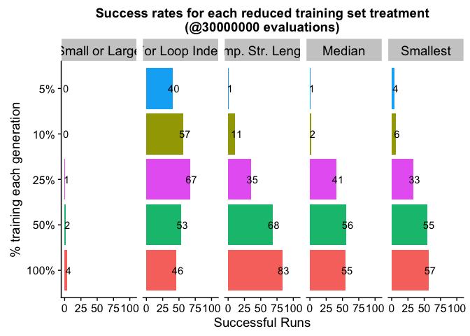
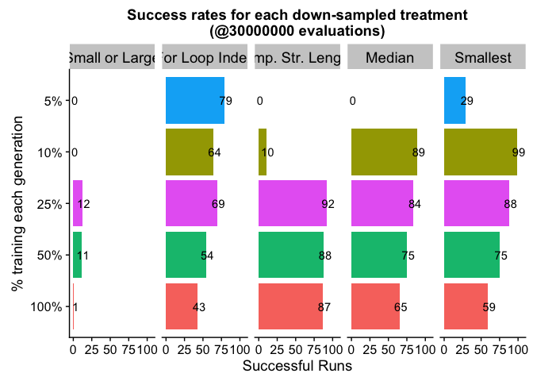
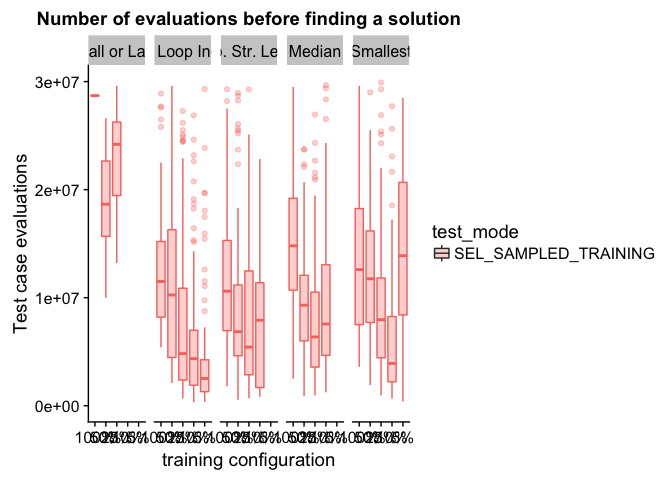
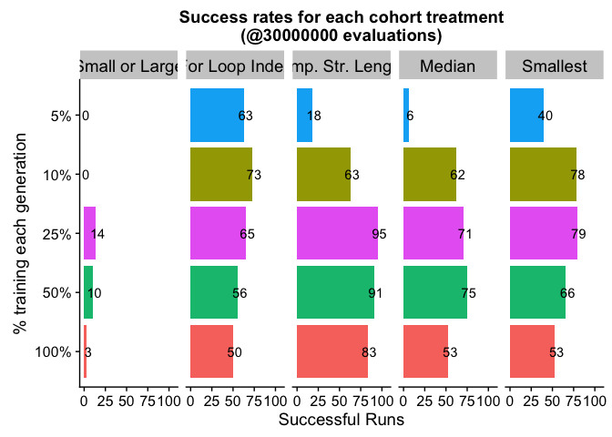
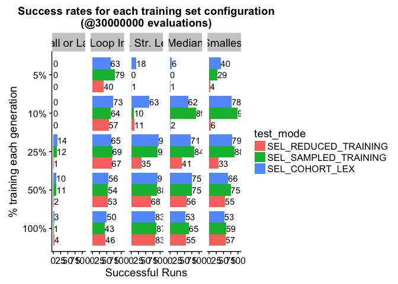
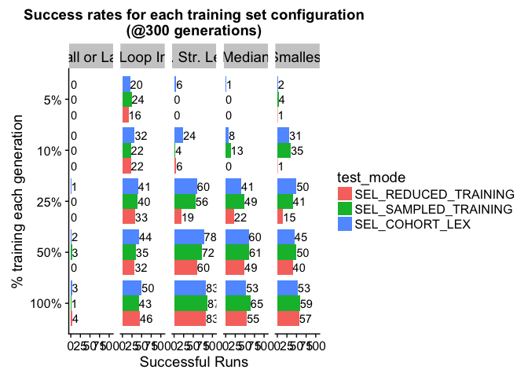

## Overview

Here, an overview of what we do in this here document.

## Analysis Setup

First, we'll load our R packages.


```r
library(tidyr)      # (Wickham & Henry, 2018)
library(ggplot2)    # (Wickham, 2009)
library(plyr)       # (Wickham, 2011)
library(dplyr)      # (Wickham et al., 2018)
library(cowplot)    # (Wilke, 2018)
library(readr)
library(rcompanion) # (Mangiafico, 2019)
```

## Data Loading

Note, the path information used here is accurate for the directory structure used in our Git repository (LINK ANONYMIZED).

First, we'll load solution data after a fixed number of _evaluations_:


```r
# (1) After 30000000 evaluations.
solutions_e30000000_data_loc <- "../../data/ds-exp-data/min_programs__eval_30000000.csv"
prog_solutions_e30000000 <- read.csv(solutions_e30000000_data_loc, na.strings = "NONE")

# (2) Load summary of solution data (contingency tables), which contains both time points.
prog_solutions_evals_summary <- read.csv("../../data/ds-exp-data/min_programs__eval_30000000__solutions_summary.csv", na.strings = "NONE")
```

Next, we'll load solution data after a fixed number of _generations_:

```r
# (1) After 300 generations.
solutions_u300_data_loc <- "../../data/ds-exp-data/min_programs__update_300.csv"
prog_solutions_u300 <- read.csv(solutions_u300_data_loc, na.strings = "NONE")

# (2) Load summary of solution data (contingency tables), which contains both time points.
prog_solutions_gens_summary <- read.csv("../../data/ds-exp-data/min_programs__update_300__solutions_summary.csv", na.strings = "NONE")
```


Below, we impose an ordering on the problems in the data (to make order of appearance in plotting consistent).


```r
prog_solutions_evals_summary$problem <- factor(prog_solutions_evals_summary$problem, levels=c('small-or-large','for-loop-index','compare-string-lengths','median','smallest'))

prog_solutions_evals_summary$test_mode <- factor(prog_solutions_evals_summary$test_mode, levels=c("SEL_REDUCED_TRAINING", "SEL_SAMPLED_TRAINING", "SEL_COHORT_LEX"))


prog_solutions_gens_summary$problem <- factor(prog_solutions_gens_summary$problem, levels=c('small-or-large','for-loop-index','compare-string-lengths','median','smallest'))

prog_solutions_gens_summary$test_mode <- factor(prog_solutions_gens_summary$test_mode, levels=c("SEL_REDUCED_TRAINING", "SEL_SAMPLED_TRAINING", "SEL_COHORT_LEX"))

prog_solutions_e30000000$problem <- factor(prog_solutions_e30000000$problem, levels=c('small-or-large','for-loop-index','compare-string-lengths','median','smallest'))

prog_solutions_e30000000$test_mode <- factor(prog_solutions_e30000000$test_mode, levels=c("SEL_REDUCED_TRAINING", "SEL_SAMPLED_TRAINING", "SEL_COHORT_LEX"))


prog_solutions_u300$problem <- factor(prog_solutions_u300$problem, levels=c('small-or-large','for-loop-index','compare-string-lengths','median','smallest'))

# A map from data column name to name to be used in figures.
problem_names <- c(
  'small-or-large'=        "Small or Large",
  'for-loop-index'=        "For Loop Index",
  'compare-string-lengths'="Comp. Str. Lengths",
  'median'=                "Median",
  'smallest'=              "Smallest"
)

prog_solutions_evals_summary$successful_runs <- prog_solutions_evals_summary$solutions_found
prog_solutions_evals_summary$failed_runs <- prog_solutions_evals_summary$total_runs - prog_solutions_evals_summary$solutions_found

problems <- c("small-or-large", "for-loop-index", "compare-string-lengths", "median", "smallest")
```

## Problem solving success given a fixed evaluation budget

### Condition - Reduced Training Set

<!-- -->

### Condition - Down-sampled Training Set

<!-- -->

Computational effort


```
## Warning: Removed 1227 rows containing non-finite values (stat_boxplot).

## Warning: Removed 1227 rows containing non-finite values (stat_boxplot).
```

<!-- -->

### Condition - Cohort lexicase

<!-- -->

### All conditions together

<!-- -->

### Reducing the training set does not improve problem solving success (usually)

Except for small or large (where we don't have high enough problem-solving success) and for loop index (which has interesting/different behavior), trading evaluations for more generations by reducing our training set doesn't improve problem problem solving success. Indeed, trading too many evaluations away _reduces_ our problem solving success (presumably because of overfitting). Data analysis below.

Here, we compare each level of reduction (50% of training, 25% of training, 10% of training, and 5% of training) with using the full training set. Each condition has been allowed to run for an equivalent number of generations; as such, the 50%-training-case condition ran for twice as many generations (600 total generations) as the 100%-training-case condition (300 total generations).

We determine if any comparison deviates from the null hypothesis using a Fisher's Exact test, correcting for multiple comparisons with the Holm-Bonferroni method.

For each problem:

#### Problem:  small-or-large   
**Results Summary**  
Significant (after correction) comparisions:  
- NONE  
  
**Comparing: 100%-training-set with 50%-training-set**  
```  
          Successful Runs Failed Runs
cn1:cs100               4          96
cn2:cs50                2          98

	Fisher's Exact Test for Count Data

data:  ts50_contingency_table
p-value = 0.6827
alternative hypothesis: true odds ratio is not equal to 1
95 percent confidence interval:
  0.2840586 22.9846000
sample estimates:
odds ratio 
  2.034629 

p.adjusted (method = holm ) = 0.7373415   
```  
  
**Comparing: 100%-training-set with 25%-training-set**  
```  
          Successful Runs Failed Runs
cn1:cs100               4          96
cn4:cs25                1          99

	Fisher's Exact Test for Count Data

data:  ts25_contingency_table
p-value = 0.3687
alternative hypothesis: true odds ratio is not equal to 1
95 percent confidence interval:
   0.3964093 204.9474039
sample estimates:
odds ratio 
  4.099101 

p.adjusted (method = holm ) = 0.7373415   
```  
  
**Comparing: 100%-training-set with 10%-training-set**  
```  
          Successful Runs Failed Runs
cn10:cs10               0         100
cn1:cs100               4          96

	Fisher's Exact Test for Count Data

data:  ts10_contingency_table
p-value = 0.1212
alternative hypothesis: true odds ratio is not equal to 1
95 percent confidence interval:
 0.000000 1.496486
sample estimates:
odds ratio 
         0 

p.adjusted (method = holm ) = 0.4849629   
```  
  
**Comparing: 100%-training-set with 5%-training-set**  
```
          Successful Runs Failed Runs
cn1:cs100               4          96
cn20:cs5                0         100

	Fisher's Exact Test for Count Data

data:  ts5_contingency_table
p-value = 0.1212
alternative hypothesis: true odds ratio is not equal to 1
95 percent confidence interval:
 0.6682322       Inf
sample estimates:
odds ratio 
       Inf 

p.adjusted (method = holm ) = 0.4849629   
```
#### Problem:  for-loop-index   
**Results Summary**  
Significant (after correction) comparisions:  
- 100% training vs 25% training ( p =  0.01684896 ); 100%-training success < 25%-training success? TRUE   
  
**Comparing: 100%-training-set with 50%-training-set**  
```  
          Successful Runs Failed Runs
cn1:cs100              46          54
cn2:cs50               53          47

	Fisher's Exact Test for Count Data

data:  ts50_contingency_table
p-value = 0.3962
alternative hypothesis: true odds ratio is not equal to 1
95 percent confidence interval:
 0.4172206 1.3669711
sample estimates:
odds ratio 
 0.7564904 

p.adjusted (method = holm ) = 0.7923654   
```  
  
**Comparing: 100%-training-set with 25%-training-set**  
```  
          Successful Runs Failed Runs
cn1:cs100              46          54
cn4:cs25               67          33

	Fisher's Exact Test for Count Data

data:  ts25_contingency_table
p-value = 0.004212
alternative hypothesis: true odds ratio is not equal to 1
95 percent confidence interval:
 0.2269702 0.7733997
sample estimates:
odds ratio 
 0.4214494 

p.adjusted (method = holm ) = 0.01684896   
```  
  
**Comparing: 100%-training-set with 10%-training-set**  
```  
          Successful Runs Failed Runs
cn10:cs10              57          43
cn1:cs100              46          54

	Fisher's Exact Test for Count Data

data:  ts10_contingency_table
p-value = 0.1569
alternative hypothesis: true odds ratio is not equal to 1
95 percent confidence interval:
 0.857935 2.825194
sample estimates:
odds ratio 
   1.55261 

p.adjusted (method = holm ) = 0.4708327   
```  
  
**Comparing: 100%-training-set with 5%-training-set**  
```
          Successful Runs Failed Runs
cn1:cs100              46          54
cn20:cs5               40          60

	Fisher's Exact Test for Count Data

data:  ts5_contingency_table
p-value = 0.4752
alternative hypothesis: true odds ratio is not equal to 1
95 percent confidence interval:
 0.701973 2.327567
sample estimates:
odds ratio 
  1.276196 

p.adjusted (method = holm ) = 0.7923654   
```
#### Problem:  compare-string-lengths   
**Results Summary**  
Significant (after correction) comparisions:  
- 100% training vs 50% training ( p =  0.0207848 ); 100%-training success < 50%-training success? FALSE   
- 100% training vs 25% training ( p =  9.199738e-12 ); 100%-training success < 25%-training success? FALSE   
- 100% training vs 10% training ( p =  9.156864e-26 ); 100%-training success < 10%-training success? FALSE   
- 100% training vs 5% training ( p =  7.601365e-37 ); 100%-training success < 5%-training success? FALSE   
  
**Comparing: 100%-training-set with 50%-training-set**  
```  
          Successful Runs Failed Runs
cn1:cs100              83          17
cn2:cs50               68          32

	Fisher's Exact Test for Count Data

data:  ts50_contingency_table
p-value = 0.02078
alternative hypothesis: true odds ratio is not equal to 1
95 percent confidence interval:
 1.122437 4.797130
sample estimates:
odds ratio 
  2.288004 

p.adjusted (method = holm ) = 0.0207848   
```  
  
**Comparing: 100%-training-set with 25%-training-set**  
```  
          Successful Runs Failed Runs
cn1:cs100              83          17
cn4:cs25               35          65

	Fisher's Exact Test for Count Data

data:  ts25_contingency_table
p-value = 4.6e-12
alternative hypothesis: true odds ratio is not equal to 1
95 percent confidence interval:
  4.461888 18.745051
sample estimates:
odds ratio 
  8.949611 

p.adjusted (method = holm ) = 9.199738e-12   
```  
  
**Comparing: 100%-training-set with 10%-training-set**  
```  
          Successful Runs Failed Runs
cn10:cs10              11          89
cn1:cs100              83          17

	Fisher's Exact Test for Count Data

data:  ts10_contingency_table
p-value < 2.2e-16
alternative hypothesis: true odds ratio is not equal to 1
95 percent confidence interval:
 0.01020852 0.06093750
sample estimates:
odds ratio 
0.02609881 

p.adjusted (method = holm ) = 9.156864e-26   
```  
  
**Comparing: 100%-training-set with 5%-training-set**  
```
          Successful Runs Failed Runs
cn1:cs100              83          17
cn20:cs5                1          99

	Fisher's Exact Test for Count Data

data:  ts5_contingency_table
p-value < 2.2e-16
alternative hypothesis: true odds ratio is not equal to 1
95 percent confidence interval:
    70.62093 16384.00000
sample estimates:
odds ratio 
  458.3263 

p.adjusted (method = holm ) = 7.601365e-37   
```
#### Problem:  median   
**Results Summary**  
Significant (after correction) comparisions:  
- 100% training vs 10% training ( p =  3.673865e-18 ); 100%-training success < 10%-training success? FALSE   
- 100% training vs 5% training ( p =  2.479551e-19 ); 100%-training success < 5%-training success? FALSE   
  
**Comparing: 100%-training-set with 50%-training-set**  
```  
          Successful Runs Failed Runs
cn1:cs100              55          45
cn2:cs50               56          44

	Fisher's Exact Test for Count Data

data:  ts50_contingency_table
p-value = 1
alternative hypothesis: true odds ratio is not equal to 1
95 percent confidence interval:
 0.5292656 1.7421477
sample estimates:
odds ratio 
 0.9604904 

p.adjusted (method = holm ) = 1   
```  
  
**Comparing: 100%-training-set with 25%-training-set**  
```  
          Successful Runs Failed Runs
cn1:cs100              55          45
cn4:cs25               41          59

	Fisher's Exact Test for Count Data

data:  ts25_contingency_table
p-value = 0.06551
alternative hypothesis: true odds ratio is not equal to 1
95 percent confidence interval:
 0.9672359 3.2022989
sample estimates:
odds ratio 
  1.753811 

p.adjusted (method = holm ) = 0.1310162   
```  
  
**Comparing: 100%-training-set with 10%-training-set**  
```  
          Successful Runs Failed Runs
cn10:cs10               2          98
cn1:cs100              55          45

	Fisher's Exact Test for Count Data

data:  ts10_contingency_table
p-value < 2.2e-16
alternative hypothesis: true odds ratio is not equal to 1
95 percent confidence interval:
 0.001931061 0.069394649
sample estimates:
odds ratio 
0.01702931 

p.adjusted (method = holm ) = 3.673865e-18   
```  
  
**Comparing: 100%-training-set with 5%-training-set**  
```
          Successful Runs Failed Runs
cn1:cs100              55          45
cn20:cs5                1          99

	Fisher's Exact Test for Count Data

data:  ts5_contingency_table
p-value < 2.2e-16
alternative hypothesis: true odds ratio is not equal to 1
95 percent confidence interval:
   19.12393 4769.31151
sample estimates:
odds ratio 
  118.5857 

p.adjusted (method = holm ) = 2.479551e-19   
```
#### Problem:  smallest   
**Results Summary**  
Significant (after correction) comparisions:  
- 100% training vs 25% training ( p =  0.00205378 ); 100%-training success < 25%-training success? FALSE   
- 100% training vs 10% training ( p =  3.602552e-15 ); 100%-training success < 10%-training success? FALSE   
- 100% training vs 5% training ( p =  7.631083e-17 ); 100%-training success < 5%-training success? FALSE   
  
**Comparing: 100%-training-set with 50%-training-set**  
```  
          Successful Runs Failed Runs
cn1:cs100              57          43
cn2:cs50               55          45

	Fisher's Exact Test for Count Data

data:  ts50_contingency_table
p-value = 0.8868
alternative hypothesis: true odds ratio is not equal to 1
95 percent confidence interval:
 0.5973505 1.9696287
sample estimates:
odds ratio 
  1.084126 

p.adjusted (method = holm ) = 0.8867745   
```  
  
**Comparing: 100%-training-set with 25%-training-set**  
```  
          Successful Runs Failed Runs
cn1:cs100              57          43
cn4:cs25               33          67

	Fisher's Exact Test for Count Data

data:  ts25_contingency_table
p-value = 0.001027
alternative hypothesis: true odds ratio is not equal to 1
95 percent confidence interval:
 1.457164 4.984644
sample estimates:
odds ratio 
  2.677363 

p.adjusted (method = holm ) = 0.00205378   
```  
  
**Comparing: 100%-training-set with 10%-training-set**  
```  
          Successful Runs Failed Runs
cn10:cs10               6          94
cn1:cs100              57          43

	Fisher's Exact Test for Count Data

data:  ts10_contingency_table
p-value = 1.201e-15
alternative hypothesis: true odds ratio is not equal to 1
95 percent confidence interval:
 0.01600652 0.12493271
sample estimates:
odds ratio 
0.04897287 

p.adjusted (method = holm ) = 3.602552e-15   
```  
  
**Comparing: 100%-training-set with 5%-training-set**  
```
          Successful Runs Failed Runs
cn1:cs100              57          43
cn20:cs5                4          96

	Fisher's Exact Test for Count Data

data:  ts5_contingency_table
p-value < 2.2e-16
alternative hypothesis: true odds ratio is not equal to 1
95 percent confidence interval:
  10.58176 125.73870
sample estimates:
odds ratio 
    31.241 

p.adjusted (method = holm ) = 7.631083e-17   
```

### Does down-sampling improve problem solving success?

For each problem: 

#### Problem:  small-or-large   
**Results Summary**  
Significant (after correction) comparisions:  
- 100% training vs 50% training ( p =  0.01494515 ); 100%-training success < 50%-training success? TRUE   
- 100% training vs 25% training ( p =  0.01015799 ); 100%-training success < 25%-training success? TRUE   
  
**Comparing: 100%-training-set with 50%-training-set**  
```  
          Successful Runs Failed Runs
cn1:cs100               1          99
cn2:cs50               11          89

	Fisher's Exact Test for Count Data

data:  ts50_contingency_table
p-value = 0.004982
alternative hypothesis: true odds ratio is not equal to 1
95 percent confidence interval:
 0.00188484 0.58806947
sample estimates:
odds ratio 
 0.0824859 

p.adjusted (method = holm ) = 0.01494515   
```  
  
**Comparing: 100%-training-set with 25%-training-set**  
```  
          Successful Runs Failed Runs
cn1:cs100               1          99
cn4:cs25               12          88

	Fisher's Exact Test for Count Data

data:  ts25_contingency_table
p-value = 0.002539
alternative hypothesis: true odds ratio is not equal to 1
95 percent confidence interval:
 0.001720579 0.524221428
sample estimates:
odds ratio 
0.07478655 

p.adjusted (method = holm ) = 0.01015799   
```  
  
**Comparing: 100%-training-set with 10%-training-set**  
```  
          Successful Runs Failed Runs
cn10:cs10               0         100
cn1:cs100               1          99

	Fisher's Exact Test for Count Data

data:  ts10_contingency_table
p-value = 1
alternative hypothesis: true odds ratio is not equal to 1
95 percent confidence interval:
  0.00000 39.00055
sample estimates:
odds ratio 
         0 

p.adjusted (method = holm ) = 1   
```  
  
**Comparing: 100%-training-set with 5%-training-set**  
```
          Successful Runs Failed Runs
cn1:cs100               1          99
cn20:cs5                0         100

	Fisher's Exact Test for Count Data

data:  ts5_contingency_table
p-value = 1
alternative hypothesis: true odds ratio is not equal to 1
95 percent confidence interval:
 0.02564066        Inf
sample estimates:
odds ratio 
       Inf 

p.adjusted (method = holm ) = 1   
```
#### Problem:  for-loop-index   
**Results Summary**  
Significant (after correction) comparisions:  
- 100% training vs 25% training ( p =  0.001030572 ); 100%-training success < 25%-training success? TRUE   
- 100% training vs 10% training ( p =  0.008911538 ); 100%-training success < 10%-training success? TRUE   
- 100% training vs 5% training ( p =  1.090421e-06 ); 100%-training success < 5%-training success? TRUE   
  
**Comparing: 100%-training-set with 50%-training-set**  
```  
          Successful Runs Failed Runs
cn1:cs100              43          57
cn2:cs50               54          46

	Fisher's Exact Test for Count Data

data:  ts50_contingency_table
p-value = 0.1569
alternative hypothesis: true odds ratio is not equal to 1
95 percent confidence interval:
 0.353958 1.165589
sample estimates:
odds ratio 
 0.6440768 

p.adjusted (method = holm ) = 0.1569442   
```  
  
**Comparing: 100%-training-set with 25%-training-set**  
```  
          Successful Runs Failed Runs
cn1:cs100              43          57
cn4:cs25               69          31

	Fisher's Exact Test for Count Data

data:  ts25_contingency_table
p-value = 0.0003435
alternative hypothesis: true odds ratio is not equal to 1
95 percent confidence interval:
 0.1818557 0.6294031
sample estimates:
odds ratio 
 0.3408825 

p.adjusted (method = holm ) = 0.001030572   
```  
  
**Comparing: 100%-training-set with 10%-training-set**  
```  
          Successful Runs Failed Runs
cn10:cs10              64          36
cn1:cs100              43          57

	Fisher's Exact Test for Count Data

data:  ts10_contingency_table
p-value = 0.004456
alternative hypothesis: true odds ratio is not equal to 1
95 percent confidence interval:
 1.284379 4.333222
sample estimates:
odds ratio 
  2.346206 

p.adjusted (method = holm ) = 0.008911538   
```  
  
**Comparing: 100%-training-set with 5%-training-set**  
```
          Successful Runs Failed Runs
cn1:cs100              43          57
cn20:cs5               79          21

	Fisher's Exact Test for Count Data

data:  ts5_contingency_table
p-value = 2.726e-07
alternative hypothesis: true odds ratio is not equal to 1
95 percent confidence interval:
 0.1019789 0.3898424
sample estimates:
odds ratio 
 0.2022697 

p.adjusted (method = holm ) = 1.090421e-06   
```
#### Problem:  compare-string-lengths   
**Results Summary**  
Significant (after correction) comparisions:  
- 100% training vs 10% training ( p =  9.066947e-30 ); 100%-training success < 10%-training success? FALSE   
- 100% training vs 5% training ( p =  3.392046e-42 ); 100%-training success < 5%-training success? FALSE   
  
**Comparing: 100%-training-set with 50%-training-set**  
```  
          Successful Runs Failed Runs
cn1:cs100              87          13
cn2:cs50               88          12

	Fisher's Exact Test for Count Data

data:  ts50_contingency_table
p-value = 1
alternative hypothesis: true odds ratio is not equal to 1
95 percent confidence interval:
 0.3586735 2.3061252
sample estimates:
odds ratio 
 0.9130073 

p.adjusted (method = holm ) = 1   
```  
  
**Comparing: 100%-training-set with 25%-training-set**  
```  
          Successful Runs Failed Runs
cn1:cs100              87          13
cn4:cs25               92           8

	Fisher's Exact Test for Count Data

data:  ts25_contingency_table
p-value = 0.3565
alternative hypothesis: true odds ratio is not equal to 1
95 percent confidence interval:
 0.1993038 1.6054624
sample estimates:
odds ratio 
 0.5835066 

p.adjusted (method = holm ) = 0.7130707   
```  
  
**Comparing: 100%-training-set with 10%-training-set**  
```  
          Successful Runs Failed Runs
cn10:cs10              10          90
cn1:cs100              87          13

	Fisher's Exact Test for Count Data

data:  ts10_contingency_table
p-value < 2.2e-16
alternative hypothesis: true odds ratio is not equal to 1
95 percent confidence interval:
 0.006236424 0.042811610
sample estimates:
odds ratio 
0.01726582 

p.adjusted (method = holm ) = 9.066947e-30   
```  
  
**Comparing: 100%-training-set with 5%-training-set**  
```
          Successful Runs Failed Runs
cn1:cs100              87          13
cn20:cs5                0         100

	Fisher's Exact Test for Count Data

data:  ts5_contingency_table
p-value < 2.2e-16
alternative hypothesis: true odds ratio is not equal to 1
95 percent confidence interval:
 145.8663      Inf
sample estimates:
odds ratio 
       Inf 

p.adjusted (method = holm ) = 3.392046e-42   
```
#### Problem:  median   
**Results Summary**  
Significant (after correction) comparisions:  
- 100% training vs 25% training ( p =  0.00652636 ); 100%-training success < 25%-training success? TRUE   
- 100% training vs 10% training ( p =  0.0002548708 ); 100%-training success < 10%-training success? TRUE   
- 100% training vs 5% training ( p =  2.464909e-26 ); 100%-training success < 5%-training success? FALSE   
  
**Comparing: 100%-training-set with 50%-training-set**  
```  
          Successful Runs Failed Runs
cn1:cs100              65          35
cn2:cs50               75          25

	Fisher's Exact Test for Count Data

data:  ts50_contingency_table
p-value = 0.1646
alternative hypothesis: true odds ratio is not equal to 1
95 percent confidence interval:
 0.3197718 1.1911759
sample estimates:
odds ratio 
 0.6205544 

p.adjusted (method = holm ) = 0.1646367   
```  
  
**Comparing: 100%-training-set with 25%-training-set**  
```  
          Successful Runs Failed Runs
cn1:cs100              65          35
cn4:cs25               84          16

	Fisher's Exact Test for Count Data

data:  ts25_contingency_table
p-value = 0.003263
alternative hypothesis: true odds ratio is not equal to 1
95 percent confidence interval:
 0.1681571 0.7261976
sample estimates:
odds ratio 
 0.3556026 

p.adjusted (method = holm ) = 0.00652636   
```  
  
**Comparing: 100%-training-set with 10%-training-set**  
```  
          Successful Runs Failed Runs
cn10:cs10              89          11
cn1:cs100              65          35

	Fisher's Exact Test for Count Data

data:  ts10_contingency_table
p-value = 8.496e-05
alternative hypothesis: true odds ratio is not equal to 1
95 percent confidence interval:
  1.969134 10.178598
sample estimates:
odds ratio 
  4.324642 

p.adjusted (method = holm ) = 0.0002548708   
```  
  
**Comparing: 100%-training-set with 5%-training-set**  
```
          Successful Runs Failed Runs
cn1:cs100              65          35
cn20:cs5                0         100

	Fisher's Exact Test for Count Data

data:  ts5_contingency_table
p-value < 2.2e-16
alternative hypothesis: true odds ratio is not equal to 1
95 percent confidence interval:
 44.70579      Inf
sample estimates:
odds ratio 
       Inf 

p.adjusted (method = holm ) = 2.464909e-26   
```
#### Problem:  smallest   
**Results Summary**  
Significant (after correction) comparisions:  
- 100% training vs 50% training ( p =  0.02372164 ); 100%-training success < 50%-training success? TRUE   
- 100% training vs 25% training ( p =  1.454896e-05 ); 100%-training success < 25%-training success? TRUE   
- 100% training vs 10% training ( p =  5.388007e-13 ); 100%-training success < 10%-training success? TRUE   
- 100% training vs 5% training ( p =  6.32756e-05 ); 100%-training success < 5%-training success? FALSE   
  
**Comparing: 100%-training-set with 50%-training-set**  
```  
          Successful Runs Failed Runs
cn1:cs100              59          41
cn2:cs50               75          25

	Fisher's Exact Test for Count Data

data:  ts50_contingency_table
p-value = 0.02372
alternative hypothesis: true odds ratio is not equal to 1
95 percent confidence interval:
 0.2500364 0.9135547
sample estimates:
odds ratio 
 0.4814615 

p.adjusted (method = holm ) = 0.02372164   
```  
  
**Comparing: 100%-training-set with 25%-training-set**  
```  
          Successful Runs Failed Runs
cn1:cs100              59          41
cn4:cs25               88          12

	Fisher's Exact Test for Count Data

data:  ts25_contingency_table
p-value = 4.85e-06
alternative hypothesis: true odds ratio is not equal to 1
95 percent confidence interval:
 0.08703814 0.42221581
sample estimates:
odds ratio 
 0.1978729 

p.adjusted (method = holm ) = 1.454896e-05   
```  
  
**Comparing: 100%-training-set with 10%-training-set**  
```  
          Successful Runs Failed Runs
cn10:cs10              99           1
cn1:cs100              59          41

	Fisher's Exact Test for Count Data

data:  ts10_contingency_table
p-value = 1.347e-13
alternative hypothesis: true odds ratio is not equal to 1
95 percent confidence interval:
   10.89059 2767.82491
sample estimates:
odds ratio 
  67.71984 

p.adjusted (method = holm ) = 5.388007e-13   
```  
  
**Comparing: 100%-training-set with 5%-training-set**  
```
          Successful Runs Failed Runs
cn1:cs100              59          41
cn20:cs5               29          71

	Fisher's Exact Test for Count Data

data:  ts5_contingency_table
p-value = 3.164e-05
alternative hypothesis: true odds ratio is not equal to 1
95 percent confidence interval:
 1.881323 6.626500
sample estimates:
odds ratio 
  3.499518 

p.adjusted (method = holm ) = 6.32756e-05   
```

### Do cohorts improve problem solving success?

For each problem: 

#### Problem:  small-or-large   
**Results Summary**  
Significant (after correction) comparisions:  
- 100% training vs 25% training ( p =  0.03731771 ); 100%-training success < 25%-training success? TRUE   
  
**Comparing: 100%-training-set with 50%-training-set**  
```  
          Successful Runs Failed Runs
cn1:cs100               3          97
cn2:cs50               10          90

	Fisher's Exact Test for Count Data

data:  ts50_contingency_table
p-value = 0.08179
alternative hypothesis: true odds ratio is not equal to 1
95 percent confidence interval:
 0.04800554 1.13329622
sample estimates:
odds ratio 
 0.2799892 

p.adjusted (method = holm ) = 0.2453822   
```  
  
**Comparing: 100%-training-set with 25%-training-set**  
```  
          Successful Runs Failed Runs
cn1:cs100               3          97
cn4:cs25               14          86

	Fisher's Exact Test for Count Data

data:  ts25_contingency_table
p-value = 0.009329
alternative hypothesis: true odds ratio is not equal to 1
95 percent confidence interval:
 0.03410613 0.71810161
sample estimates:
odds ratio 
 0.1913627 

p.adjusted (method = holm ) = 0.03731771   
```  
  
**Comparing: 100%-training-set with 10%-training-set**  
```  
          Successful Runs Failed Runs
cn10:cs10               0         100
cn1:cs100               3          97

	Fisher's Exact Test for Count Data

data:  ts10_contingency_table
p-value = 0.2462
alternative hypothesis: true odds ratio is not equal to 1
95 percent confidence interval:
 0.000000 2.405608
sample estimates:
odds ratio 
         0 

p.adjusted (method = holm ) = 0.4924623   
```  
  
**Comparing: 100%-training-set with 5%-training-set**  
```
          Successful Runs Failed Runs
cn1:cs100               3          97
cn20:cs5                0         100

	Fisher's Exact Test for Count Data

data:  ts5_contingency_table
p-value = 0.2462
alternative hypothesis: true odds ratio is not equal to 1
95 percent confidence interval:
 0.4156953       Inf
sample estimates:
odds ratio 
       Inf 

p.adjusted (method = holm ) = 0.4924623   
```
#### Problem:  for-loop-index   
**Results Summary**  
Significant (after correction) comparisions:  
- 100% training vs 10% training ( p =  0.005265923 ); 100%-training success < 10%-training success? TRUE   
  
**Comparing: 100%-training-set with 50%-training-set**  
```  
          Successful Runs Failed Runs
cn1:cs100              50          50
cn2:cs50               56          44

	Fisher's Exact Test for Count Data

data:  ts50_contingency_table
p-value = 0.4788
alternative hypothesis: true odds ratio is not equal to 1
95 percent confidence interval:
 0.4336443 1.4228271
sample estimates:
odds ratio 
 0.7866726 

p.adjusted (method = holm ) = 0.478807   
```  
  
**Comparing: 100%-training-set with 25%-training-set**  
```  
          Successful Runs Failed Runs
cn1:cs100              50          50
cn4:cs25               65          35

	Fisher's Exact Test for Count Data

data:  ts25_contingency_table
p-value = 0.04493
alternative hypothesis: true odds ratio is not equal to 1
95 percent confidence interval:
 0.2930531 0.9871730
sample estimates:
odds ratio 
 0.5401486 

p.adjusted (method = holm ) = 0.134796   
```  
  
**Comparing: 100%-training-set with 10%-training-set**  
```  
          Successful Runs Failed Runs
cn10:cs10              73          27
cn1:cs100              50          50

	Fisher's Exact Test for Count Data

data:  ts10_contingency_table
p-value = 0.001316
alternative hypothesis: true odds ratio is not equal to 1
95 percent confidence interval:
 1.439928 5.105704
sample estimates:
odds ratio 
  2.689832 

p.adjusted (method = holm ) = 0.005265923   
```  
  
**Comparing: 100%-training-set with 5%-training-set**  
```
          Successful Runs Failed Runs
cn1:cs100              50          50
cn20:cs5               63          37

	Fisher's Exact Test for Count Data

data:  ts5_contingency_table
p-value = 0.08671
alternative hypothesis: true odds ratio is not equal to 1
95 percent confidence interval:
 0.3210386 1.0725947
sample estimates:
odds ratio 
 0.5888725 

p.adjusted (method = holm ) = 0.1734129   
```
#### Problem:  compare-string-lengths   
**Results Summary**  
Significant (after correction) comparisions:  
- 100% training vs 25% training ( p =  0.02293316 ); 100%-training success < 25%-training success? TRUE   
- 100% training vs 10% training ( p =  0.006901549 ); 100%-training success < 10%-training success? FALSE   
- 100% training vs 5% training ( p =  1.902697e-20 ); 100%-training success < 5%-training success? FALSE   
  
**Comparing: 100%-training-set with 50%-training-set**  
```  
          Successful Runs Failed Runs
cn1:cs100              83          17
cn2:cs50               91           9

	Fisher's Exact Test for Count Data

data:  ts50_contingency_table
p-value = 0.14
alternative hypothesis: true odds ratio is not equal to 1
95 percent confidence interval:
 0.1799381 1.2237386
sample estimates:
odds ratio 
 0.4846008 

p.adjusted (method = holm ) = 0.1399768   
```  
  
**Comparing: 100%-training-set with 25%-training-set**  
```  
          Successful Runs Failed Runs
cn1:cs100              83          17
cn4:cs25               95           5

	Fisher's Exact Test for Count Data

data:  ts25_contingency_table
p-value = 0.01147
alternative hypothesis: true odds ratio is not equal to 1
95 percent confidence interval:
 0.07142547 0.77129990
sample estimates:
odds ratio 
 0.2586043 

p.adjusted (method = holm ) = 0.02293316   
```  
  
**Comparing: 100%-training-set with 10%-training-set**  
```  
          Successful Runs Failed Runs
cn10:cs10              63          37
cn1:cs100              83          17

	Fisher's Exact Test for Count Data

data:  ts10_contingency_table
p-value = 0.002301
alternative hypothesis: true odds ratio is not equal to 1
95 percent confidence interval:
 0.1686558 0.7059197
sample estimates:
odds ratio 
 0.3506145 

p.adjusted (method = holm ) = 0.006901549   
```  
  
**Comparing: 100%-training-set with 5%-training-set**  
```
          Successful Runs Failed Runs
cn1:cs100              83          17
cn20:cs5               18          82

	Fisher's Exact Test for Count Data

data:  ts5_contingency_table
p-value < 2.2e-16
alternative hypothesis: true odds ratio is not equal to 1
95 percent confidence interval:
 10.14088 49.43825
sample estimates:
odds ratio 
   21.7444 

p.adjusted (method = holm ) = 1.902697e-20   
```
#### Problem:  median   
**Results Summary**  
Significant (after correction) comparisions:  
- 100% training vs 50% training ( p =  0.00563598 ); 100%-training success < 50%-training success? TRUE   
- 100% training vs 25% training ( p =  0.02604144 ); 100%-training success < 25%-training success? TRUE   
- 100% training vs 5% training ( p =  2.841317e-13 ); 100%-training success < 5%-training success? FALSE   
  
**Comparing: 100%-training-set with 50%-training-set**  
```  
          Successful Runs Failed Runs
cn1:cs100              53          47
cn2:cs50               75          25

	Fisher's Exact Test for Count Data

data:  ts50_contingency_table
p-value = 0.001879
alternative hypothesis: true odds ratio is not equal to 1
95 percent confidence interval:
 0.1968355 0.7124999
sample estimates:
odds ratio 
 0.3777851 

p.adjusted (method = holm ) = 0.00563598   
```  
  
**Comparing: 100%-training-set with 25%-training-set**  
```  
          Successful Runs Failed Runs
cn1:cs100              53          47
cn4:cs25               71          29

	Fisher's Exact Test for Count Data

data:  ts25_contingency_table
p-value = 0.01302
alternative hypothesis: true odds ratio is not equal to 1
95 percent confidence interval:
 0.2458621 0.8589599
sample estimates:
odds ratio 
 0.4624169 

p.adjusted (method = holm ) = 0.02604144   
```  
  
**Comparing: 100%-training-set with 10%-training-set**  
```  
          Successful Runs Failed Runs
cn10:cs10              62          38
cn1:cs100              53          47

	Fisher's Exact Test for Count Data

data:  ts10_contingency_table
p-value = 0.2524
alternative hypothesis: true odds ratio is not equal to 1
95 percent confidence interval:
 0.792997 2.643218
sample estimates:
odds ratio 
  1.444158 

p.adjusted (method = holm ) = 0.2524328   
```  
  
**Comparing: 100%-training-set with 5%-training-set**  
```
          Successful Runs Failed Runs
cn1:cs100              53          47
cn20:cs5                6          94

	Fisher's Exact Test for Count Data

data:  ts5_contingency_table
p-value = 7.103e-14
alternative hypothesis: true odds ratio is not equal to 1
95 percent confidence interval:
  6.826683 53.134701
sample estimates:
odds ratio 
  17.39731 

p.adjusted (method = holm ) = 2.841317e-13   
```
#### Problem:  smallest   
**Results Summary**  
Significant (after correction) comparisions:  
- 100% training vs 25% training ( p =  0.0006732183 ); 100%-training success < 25%-training success? TRUE   
- 100% training vs 10% training ( p =  0.0009698796 ); 100%-training success < 10%-training success? TRUE   
  
**Comparing: 100%-training-set with 50%-training-set**  
```  
          Successful Runs Failed Runs
cn1:cs100              53          47
cn2:cs50               66          34

	Fisher's Exact Test for Count Data

data:  ts50_contingency_table
p-value = 0.0836
alternative hypothesis: true odds ratio is not equal to 1
95 percent confidence interval:
 0.3152205 1.0680788
sample estimates:
odds ratio 
 0.5825014 

p.adjusted (method = holm ) = 0.1671993   
```  
  
**Comparing: 100%-training-set with 25%-training-set**  
```  
          Successful Runs Failed Runs
cn1:cs100              53          47
cn4:cs25               79          21

	Fisher's Exact Test for Count Data

data:  ts25_contingency_table
p-value = 0.0001683
alternative hypothesis: true odds ratio is not equal to 1
95 percent confidence interval:
 0.1526582 0.5812966
sample estimates:
odds ratio 
 0.3016506 

p.adjusted (method = holm ) = 0.0006732183   
```  
  
**Comparing: 100%-training-set with 10%-training-set**  
```  
          Successful Runs Failed Runs
cn10:cs10              78          22
cn1:cs100              53          47

	Fisher's Exact Test for Count Data

data:  ts10_contingency_table
p-value = 0.0003233
alternative hypothesis: true odds ratio is not equal to 1
95 percent confidence interval:
 1.631768 6.125548
sample estimates:
odds ratio 
  3.125452 

p.adjusted (method = holm ) = 0.0009698796   
```  
  
**Comparing: 100%-training-set with 5%-training-set**  
```
          Successful Runs Failed Runs
cn1:cs100              53          47
cn20:cs5               40          60

	Fisher's Exact Test for Count Data

data:  ts5_contingency_table
p-value = 0.08865
alternative hypothesis: true odds ratio is not equal to 1
95 percent confidence interval:
 0.9299641 3.0806129
sample estimates:
odds ratio 
  1.687032 

p.adjusted (method = holm ) = 0.1671993   
```

## Problem solving success given a fixed generation budget


<!-- -->

## References

Claus O. Wilke (2018). cowplot: Streamlined Plot Theme and Plot Annotations for 'ggplot2'. R package version 0.9.3.
  https://CRAN.R-project.org/package=cowplot

Helmuth, T., & Spector, L. (2015). General Program Synthesis Benchmark Suite. In Proceedings of the 2015 on Genetic and Evolutionary Computation Conference - GECCO ’15 (pp. 1039–1046). New York, New York, USA: ACM Press. https://doi.org/10.1145/2739480.2754769

R Core Team (2016). R: A language and environment for statistical computing. R Foundation for Statistical Computing, Vienna, Austria. URL
  https://www.R-project.org/.

H. Wickham. ggplot2: Elegant Graphics for Data Analysis. Springer-Verlag New York, 2009.

Hadley Wickham and Lionel Henry (2018). tidyr: Easily Tidy Data with 'spread()' and 'gather()'
Functions. R package version 0.8.1. https://CRAN.R-project.org/package=tidyr

Hadley Wickham (2011). The Split-Apply-Combine Strategy for Data Analysis. Journal of Statistical
Software, 40(1), 1-29. URL http://www.jstatsoft.org/v40/i01/.

Hadley Wickham, Romain François, Lionel Henry and Kirill Müller (2018). dplyr: A Grammar of Data
Manipulation. R package version 0.7.5. https://CRAN.R-project.org/package=dplyr

Salvatore Mangiafico (2019). rcompanion: Functions to Support Extension Education Program Evaluation. R package
  version 2.0.10. https://CRAN.R-project.org/package=rcompanion
