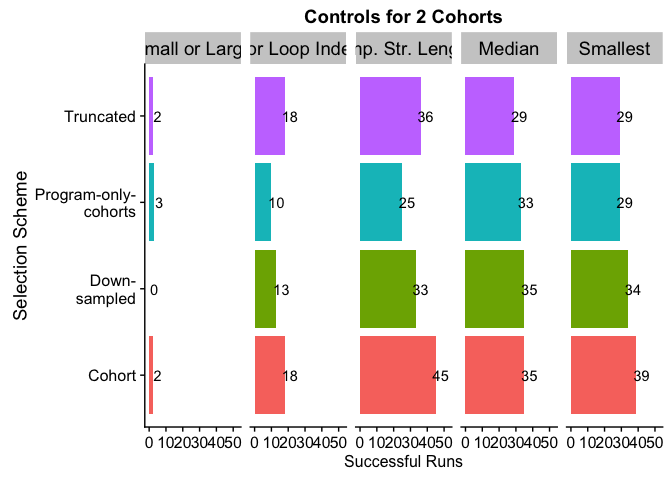
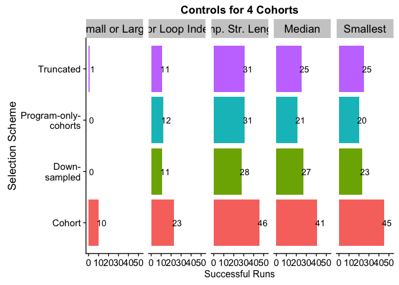
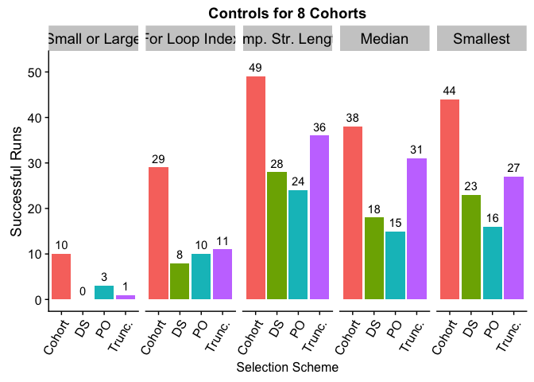
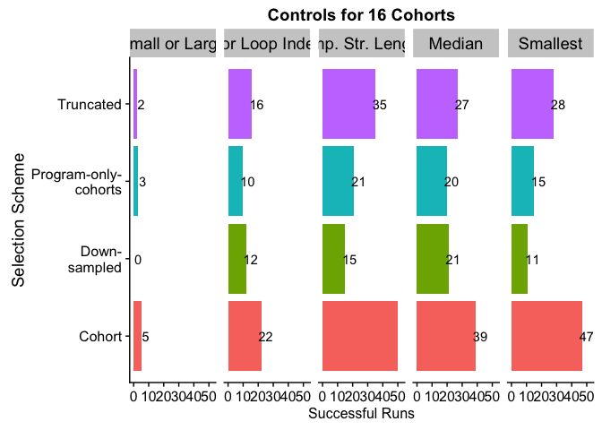
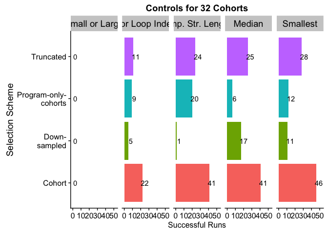
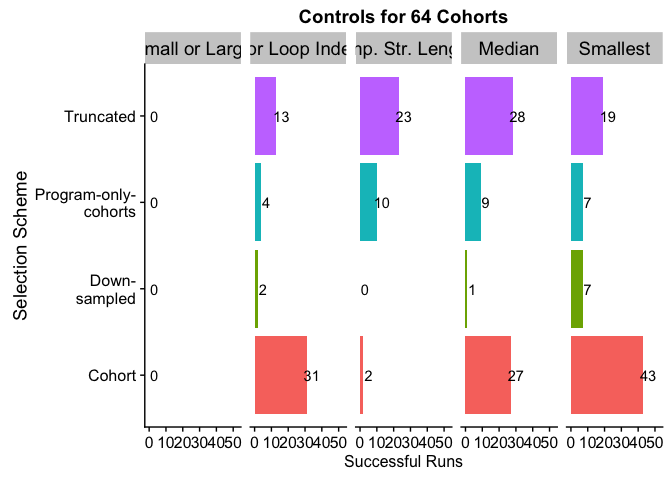
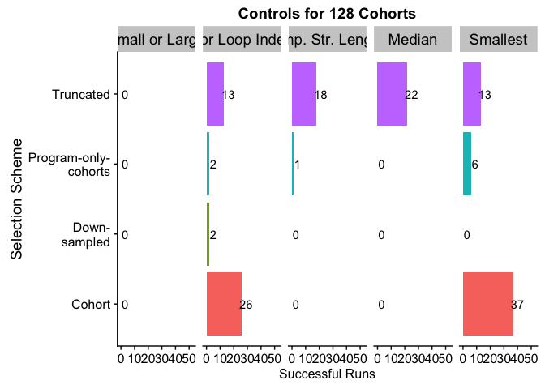
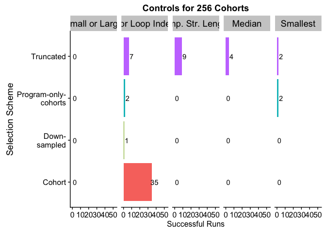

## Overview

Here, an overview of what we do in this here document.

## Analysis Setup

First, we'll load our R packages.


```r
library(tidyr)      # (Wickham & Henry, 2018)
library(ggplot2)    # (Wickham, 2009)
library(plyr)       # (Wickham, 2011)
library(dplyr)      # (Wickham et al., 2018)
library(cowplot)    # (Wilke, 2018)
library(readr)
library(rcompanion) # (Mangiafico, 2019)
```

## Data Loading

Note, the path information used here is accurate for the directory structure used in our Git repository (LINK ANONYMIZED).

First, we'll load solution data after a fixed number of _evaluations_:


```r
# (1) After 26214400 total evaluations (100 generations of std lex)
solutions_e26214400_data_loc <- "../data/exp-data/min_programs__eval_26214400.csv"
prog_solutions_e26214400 <- read.csv(solutions_e26214400_data_loc, na.strings = "NONE")

# (2) After 78643200 total evaluations (300 generations of std lex)
solutions_e78643200_data_loc <- "../data/exp-data/min_programs__eval_78643200.csv"
prog_solutions_e78643200 <- read.csv(solutions_e78643200_data_loc, na.strings = "NONE")

# (3) Load summary of solution data (contingency tables), which contains both time points.
prog_solutions_evals_summary <- read.csv("../data/exp-data/min_programs__eval_all__solutions_summary.csv", na.strings = "NONE")
```

Next, we'll load solution data after a fixed number of _generations_:


```r
# (1) After 100 generations (for all conditions)
solutions_u100_data_loc <- "../data/exp-data/min_programs__update_100.csv"
prog_solutions_u100 <- read.csv(solutions_u100_data_loc, na.strings = "NONE")

# (2) After 300 generations (for all conditions)
solutions_u300_data_loc <- "../data/exp-data/min_programs__update_300.csv"
prog_solutions_u300 <- read.csv(solutions_u300_data_loc, na.strings = "NONE")

# (3) Load summary of solution data (contingency tables), which contains both time points.
prog_solutions_updates_summary <- read.csv("../data/exp-data/min_programs__update_all__solutions_summary.csv", na.strings = "NONE")
```

Below, we impose an ordering on the problems in the data (to make order of appearance in plotting consistent).


```r
prog_solutions_evals_summary$problem <- factor(prog_solutions_evals_summary$problem, levels=c('small-or-large','for-loop-index','compare-string-lengths','median','smallest'))

prog_solutions_updates_summary$problem <- factor(prog_solutions_updates_summary$problem, levels=c('small-or-large','for-loop-index','compare-string-lengths','median','smallest'))

prog_solutions_e78643200$problem <- factor(prog_solutions_e78643200$problem, levels=c('small-or-large','for-loop-index','compare-string-lengths','median','smallest'))

prog_solutions_evals_summary$test_mode <- factor(prog_solutions_evals_summary$test_mode, levels=c("SEL_COHORT_LEX", "SEL_DOWN_SAMPLE_TESTS", "SEL_PROG_ONLY_COHORT_LEX", "SEL_TRUNCATED"))

# A map from data column name to name to be used in figures.
problem_names <- c(
  'small-or-large'=        "Small or Large",
  'for-loop-index'=        "For Loop Index",
  'compare-string-lengths'="Comp. Str. Lengths",
  'median'=                "Median",
  'smallest'=              "Smallest"
)

problems <- c('small-or-large','compare-string-lengths','for-loop-index','median','smallest')

sig_thresh <- 0.05
```

## K = 2


```r
cohort_cfg <- "cn2:cs256"
eval <- "78643200"

ggplot(data = filter(prog_solutions_evals_summary, cohort_config==cohort_cfg & evaluation==eval), mapping=aes(x=test_mode, y=solutions_found, fill=test_mode)) +
    geom_bar(stat="identity") + xlab("Selection Scheme") + ylab("Successful Runs")  +  ylim(0, 52) +
    guides(fill=FALSE)+
    geom_text(aes(label=solutions_found), nudge_y=3) + 
    theme(axis.title.x = element_text(size=12)) + 
    scale_x_discrete(labels=c("Cohort", "Down-\nsampled", "Program-only-\ncohorts", "Truncated")) +
    coord_flip() + facet_wrap( ~ problem, labeller=as_labeller(problem_names), nrow=1) + 
    theme(strip.text.x = element_text(size = 14)) + 
    ggtitle("Controls for 2 Cohorts") 
```

<!-- -->

### Statistical Analysis 


```r
for (p in problems) {
  print(sprintf("Problem: %s", p))
  # Comparison: truncated v cohort
  data <- filter(prog_solutions_evals_summary, cohort_config==cohort_cfg & evaluation==eval & (test_mode=="SEL_COHORT_LEX"|test_mode=="SEL_TRUNCATED") & problem==p)
  data$successful_runs = data$solutions_found
  data$failed_runs = data$total_runs - data$solutions_found
  con_table <- matrix(c(data$successful_runs, data$failed_runs), nrow=length(data$successful_runs))
  rownames(con_table) <- data$test_mode
  colnames(con_table) <- c("Successful Runs", "Failed Runs")
  trunc_v_cohort_test <- fisher.test(con_table)
  
  # Comparison: down-sample v cohort
  data <- filter(prog_solutions_evals_summary, cohort_config==cohort_cfg & evaluation==eval & (test_mode=="SEL_COHORT_LEX"|test_mode=="SEL_DOWN_SAMPLE_TESTS") & problem==p)
  data$successful_runs = data$solutions_found
  data$failed_runs = data$total_runs - data$solutions_found
  con_table <- matrix(c(data$successful_runs, data$failed_runs), nrow=length(data$successful_runs))
  rownames(con_table) <- data$test_mode
  colnames(con_table) <- c("Successful Runs", "Failed Runs")
  ds_v_cohort_test <- fisher.test(con_table)
  
  # Comparison: program-only v cohort
  data <- filter(prog_solutions_evals_summary, cohort_config==cohort_cfg & evaluation==eval & (test_mode=="SEL_COHORT_LEX"|test_mode=="SEL_PROG_ONLY_COHORT_LEX") & problem==p)
  data$successful_runs = data$solutions_found
  data$failed_runs = data$total_runs - data$solutions_found
  con_table <- matrix(c(data$successful_runs, data$failed_runs), nrow=length(data$successful_runs))
  rownames(con_table) <- data$test_mode
  colnames(con_table) <- c("Successful Runs", "Failed Runs")
  po_v_cohort_test <- fisher.test(con_table)
  
  
  # Adjust pvalues using holm method
  pvals <- c(trunc_v_cohort_test$p.value, ds_v_cohort_test$p.value, po_v_cohort_test$p.value)
  pvals.adj <- p.adjust(pvals, method="holm")
  
  sig <- ""
  if (pvals.adj[1] < sig_thresh) {
    sig <- "*"
  }
  print(sprintf("  Truncated v Cohort%s", sig))
  print(sprintf("    Unadj p = %s", toString(pvals[1])))
  print(sprintf("    Adj p = %s", toString(pvals.adj[1])))

  sig <- ""
  if (pvals.adj[2] < sig_thresh) {
    sig <- "*"
  }
  print(sprintf("  Down-sample v Cohort%s", sig))
  print(sprintf("    Unadj p = %s", toString(pvals[2])))
  print(sprintf("    Adj p = %s", toString(pvals.adj[2])))
  
  
  sig <- ""
  if (pvals.adj[3] < sig_thresh) {
    sig <- "*"
  }
  print(sprintf("  Program-only-cohort v Cohort%s", sig))
  print(sprintf("    Unadj p = %s", toString(pvals[3])))
  print(sprintf("    Adj p = %s", toString(pvals.adj[3])))
}
```

```
## [1] "Problem: small-or-large"
## [1] "  Truncated v Cohort"
## [1] "    Unadj p = 1"
## [1] "    Adj p = 1"
## [1] "  Down-sample v Cohort"
## [1] "    Unadj p = 0.494949494949495"
## [1] "    Adj p = 1"
## [1] "  Program-only-cohort v Cohort"
## [1] "    Unadj p = 1"
## [1] "    Adj p = 1"
## [1] "Problem: compare-string-lengths"
## [1] "  Truncated v Cohort*"
## [1] "    Unadj p = 0.0395179881271085"
## [1] "    Adj p = 0.0395179881271085"
## [1] "  Down-sample v Cohort*"
## [1] "    Unadj p = 0.00700460226571764"
## [1] "    Adj p = 0.0140092045314353"
## [1] "  Program-only-cohort v Cohort*"
## [1] "    Unadj p = 2.02950241284007e-05"
## [1] "    Adj p = 6.08850723852022e-05"
## [1] "Problem: for-loop-index"
## [1] "  Truncated v Cohort"
## [1] "    Unadj p = 1"
## [1] "    Adj p = 1"
## [1] "  Down-sample v Cohort"
## [1] "    Unadj p = 0.387325467816703"
## [1] "    Adj p = 0.774650935633406"
## [1] "  Program-only-cohort v Cohort"
## [1] "    Unadj p = 0.118159400203481"
## [1] "    Adj p = 0.354478200610443"
## [1] "Problem: median"
## [1] "  Truncated v Cohort"
## [1] "    Unadj p = 0.29756036803065"
## [1] "    Adj p = 0.89268110409195"
## [1] "  Down-sample v Cohort"
## [1] "    Unadj p = 1"
## [1] "    Adj p = 1"
## [1] "  Program-only-cohort v Cohort"
## [1] "    Unadj p = 0.830485307301064"
## [1] "    Adj p = 1"
## [1] "Problem: smallest"
## [1] "  Truncated v Cohort"
## [1] "    Unadj p = 0.052825527191179"
## [1] "    Adj p = 0.158476581573537"
## [1] "  Down-sample v Cohort"
## [1] "    Unadj p = 0.367821932005209"
## [1] "    Adj p = 0.367821932005209"
## [1] "  Program-only-cohort v Cohort"
## [1] "    Unadj p = 0.052825527191179"
## [1] "    Adj p = 0.158476581573537"
```

## K = 4


```r
cohort_cfg <- "cn4:cs128"
eval <- "78643200"

ggplot(data = filter(prog_solutions_evals_summary, cohort_config==cohort_cfg & evaluation==eval), mapping=aes(x=test_mode, y=solutions_found, fill=test_mode)) +
    geom_bar(stat="identity") + xlab("Selection Scheme") + ylab("Successful Runs")  +  ylim(0, 52) +
    guides(fill=FALSE)+
    geom_text(aes(label=solutions_found), nudge_y=3) + 
    theme(axis.title.x = element_text(size=12)) + 
    scale_x_discrete(labels=c("Cohort", "Down-\nsampled", "Program-only-\ncohorts", "Truncated")) +
    coord_flip() + facet_wrap( ~ problem, labeller=as_labeller(problem_names), nrow=1) + 
    theme(strip.text.x = element_text(size = 14)) + 
    ggtitle("Controls for 4 Cohorts") 
```

<!-- -->

### Statistical Analysis 


```r
for (p in problems) {
  print(sprintf("Problem: %s", p))
  # Comparison: truncated v cohort
  data <- filter(prog_solutions_evals_summary, cohort_config==cohort_cfg & evaluation==eval & (test_mode=="SEL_COHORT_LEX"|test_mode=="SEL_TRUNCATED") & problem==p)
  data$successful_runs = data$solutions_found
  data$failed_runs = data$total_runs - data$solutions_found
  con_table <- matrix(c(data$successful_runs, data$failed_runs), nrow=length(data$successful_runs))
  rownames(con_table) <- data$test_mode
  colnames(con_table) <- c("Successful Runs", "Failed Runs")
  trunc_v_cohort_test <- fisher.test(con_table)
  
  # Comparison: down-sample v cohort
  data <- filter(prog_solutions_evals_summary, cohort_config==cohort_cfg & evaluation==eval & (test_mode=="SEL_COHORT_LEX"|test_mode=="SEL_DOWN_SAMPLE_TESTS") & problem==p)
  data$successful_runs = data$solutions_found
  data$failed_runs = data$total_runs - data$solutions_found
  con_table <- matrix(c(data$successful_runs, data$failed_runs), nrow=length(data$successful_runs))
  rownames(con_table) <- data$test_mode
  colnames(con_table) <- c("Successful Runs", "Failed Runs")
  ds_v_cohort_test <- fisher.test(con_table)
  
  # Comparison: program-only v cohort
  data <- filter(prog_solutions_evals_summary, cohort_config==cohort_cfg & evaluation==eval & (test_mode=="SEL_COHORT_LEX"|test_mode=="SEL_PROG_ONLY_COHORT_LEX") & problem==p)
  data$successful_runs = data$solutions_found
  data$failed_runs = data$total_runs - data$solutions_found
  con_table <- matrix(c(data$successful_runs, data$failed_runs), nrow=length(data$successful_runs))
  rownames(con_table) <- data$test_mode
  colnames(con_table) <- c("Successful Runs", "Failed Runs")
  po_v_cohort_test <- fisher.test(con_table)
  
  
  # Adjust pvalues using holm method
  pvals <- c(trunc_v_cohort_test$p.value, ds_v_cohort_test$p.value, po_v_cohort_test$p.value)
  pvals.adj <- p.adjust(pvals, method="holm")
  
  sig <- ""
  if (pvals.adj[1] < sig_thresh) {
    sig <- "*"
  }
  print(sprintf("  Truncated v Cohort%s", sig))
  print(sprintf("    Unadj p = %s", toString(pvals[1])))
  print(sprintf("    Adj p = %s", toString(pvals.adj[1])))

  sig <- ""
  if (pvals.adj[2] < sig_thresh) {
    sig <- "*"
  }
  print(sprintf("  Down-sample v Cohort%s", sig))
  print(sprintf("    Unadj p = %s", toString(pvals[2])))
  print(sprintf("    Adj p = %s", toString(pvals.adj[2])))
  
  
  sig <- ""
  if (pvals.adj[3] < sig_thresh) {
    sig <- "*"
  }
  print(sprintf("  Program-only-cohort v Cohort%s", sig))
  print(sprintf("    Unadj p = %s", toString(pvals[3])))
  print(sprintf("    Adj p = %s", toString(pvals.adj[3])))
}
```

```
## [1] "Problem: small-or-large"
## [1] "  Truncated v Cohort*"
## [1] "    Unadj p = 0.00778039126279198"
## [1] "    Adj p = 0.00778039126279198"
## [1] "  Down-sample v Cohort*"
## [1] "    Unadj p = 0.00118683934517166"
## [1] "    Adj p = 0.00356051803551497"
## [1] "  Program-only-cohort v Cohort*"
## [1] "    Unadj p = 0.00118683934517166"
## [1] "    Adj p = 0.00356051803551497"
## [1] "Problem: compare-string-lengths"
## [1] "  Truncated v Cohort*"
## [1] "    Unadj p = 0.000644532947189431"
## [1] "    Adj p = 0.00128906589437886"
## [1] "  Down-sample v Cohort*"
## [1] "    Unadj p = 6.49310663369139e-05"
## [1] "    Adj p = 0.000194793199010742"
## [1] "  Program-only-cohort v Cohort*"
## [1] "    Unadj p = 0.000644532947189431"
## [1] "    Adj p = 0.00128906589437886"
## [1] "Problem: for-loop-index"
## [1] "  Truncated v Cohort"
## [1] "    Unadj p = 0.0195576276896062"
## [1] "    Adj p = 0.0586728830688186"
## [1] "  Down-sample v Cohort"
## [1] "    Unadj p = 0.0195576276896062"
## [1] "    Adj p = 0.0586728830688186"
## [1] "  Program-only-cohort v Cohort"
## [1] "    Unadj p = 0.0352997806006067"
## [1] "    Adj p = 0.0586728830688186"
## [1] "Problem: median"
## [1] "  Truncated v Cohort*"
## [1] "    Unadj p = 0.00135806679492349"
## [1] "    Adj p = 0.00271613358984699"
## [1] "  Down-sample v Cohort*"
## [1] "    Unadj p = 0.00490531613398259"
## [1] "    Adj p = 0.00490531613398259"
## [1] "  Program-only-cohort v Cohort*"
## [1] "    Unadj p = 6.96054396270303e-05"
## [1] "    Adj p = 0.000208816318881091"
## [1] "Problem: smallest"
## [1] "  Truncated v Cohort*"
## [1] "    Unadj p = 2.02950241284007e-05"
## [1] "    Adj p = 2.02950241284007e-05"
## [1] "  Down-sample v Cohort*"
## [1] "    Unadj p = 3.50648640041163e-06"
## [1] "    Adj p = 7.01297280082326e-06"
## [1] "  Program-only-cohort v Cohort*"
## [1] "    Unadj p = 1.95831166744803e-07"
## [1] "    Adj p = 5.8749350023441e-07"
```

## K = 8 **(Paper)**


```r
cohort_cfg <- "cn8:cs64"
eval <- "78643200"

ggplot(data = filter(prog_solutions_evals_summary, cohort_config==cohort_cfg & evaluation==eval), mapping=aes(x=test_mode, y=solutions_found, fill=test_mode)) +
    geom_bar(stat="identity") + xlab("Selection Scheme") + ylab("Successful Runs")  +  ylim(0, 52) +
    guides(fill=FALSE)+
    geom_text(aes(label=solutions_found), nudge_y=2) + 
    theme(axis.title.x = element_text(size=12)) + 
    scale_x_discrete(labels=c("Cohort", "DS", "PO", "Trunc.")) +
    facet_wrap( ~ problem, labeller=as_labeller(problem_names), nrow=1) + 
    theme(strip.text.x = element_text(size = 14)) + 
    theme(axis.text.x = element_text(angle=60, hjust=1)) +
    ggtitle("Controls for 8 Cohorts") + 
    ggsave("tease-apart-cn8-cs64-late.pdf", height=5, width=15)
```

<!-- -->

### Statistical Analysis 


```r
for (p in problems) {
  print(sprintf("Problem: %s", p))
  # Comparison: truncated v cohort
  data <- filter(prog_solutions_evals_summary, cohort_config==cohort_cfg & evaluation==eval & (test_mode=="SEL_COHORT_LEX"|test_mode=="SEL_TRUNCATED") & problem==p)
  data$successful_runs = data$solutions_found
  data$failed_runs = data$total_runs - data$solutions_found
  con_table <- matrix(c(data$successful_runs, data$failed_runs), nrow=length(data$successful_runs))
  rownames(con_table) <- data$test_mode
  colnames(con_table) <- c("Successful Runs", "Failed Runs")
  trunc_v_cohort_test <- fisher.test(con_table)
  
  # Comparison: down-sample v cohort
  data <- filter(prog_solutions_evals_summary, cohort_config==cohort_cfg & evaluation==eval & (test_mode=="SEL_COHORT_LEX"|test_mode=="SEL_DOWN_SAMPLE_TESTS") & problem==p)
  data$successful_runs = data$solutions_found
  data$failed_runs = data$total_runs - data$solutions_found
  con_table <- matrix(c(data$successful_runs, data$failed_runs), nrow=length(data$successful_runs))
  rownames(con_table) <- data$test_mode
  colnames(con_table) <- c("Successful Runs", "Failed Runs")
  ds_v_cohort_test <- fisher.test(con_table)
  
  # Comparison: program-only v cohort
  data <- filter(prog_solutions_evals_summary, cohort_config==cohort_cfg & evaluation==eval & (test_mode=="SEL_COHORT_LEX"|test_mode=="SEL_PROG_ONLY_COHORT_LEX") & problem==p)
  data$successful_runs = data$solutions_found
  data$failed_runs = data$total_runs - data$solutions_found
  con_table <- matrix(c(data$successful_runs, data$failed_runs), nrow=length(data$successful_runs))
  rownames(con_table) <- data$test_mode
  colnames(con_table) <- c("Successful Runs", "Failed Runs")
  po_v_cohort_test <- fisher.test(con_table)
  
  
  # Adjust pvalues using holm method
  pvals <- c(trunc_v_cohort_test$p.value, ds_v_cohort_test$p.value, po_v_cohort_test$p.value)
  pvals.adj <- p.adjust(pvals, method="holm")
  
  sig <- ""
  if (pvals.adj[1] < sig_thresh) {
    sig <- "*"
  }
  print(sprintf("  Truncated v Cohort%s", sig))
  print(sprintf("    Unadj p = %s", toString(pvals[1])))
  print(sprintf("    Adj p = %s", toString(pvals.adj[1])))

  sig <- ""
  if (pvals.adj[2] < sig_thresh) {
    sig <- "*"
  }
  print(sprintf("  Down-sample v Cohort%s", sig))
  print(sprintf("    Unadj p = %s", toString(pvals[2])))
  print(sprintf("    Adj p = %s", toString(pvals.adj[2])))
  
  
  sig <- ""
  if (pvals.adj[3] < sig_thresh) {
    sig <- "*"
  }
  print(sprintf("  Program-only-cohort v Cohort%s", sig))
  print(sprintf("    Unadj p = %s", toString(pvals[3])))
  print(sprintf("    Adj p = %s", toString(pvals.adj[3])))
}
```

```
## [1] "Problem: small-or-large"
## [1] "  Truncated v Cohort*"
## [1] "    Unadj p = 0.00778039126279198"
## [1] "    Adj p = 0.015560782525584"
## [1] "  Down-sample v Cohort*"
## [1] "    Unadj p = 0.00118683934517166"
## [1] "    Adj p = 0.00356051803551497"
## [1] "  Program-only-cohort v Cohort"
## [1] "    Unadj p = 0.0713081527162687"
## [1] "    Adj p = 0.0713081527162687"
## [1] "Problem: compare-string-lengths"
## [1] "  Truncated v Cohort*"
## [1] "    Unadj p = 0.000387964071372551"
## [1] "    Adj p = 0.000387964071372551"
## [1] "  Down-sample v Cohort*"
## [1] "    Unadj p = 3.65613078853375e-07"
## [1] "    Adj p = 7.31226157706751e-07"
## [1] "  Program-only-cohort v Cohort*"
## [1] "    Unadj p = 6.45209891705173e-09"
## [1] "    Adj p = 1.93562967511552e-08"
## [1] "Problem: for-loop-index"
## [1] "  Truncated v Cohort*"
## [1] "    Unadj p = 0.000448995068996525"
## [1] "    Adj p = 0.000448995068996525"
## [1] "  Down-sample v Cohort*"
## [1] "    Unadj p = 2.41974116554678e-05"
## [1] "    Adj p = 7.25922349664035e-05"
## [1] "  Program-only-cohort v Cohort*"
## [1] "    Unadj p = 0.000183711419594277"
## [1] "    Adj p = 0.000367422839188555"
## [1] "Problem: median"
## [1] "  Truncated v Cohort"
## [1] "    Unadj p = 0.194139804515663"
## [1] "    Adj p = 0.194139804515663"
## [1] "  Down-sample v Cohort*"
## [1] "    Unadj p = 0.000105969210219583"
## [1] "    Adj p = 0.000211938420439165"
## [1] "  Program-only-cohort v Cohort*"
## [1] "    Unadj p = 7.39816545934114e-06"
## [1] "    Adj p = 2.21944963780234e-05"
## [1] "Problem: smallest"
## [1] "  Truncated v Cohort*"
## [1] "    Unadj p = 0.000323273151003734"
## [1] "    Adj p = 0.000323273151003734"
## [1] "  Down-sample v Cohort*"
## [1] "    Unadj p = 1.30399678570126e-05"
## [1] "    Adj p = 2.60799357140251e-05"
## [1] "  Program-only-cohort v Cohort*"
## [1] "    Unadj p = 1.21099254307132e-08"
## [1] "    Adj p = 3.63297762921395e-08"
```

## K = 16


```r
cohort_cfg <- "cn16:cs32"
eval <- "78643200"

ggplot(data = filter(prog_solutions_evals_summary, cohort_config==cohort_cfg & evaluation==eval), mapping=aes(x=test_mode, y=solutions_found, fill=test_mode)) +
    geom_bar(stat="identity") + xlab("Selection Scheme") + ylab("Successful Runs")  +  ylim(0, 52) +
    guides(fill=FALSE)+
    geom_text(aes(label=solutions_found), nudge_y=3) + 
    theme(axis.title.x = element_text(size=12)) + 
    scale_x_discrete(labels=c("Cohort", "Down-\nsampled", "Program-only-\ncohorts", "Truncated")) +
    coord_flip() + facet_wrap( ~ problem, labeller=as_labeller(problem_names), nrow=1) + 
    theme(strip.text.x = element_text(size = 14)) + 
    ggtitle("Controls for 16 Cohorts")
```

```
## Warning: Removed 1 rows containing missing values (geom_text).
```

<!-- -->

### Statistical Analysis 


```r
for (p in problems) {
  print(sprintf("Problem: %s", p))
  # Comparison: truncated v cohort
  data <- filter(prog_solutions_evals_summary, cohort_config==cohort_cfg & evaluation==eval & (test_mode=="SEL_COHORT_LEX"|test_mode=="SEL_TRUNCATED") & problem==p)
  data$successful_runs = data$solutions_found
  data$failed_runs = data$total_runs - data$solutions_found
  con_table <- matrix(c(data$successful_runs, data$failed_runs), nrow=length(data$successful_runs))
  rownames(con_table) <- data$test_mode
  colnames(con_table) <- c("Successful Runs", "Failed Runs")
  trunc_v_cohort_test <- fisher.test(con_table)
  
  # Comparison: down-sample v cohort
  data <- filter(prog_solutions_evals_summary, cohort_config==cohort_cfg & evaluation==eval & (test_mode=="SEL_COHORT_LEX"|test_mode=="SEL_DOWN_SAMPLE_TESTS") & problem==p)
  data$successful_runs = data$solutions_found
  data$failed_runs = data$total_runs - data$solutions_found
  con_table <- matrix(c(data$successful_runs, data$failed_runs), nrow=length(data$successful_runs))
  rownames(con_table) <- data$test_mode
  colnames(con_table) <- c("Successful Runs", "Failed Runs")
  ds_v_cohort_test <- fisher.test(con_table)
  
  # Comparison: program-only v cohort
  data <- filter(prog_solutions_evals_summary, cohort_config==cohort_cfg & evaluation==eval & (test_mode=="SEL_COHORT_LEX"|test_mode=="SEL_PROG_ONLY_COHORT_LEX") & problem==p)
  data$successful_runs = data$solutions_found
  data$failed_runs = data$total_runs - data$solutions_found
  con_table <- matrix(c(data$successful_runs, data$failed_runs), nrow=length(data$successful_runs))
  rownames(con_table) <- data$test_mode
  colnames(con_table) <- c("Successful Runs", "Failed Runs")
  po_v_cohort_test <- fisher.test(con_table)
  
  
  # Adjust pvalues using holm method
  pvals <- c(trunc_v_cohort_test$p.value, ds_v_cohort_test$p.value, po_v_cohort_test$p.value)
  pvals.adj <- p.adjust(pvals, method="holm")
  
  sig <- ""
  if (pvals.adj[1] < sig_thresh) {
    sig <- "*"
  }
  print(sprintf("  Truncated v Cohort%s", sig))
  print(sprintf("    Unadj p = %s", toString(pvals[1])))
  print(sprintf("    Adj p = %s", toString(pvals.adj[1])))

  sig <- ""
  if (pvals.adj[2] < sig_thresh) {
    sig <- "*"
  }
  print(sprintf("  Down-sample v Cohort%s", sig))
  print(sprintf("    Unadj p = %s", toString(pvals[2])))
  print(sprintf("    Adj p = %s", toString(pvals.adj[2])))
  
  
  sig <- ""
  if (pvals.adj[3] < sig_thresh) {
    sig <- "*"
  }
  print(sprintf("  Program-only-cohort v Cohort%s", sig))
  print(sprintf("    Unadj p = %s", toString(pvals[3])))
  print(sprintf("    Adj p = %s", toString(pvals.adj[3])))
}
```

```
## [1] "Problem: small-or-large"
## [1] "  Truncated v Cohort"
## [1] "    Unadj p = 0.436031503313109"
## [1] "    Adj p = 0.872063006626218"
## [1] "  Down-sample v Cohort"
## [1] "    Unadj p = 0.0562844944288243"
## [1] "    Adj p = 0.168853483286473"
## [1] "  Program-only-cohort v Cohort"
## [1] "    Unadj p = 0.71498366296469"
## [1] "    Adj p = 0.872063006626218"
## [1] "Problem: compare-string-lengths"
## [1] "  Truncated v Cohort*"
## [1] "    Unadj p = 1.77693467804222e-05"
## [1] "    Adj p = 1.77693467804222e-05"
## [1] "  Down-sample v Cohort*"
## [1] "    Unadj p = 4.11085214010365e-15"
## [1] "    Adj p = 1.2332556420311e-14"
## [1] "  Program-only-cohort v Cohort*"
## [1] "    Unadj p = 1.0849773856381e-11"
## [1] "    Adj p = 2.16995477127621e-11"
## [1] "Problem: for-loop-index"
## [1] "  Truncated v Cohort"
## [1] "    Unadj p = 0.302966094119224"
## [1] "    Adj p = 0.302966094119224"
## [1] "  Down-sample v Cohort"
## [1] "    Unadj p = 0.0566641309798219"
## [1] "    Adj p = 0.113328261959644"
## [1] "  Program-only-cohort v Cohort"
## [1] "    Unadj p = 0.0176547300849798"
## [1] "    Adj p = 0.0529641902549393"
## [1] "Problem: median"
## [1] "  Truncated v Cohort*"
## [1] "    Unadj p = 0.0195576276896062"
## [1] "    Adj p = 0.0195576276896062"
## [1] "  Down-sample v Cohort*"
## [1] "    Unadj p = 0.000448995068996525"
## [1] "    Adj p = 0.00089799013799305"
## [1] "  Program-only-cohort v Cohort*"
## [1] "    Unadj p = 0.000211154555739337"
## [1] "    Adj p = 0.000633463667218012"
## [1] "Problem: smallest"
## [1] "  Truncated v Cohort*"
## [1] "    Unadj p = 1.54878679152626e-05"
## [1] "    Adj p = 1.54878679152626e-05"
## [1] "  Down-sample v Cohort*"
## [1] "    Unadj p = 5.27157838249858e-14"
## [1] "    Adj p = 1.58147351474957e-13"
## [1] "  Program-only-cohort v Cohort*"
## [1] "    Unadj p = 1.59726962266607e-11"
## [1] "    Adj p = 3.19453924533214e-11"
```
## K = 32


```r
cohort_cfg <- "cn32:cs16"
eval <- "78643200"

ggplot(data = filter(prog_solutions_evals_summary, cohort_config==cohort_cfg & evaluation==eval), mapping=aes(x=test_mode, y=solutions_found, fill=test_mode)) +
    geom_bar(stat="identity") + xlab("Selection Scheme") + ylab("Successful Runs")  +  ylim(0, 52) +
    guides(fill=FALSE)+
    geom_text(aes(label=solutions_found), nudge_y=3) + 
    theme(axis.title.x = element_text(size=12)) + 
    scale_x_discrete(labels=c("Cohort", "Down-\nsampled", "Program-only-\ncohorts", "Truncated")) +
    coord_flip() + facet_wrap( ~ problem, labeller=as_labeller(problem_names), nrow=1) + 
    theme(strip.text.x = element_text(size = 14)) + 
    ggtitle("Controls for 32 Cohorts") 
```

<!-- -->

### Statistical Analysis 


```r
for (p in problems) {
  print(sprintf("Problem: %s", p))
  # Comparison: truncated v cohort
  data <- filter(prog_solutions_evals_summary, cohort_config==cohort_cfg & evaluation==eval & (test_mode=="SEL_COHORT_LEX"|test_mode=="SEL_TRUNCATED") & problem==p)
  data$successful_runs = data$solutions_found
  data$failed_runs = data$total_runs - data$solutions_found
  con_table <- matrix(c(data$successful_runs, data$failed_runs), nrow=length(data$successful_runs))
  rownames(con_table) <- data$test_mode
  colnames(con_table) <- c("Successful Runs", "Failed Runs")
  trunc_v_cohort_test <- fisher.test(con_table)
  
  # Comparison: down-sample v cohort
  data <- filter(prog_solutions_evals_summary, cohort_config==cohort_cfg & evaluation==eval & (test_mode=="SEL_COHORT_LEX"|test_mode=="SEL_DOWN_SAMPLE_TESTS") & problem==p)
  data$successful_runs = data$solutions_found
  data$failed_runs = data$total_runs - data$solutions_found
  con_table <- matrix(c(data$successful_runs, data$failed_runs), nrow=length(data$successful_runs))
  rownames(con_table) <- data$test_mode
  colnames(con_table) <- c("Successful Runs", "Failed Runs")
  ds_v_cohort_test <- fisher.test(con_table)
  
  # Comparison: program-only v cohort
  data <- filter(prog_solutions_evals_summary, cohort_config==cohort_cfg & evaluation==eval & (test_mode=="SEL_COHORT_LEX"|test_mode=="SEL_PROG_ONLY_COHORT_LEX") & problem==p)
  data$successful_runs = data$solutions_found
  data$failed_runs = data$total_runs - data$solutions_found
  con_table <- matrix(c(data$successful_runs, data$failed_runs), nrow=length(data$successful_runs))
  rownames(con_table) <- data$test_mode
  colnames(con_table) <- c("Successful Runs", "Failed Runs")
  po_v_cohort_test <- fisher.test(con_table)
  
  
  # Adjust pvalues using holm method
  pvals <- c(trunc_v_cohort_test$p.value, ds_v_cohort_test$p.value, po_v_cohort_test$p.value)
  pvals.adj <- p.adjust(pvals, method="holm")
  
  sig <- ""
  if (pvals.adj[1] < sig_thresh) {
    sig <- "*"
  }
  print(sprintf("  Truncated v Cohort%s", sig))
  print(sprintf("    Unadj p = %s", toString(pvals[1])))
  print(sprintf("    Adj p = %s", toString(pvals.adj[1])))

  sig <- ""
  if (pvals.adj[2] < sig_thresh) {
    sig <- "*"
  }
  print(sprintf("  Down-sample v Cohort%s", sig))
  print(sprintf("    Unadj p = %s", toString(pvals[2])))
  print(sprintf("    Adj p = %s", toString(pvals.adj[2])))
  
  
  sig <- ""
  if (pvals.adj[3] < sig_thresh) {
    sig <- "*"
  }
  print(sprintf("  Program-only-cohort v Cohort%s", sig))
  print(sprintf("    Unadj p = %s", toString(pvals[3])))
  print(sprintf("    Adj p = %s", toString(pvals.adj[3])))
}
```

```
## [1] "Problem: small-or-large"
## [1] "  Truncated v Cohort"
## [1] "    Unadj p = 1"
## [1] "    Adj p = 1"
## [1] "  Down-sample v Cohort"
## [1] "    Unadj p = 1"
## [1] "    Adj p = 1"
## [1] "  Program-only-cohort v Cohort"
## [1] "    Unadj p = 1"
## [1] "    Adj p = 1"
## [1] "Problem: compare-string-lengths"
## [1] "  Truncated v Cohort*"
## [1] "    Unadj p = 0.000680469778319559"
## [1] "    Adj p = 0.000680469778319559"
## [1] "  Down-sample v Cohort*"
## [1] "    Unadj p = 8.90402452726041e-18"
## [1] "    Adj p = 2.67120735817812e-17"
## [1] "  Program-only-cohort v Cohort*"
## [1] "    Unadj p = 3.02585499831512e-05"
## [1] "    Adj p = 6.05170999663023e-05"
## [1] "Problem: for-loop-index"
## [1] "  Truncated v Cohort*"
## [1] "    Unadj p = 0.0326540406155647"
## [1] "    Adj p = 0.0326540406155647"
## [1] "  Down-sample v Cohort*"
## [1] "    Unadj p = 0.000224752864478251"
## [1] "    Adj p = 0.000674258593434754"
## [1] "  Program-only-cohort v Cohort*"
## [1] "    Unadj p = 0.0088895079936692"
## [1] "    Adj p = 0.0177790159873384"
## [1] "Problem: median"
## [1] "  Truncated v Cohort*"
## [1] "    Unadj p = 0.00135806679492349"
## [1] "    Adj p = 0.00135806679492349"
## [1] "  Down-sample v Cohort*"
## [1] "    Unadj p = 1.95025109081724e-06"
## [1] "    Adj p = 3.90050218163447e-06"
## [1] "  Program-only-cohort v Cohort*"
## [1] "    Unadj p = 9.7079106825006e-13"
## [1] "    Adj p = 2.91237320475018e-12"
## [1] "Problem: smallest"
## [1] "  Truncated v Cohort*"
## [1] "    Unadj p = 6.49310663369139e-05"
## [1] "    Adj p = 6.49310663369139e-05"
## [1] "  Down-sample v Cohort*"
## [1] "    Unadj p = 4.62109123193563e-13"
## [1] "    Adj p = 1.38632736958069e-12"
## [1] "  Program-only-cohort v Cohort*"
## [1] "    Unadj p = 2.03145025743975e-12"
## [1] "    Adj p = 4.0629005148795e-12"
```

## K = 64


```r
cohort_cfg <- "cn64:cs8"
eval <- "78643200"

ggplot(data = filter(prog_solutions_evals_summary, cohort_config==cohort_cfg & evaluation==eval), mapping=aes(x=test_mode, y=solutions_found, fill=test_mode)) +
    geom_bar(stat="identity") + xlab("Selection Scheme") + ylab("Successful Runs")  +  ylim(0, 52) +
    guides(fill=FALSE)+
    geom_text(aes(label=solutions_found), nudge_y=3) + 
    theme(axis.title.x = element_text(size=12)) + 
    scale_x_discrete(labels=c("Cohort", "Down-\nsampled", "Program-only-\ncohorts", "Truncated")) +
    coord_flip() + facet_wrap( ~ problem, labeller=as_labeller(problem_names), nrow=1) + 
    theme(strip.text.x = element_text(size = 14)) + 
    ggtitle("Controls for 64 Cohorts")
```

<!-- -->

### Statistical Analysis 


```r
for (p in problems) {
  print(sprintf("Problem: %s", p))
  # Comparison: truncated v cohort
  data <- filter(prog_solutions_evals_summary, cohort_config==cohort_cfg & evaluation==eval & (test_mode=="SEL_COHORT_LEX"|test_mode=="SEL_TRUNCATED") & problem==p)
  data$successful_runs = data$solutions_found
  data$failed_runs = data$total_runs - data$solutions_found
  con_table <- matrix(c(data$successful_runs, data$failed_runs), nrow=length(data$successful_runs))
  rownames(con_table) <- data$test_mode
  colnames(con_table) <- c("Successful Runs", "Failed Runs")
  trunc_v_cohort_test <- fisher.test(con_table)
  
  # Comparison: down-sample v cohort
  data <- filter(prog_solutions_evals_summary, cohort_config==cohort_cfg & evaluation==eval & (test_mode=="SEL_COHORT_LEX"|test_mode=="SEL_DOWN_SAMPLE_TESTS") & problem==p)
  data$successful_runs = data$solutions_found
  data$failed_runs = data$total_runs - data$solutions_found
  con_table <- matrix(c(data$successful_runs, data$failed_runs), nrow=length(data$successful_runs))
  rownames(con_table) <- data$test_mode
  colnames(con_table) <- c("Successful Runs", "Failed Runs")
  ds_v_cohort_test <- fisher.test(con_table)
  
  # Comparison: program-only v cohort
  data <- filter(prog_solutions_evals_summary, cohort_config==cohort_cfg & evaluation==eval & (test_mode=="SEL_COHORT_LEX"|test_mode=="SEL_PROG_ONLY_COHORT_LEX") & problem==p)
  data$successful_runs = data$solutions_found
  data$failed_runs = data$total_runs - data$solutions_found
  con_table <- matrix(c(data$successful_runs, data$failed_runs), nrow=length(data$successful_runs))
  rownames(con_table) <- data$test_mode
  colnames(con_table) <- c("Successful Runs", "Failed Runs")
  po_v_cohort_test <- fisher.test(con_table)
  
  
  # Adjust pvalues using holm method
  pvals <- c(trunc_v_cohort_test$p.value, ds_v_cohort_test$p.value, po_v_cohort_test$p.value)
  pvals.adj <- p.adjust(pvals, method="holm")
  
  sig <- ""
  if (pvals.adj[1] < sig_thresh) {
    sig <- "*"
  }
  print(sprintf("  Truncated v Cohort%s", sig))
  print(sprintf("    Unadj p = %s", toString(pvals[1])))
  print(sprintf("    Adj p = %s", toString(pvals.adj[1])))

  sig <- ""
  if (pvals.adj[2] < sig_thresh) {
    sig <- "*"
  }
  print(sprintf("  Down-sample v Cohort%s", sig))
  print(sprintf("    Unadj p = %s", toString(pvals[2])))
  print(sprintf("    Adj p = %s", toString(pvals.adj[2])))
  
  
  sig <- ""
  if (pvals.adj[3] < sig_thresh) {
    sig <- "*"
  }
  print(sprintf("  Program-only-cohort v Cohort%s", sig))
  print(sprintf("    Unadj p = %s", toString(pvals[3])))
  print(sprintf("    Adj p = %s", toString(pvals.adj[3])))
}
```

```
## [1] "Problem: small-or-large"
## [1] "  Truncated v Cohort"
## [1] "    Unadj p = 1"
## [1] "    Adj p = 1"
## [1] "  Down-sample v Cohort"
## [1] "    Unadj p = 1"
## [1] "    Adj p = 1"
## [1] "  Program-only-cohort v Cohort"
## [1] "    Unadj p = 1"
## [1] "    Adj p = 1"
## [1] "Problem: compare-string-lengths"
## [1] "  Truncated v Cohort*"
## [1] "    Unadj p = 1.14264593606018e-06"
## [1] "    Adj p = 3.42793780818053e-06"
## [1] "  Down-sample v Cohort"
## [1] "    Unadj p = 0.494949494949495"
## [1] "    Adj p = 0.494949494949495"
## [1] "  Program-only-cohort v Cohort"
## [1] "    Unadj p = 0.0277462591481704"
## [1] "    Adj p = 0.0554925182963408"
## [1] "Problem: for-loop-index"
## [1] "  Truncated v Cohort*"
## [1] "    Unadj p = 0.000542998547672096"
## [1] "    Adj p = 0.000542998547672096"
## [1] "  Down-sample v Cohort*"
## [1] "    Unadj p = 2.58980557142591e-10"
## [1] "    Adj p = 7.76941671427774e-10"
## [1] "  Program-only-cohort v Cohort*"
## [1] "    Unadj p = 1.34578950357332e-08"
## [1] "    Adj p = 2.69157900714664e-08"
## [1] "Problem: median"
## [1] "  Truncated v Cohort"
## [1] "    Unadj p = 1"
## [1] "    Adj p = 1"
## [1] "  Down-sample v Cohort*"
## [1] "    Unadj p = 2.19688622574975e-09"
## [1] "    Adj p = 6.59065867724926e-09"
## [1] "  Program-only-cohort v Cohort*"
## [1] "    Unadj p = 0.00032964292061042"
## [1] "    Adj p = 0.00065928584122084"
## [1] "Problem: smallest"
## [1] "  Truncated v Cohort*"
## [1] "    Unadj p = 1.18023885608966e-06"
## [1] "    Adj p = 1.18023885608966e-06"
## [1] "  Down-sample v Cohort*"
## [1] "    Unadj p = 2.02870728378862e-13"
## [1] "    Adj p = 6.08612185136585e-13"
## [1] "  Program-only-cohort v Cohort*"
## [1] "    Unadj p = 2.02870728378862e-13"
## [1] "    Adj p = 6.08612185136585e-13"
```

## K = 128


```r
cohort_cfg <- "cn128:cs4"
eval <- "78643200"

ggplot(data = filter(prog_solutions_evals_summary, cohort_config==cohort_cfg & evaluation==eval), mapping=aes(x=test_mode, y=solutions_found, fill=test_mode)) +
    geom_bar(stat="identity") + xlab("Selection Scheme") + ylab("Successful Runs")  +  ylim(0, 52) +
    guides(fill=FALSE)+
    geom_text(aes(label=solutions_found), nudge_y=3) + 
    theme(axis.title.x = element_text(size=12)) + 
    scale_x_discrete(labels=c("Cohort", "Down-\nsampled", "Program-only-\ncohorts", "Truncated")) +
    coord_flip() + facet_wrap( ~ problem, labeller=as_labeller(problem_names), nrow=1) + 
    theme(strip.text.x = element_text(size = 14)) + 
    ggtitle("Controls for 128 Cohorts") 
```

<!-- -->

### Statistical Analysis 


```r
for (p in problems) {
  print(sprintf("Problem: %s", p))
  # Comparison: truncated v cohort
  data <- filter(prog_solutions_evals_summary, cohort_config==cohort_cfg & evaluation==eval & (test_mode=="SEL_COHORT_LEX"|test_mode=="SEL_TRUNCATED") & problem==p)
  data$successful_runs = data$solutions_found
  data$failed_runs = data$total_runs - data$solutions_found
  con_table <- matrix(c(data$successful_runs, data$failed_runs), nrow=length(data$successful_runs))
  rownames(con_table) <- data$test_mode
  colnames(con_table) <- c("Successful Runs", "Failed Runs")
  trunc_v_cohort_test <- fisher.test(con_table)
  
  # Comparison: down-sample v cohort
  data <- filter(prog_solutions_evals_summary, cohort_config==cohort_cfg & evaluation==eval & (test_mode=="SEL_COHORT_LEX"|test_mode=="SEL_DOWN_SAMPLE_TESTS") & problem==p)
  data$successful_runs = data$solutions_found
  data$failed_runs = data$total_runs - data$solutions_found
  con_table <- matrix(c(data$successful_runs, data$failed_runs), nrow=length(data$successful_runs))
  rownames(con_table) <- data$test_mode
  colnames(con_table) <- c("Successful Runs", "Failed Runs")
  ds_v_cohort_test <- fisher.test(con_table)
  
  # Comparison: program-only v cohort
  data <- filter(prog_solutions_evals_summary, cohort_config==cohort_cfg & evaluation==eval & (test_mode=="SEL_COHORT_LEX"|test_mode=="SEL_PROG_ONLY_COHORT_LEX") & problem==p)
  data$successful_runs = data$solutions_found
  data$failed_runs = data$total_runs - data$solutions_found
  con_table <- matrix(c(data$successful_runs, data$failed_runs), nrow=length(data$successful_runs))
  rownames(con_table) <- data$test_mode
  colnames(con_table) <- c("Successful Runs", "Failed Runs")
  po_v_cohort_test <- fisher.test(con_table)
  
  
  # Adjust pvalues using holm method
  pvals <- c(trunc_v_cohort_test$p.value, ds_v_cohort_test$p.value, po_v_cohort_test$p.value)
  pvals.adj <- p.adjust(pvals, method="holm")
  
  sig <- ""
  if (pvals.adj[1] < sig_thresh) {
    sig <- "*"
  }
  print(sprintf("  Truncated v Cohort%s", sig))
  print(sprintf("    Unadj p = %s", toString(pvals[1])))
  print(sprintf("    Adj p = %s", toString(pvals.adj[1])))

  sig <- ""
  if (pvals.adj[2] < sig_thresh) {
    sig <- "*"
  }
  print(sprintf("  Down-sample v Cohort%s", sig))
  print(sprintf("    Unadj p = %s", toString(pvals[2])))
  print(sprintf("    Adj p = %s", toString(pvals.adj[2])))
  
  
  sig <- ""
  if (pvals.adj[3] < sig_thresh) {
    sig <- "*"
  }
  print(sprintf("  Program-only-cohort v Cohort%s", sig))
  print(sprintf("    Unadj p = %s", toString(pvals[3])))
  print(sprintf("    Adj p = %s", toString(pvals.adj[3])))
}
```

```
## [1] "Problem: small-or-large"
## [1] "  Truncated v Cohort"
## [1] "    Unadj p = 1"
## [1] "    Adj p = 1"
## [1] "  Down-sample v Cohort"
## [1] "    Unadj p = 1"
## [1] "    Adj p = 1"
## [1] "  Program-only-cohort v Cohort"
## [1] "    Unadj p = 1"
## [1] "    Adj p = 1"
## [1] "Problem: compare-string-lengths"
## [1] "  Truncated v Cohort*"
## [1] "    Unadj p = 1.17748683484725e-06"
## [1] "    Adj p = 3.53246050454175e-06"
## [1] "  Down-sample v Cohort"
## [1] "    Unadj p = 1"
## [1] "    Adj p = 1"
## [1] "  Program-only-cohort v Cohort"
## [1] "    Unadj p = 1"
## [1] "    Adj p = 1"
## [1] "Problem: for-loop-index"
## [1] "  Truncated v Cohort*"
## [1] "    Unadj p = 0.0133997915679029"
## [1] "    Adj p = 0.0133997915679029"
## [1] "  Down-sample v Cohort*"
## [1] "    Unadj p = 6.17698639039781e-08"
## [1] "    Adj p = 1.85309591711934e-07"
## [1] "  Program-only-cohort v Cohort*"
## [1] "    Unadj p = 6.17698639039781e-08"
## [1] "    Adj p = 1.85309591711934e-07"
## [1] "Problem: median"
## [1] "  Truncated v Cohort*"
## [1] "    Unadj p = 2.42086758493745e-08"
## [1] "    Adj p = 7.26260275481235e-08"
## [1] "  Down-sample v Cohort"
## [1] "    Unadj p = 1"
## [1] "    Adj p = 1"
## [1] "  Program-only-cohort v Cohort"
## [1] "    Unadj p = 1"
## [1] "    Adj p = 1"
## [1] "Problem: smallest"
## [1] "  Truncated v Cohort*"
## [1] "    Unadj p = 2.81830439985578e-06"
## [1] "    Adj p = 2.81830439985578e-06"
## [1] "  Down-sample v Cohort*"
## [1] "    Unadj p = 2.07518978226391e-16"
## [1] "    Adj p = 6.22556934679173e-16"
## [1] "  Program-only-cohort v Cohort*"
## [1] "    Unadj p = 3.09839605957514e-10"
## [1] "    Adj p = 6.19679211915027e-10"
```

## K = 256


```r
cohort_cfg <-"cn256:cs2"
eval <- "78643200"

ggplot(data = filter(prog_solutions_evals_summary, cohort_config==cohort_cfg & evaluation==eval), mapping=aes(x=test_mode, y=solutions_found, fill=test_mode)) +
    geom_bar(stat="identity") + xlab("Selection Scheme") + ylab("Successful Runs")  +  ylim(0, 52) +
    guides(fill=FALSE)+
    geom_text(aes(label=solutions_found), nudge_y=3) + 
    theme(axis.title.x = element_text(size=12)) + 
    scale_x_discrete(labels=c("Cohort", "Down-\nsampled", "Program-only-\ncohorts", "Truncated")) +
    coord_flip() + facet_wrap( ~ problem, labeller=as_labeller(problem_names), nrow=1) + 
    theme(strip.text.x = element_text(size = 14)) + 
    ggtitle("Controls for 256 Cohorts") 
```

<!-- -->

### Statistical Analysis


```r
for (p in problems) {
  print(sprintf("Problem: %s", p))
  # Comparison: truncated v cohort
  data <- filter(prog_solutions_evals_summary, cohort_config==cohort_cfg & evaluation==eval & (test_mode=="SEL_COHORT_LEX"|test_mode=="SEL_TRUNCATED") & problem==p)
  data$successful_runs = data$solutions_found
  data$failed_runs = data$total_runs - data$solutions_found
  con_table <- matrix(c(data$successful_runs, data$failed_runs), nrow=length(data$successful_runs))
  rownames(con_table) <- data$test_mode
  colnames(con_table) <- c("Successful Runs", "Failed Runs")
  trunc_v_cohort_test <- fisher.test(con_table)
  
  # Comparison: down-sample v cohort
  data <- filter(prog_solutions_evals_summary, cohort_config==cohort_cfg & evaluation==eval & (test_mode=="SEL_COHORT_LEX"|test_mode=="SEL_DOWN_SAMPLE_TESTS") & problem==p)
  data$successful_runs = data$solutions_found
  data$failed_runs = data$total_runs - data$solutions_found
  con_table <- matrix(c(data$successful_runs, data$failed_runs), nrow=length(data$successful_runs))
  rownames(con_table) <- data$test_mode
  colnames(con_table) <- c("Successful Runs", "Failed Runs")
  ds_v_cohort_test <- fisher.test(con_table)
  
  # Comparison: program-only v cohort
  data <- filter(prog_solutions_evals_summary, cohort_config==cohort_cfg & evaluation==eval & (test_mode=="SEL_COHORT_LEX"|test_mode=="SEL_PROG_ONLY_COHORT_LEX") & problem==p)
  data$successful_runs = data$solutions_found
  data$failed_runs = data$total_runs - data$solutions_found
  con_table <- matrix(c(data$successful_runs, data$failed_runs), nrow=length(data$successful_runs))
  rownames(con_table) <- data$test_mode
  colnames(con_table) <- c("Successful Runs", "Failed Runs")
  po_v_cohort_test <- fisher.test(con_table)
  
  
  # Adjust pvalues using holm method
  pvals <- c(trunc_v_cohort_test$p.value, ds_v_cohort_test$p.value, po_v_cohort_test$p.value)
  pvals.adj <- p.adjust(pvals, method="holm")
  
  sig <- ""
  if (pvals.adj[1] < sig_thresh) {
    sig <- "*"
  }
  print(sprintf("  Truncated v Cohort%s", sig))
  print(sprintf("    Unadj p = %s", toString(pvals[1])))
  print(sprintf("    Adj p = %s", toString(pvals.adj[1])))

  sig <- ""
  if (pvals.adj[2] < sig_thresh) {
    sig <- "*"
  }
  print(sprintf("  Down-sample v Cohort%s", sig))
  print(sprintf("    Unadj p = %s", toString(pvals[2])))
  print(sprintf("    Adj p = %s", toString(pvals.adj[2])))
  
  
  sig <- ""
  if (pvals.adj[3] < sig_thresh) {
    sig <- "*"
  }
  print(sprintf("  Program-only-cohort v Cohort%s", sig))
  print(sprintf("    Unadj p = %s", toString(pvals[3])))
  print(sprintf("    Adj p = %s", toString(pvals.adj[3])))
}
```

```
## [1] "Problem: small-or-large"
## [1] "  Truncated v Cohort"
## [1] "    Unadj p = 1"
## [1] "    Adj p = 1"
## [1] "  Down-sample v Cohort"
## [1] "    Unadj p = 1"
## [1] "    Adj p = 1"
## [1] "  Program-only-cohort v Cohort"
## [1] "    Unadj p = 1"
## [1] "    Adj p = 1"
## [1] "Problem: compare-string-lengths"
## [1] "  Truncated v Cohort*"
## [1] "    Unadj p = 0.00263420440025905"
## [1] "    Adj p = 0.00790261320077714"
## [1] "  Down-sample v Cohort"
## [1] "    Unadj p = 1"
## [1] "    Adj p = 1"
## [1] "  Program-only-cohort v Cohort"
## [1] "    Unadj p = 1"
## [1] "    Adj p = 1"
## [1] "Problem: for-loop-index"
## [1] "  Truncated v Cohort*"
## [1] "    Unadj p = 1.70216907679912e-08"
## [1] "    Adj p = 1.70216907679912e-08"
## [1] "  Down-sample v Cohort*"
## [1] "    Unadj p = 1.1478764052751e-13"
## [1] "    Adj p = 3.44362921582531e-13"
## [1] "  Program-only-cohort v Cohort*"
## [1] "    Unadj p = 1.64005213049146e-12"
## [1] "    Adj p = 3.28010426098293e-12"
## [1] "Problem: median"
## [1] "  Truncated v Cohort"
## [1] "    Unadj p = 0.117463292721025"
## [1] "    Adj p = 0.352389878163074"
## [1] "  Down-sample v Cohort"
## [1] "    Unadj p = 1"
## [1] "    Adj p = 1"
## [1] "  Program-only-cohort v Cohort"
## [1] "    Unadj p = 1"
## [1] "    Adj p = 1"
## [1] "Problem: smallest"
## [1] "  Truncated v Cohort"
## [1] "    Unadj p = 0.494949494949495"
## [1] "    Adj p = 1"
## [1] "  Down-sample v Cohort"
## [1] "    Unadj p = 1"
## [1] "    Adj p = 1"
## [1] "  Program-only-cohort v Cohort"
## [1] "    Unadj p = 0.494949494949495"
## [1] "    Adj p = 1"
```
